Build Number: 12

Build Date and Time: 2026-07-31T11:52:18Z

Test Type: long-running (soak)

Test Duration: ~168.1 hours (168.126h, 1871 samples)

Thunder Pack URL: https://github.com/thunder-id/thunderid/releases/download/v1.0.0-alpha/thunderid-1.0.0-alpha-linux-x64.zip

Deployment Pattern: single-node

Thunder Instance Type: m8i.large

Nginx Instance Type: t3a.small

Bastion Instance Type: m8i.xlarge

Database Instance Type: db.m6i.xlarge

Database Type: postgres

Concurrency: 1000

Additional Params: -d 10080 -w 5 -x false -y JWT

Use Delays: true

Thunder Instance ID: i-0914eb20df64689ac

Nginx Instance ID: i-001b57fda539f25cb

Bastion Instance ID: i-0fdf53a0cd415197d

RDS Instance ID: wso2thunderdbinstance6232

Performance Repo: https://github.com/asgardeo/thunder-performance

Pipeline Definition Branch: long-running-test

Checkout Ref (code under test): long-running-test

## Test Overview

This is a **long-running (soak) test** of the OAuth 2.0 Authorization Code grant flow,
sustained at **1000 concurrent users for 7 days**. Unlike the standard multi-concurrency
benchmarks, the goal here is to surface behaviour that only appears over time — memory drift,
unbounded data/log growth, and latency creep. Alongside the usual JMeter summary and CloudWatch
metrics, this run captures long-running resource-growth trends and end-to-end latency drift.

Results were collected via the `vm-perf-collect.yml` pipeline (trigger run number 12).

Two incidents affect what is and is not in this directory. Both are described at the bottom:
[Note 1](#note-1-bastion-disk-filled-and-jtl-truncated) (the bastion disk filled on day 7 and the
JMeter result log had to be truncated) and
[Note 2](#note-2-cloudwatch-collection-failed) (CloudWatch collection returned nothing and was
recovered by hand). `long-run-metrics.csv` and `long-run/` are unaffected by either and cover all
168.126 hours.

## Summary

| Scenario Name | Heap Size | Concurrent Users | Label | # Samples | Error % | Throughput (Requests/sec) | Average Response Time (ms) | 95th Percentile of Response Time (ms) |
| --- | --- | --- | --- | --- | --- | --- | --- | --- |
| Authorization Code Grant Type | N/A | 1000 | 1 Send request to authorize endpoint | 2878278 | 0.00 | 164.64 | 11.31 | 10.00 |
| Authorization Code Grant Type | N/A | 1000 | 2 Start Authentication Flow | 2878282 | 0.00 | 164.64 | 9.19 | 7.00 |
| Authorization Code Grant Type | N/A | 1000 | 3 Perform authentication | 2878280 | 0.00 | 164.64 | 23.26 | 23.00 |
| Authorization Code Grant Type | N/A | 1000 | 4 Obtain authorization code | 2878273 | 0.00 | 164.64 | 14.90 | 9.00 |
| Authorization Code Grant Type | N/A | 1000 | 5 Obtain access token | 2878276 | 0.00 | 164.64 | 8.59 | 9.00 |

Full per-label statistics (all percentiles, min/max, throughput in KB/sec, etc.) are in
[`summary.csv`](summary.csv). **These figures cover the final 5.00 hours of the run only**
(2026-08-07T07:10Z → 12:10Z), at a 0.00% error rate and a stable ~164.6 req/sec throughput per
step — see [Note 1](#note-1-bastion-disk-filled-and-jtl-truncated).
Across the whole 168 hours, `latency-drift.csv` records **488,483,405 requests**. Its per-bucket
`error_rate` is written to four decimal places, so bucket rates below 0.005% appear as `0.0000`;
9 of the 1995 buckets carry a nonzero rate.

Per-error detail is in [`errors.csv`](errors.csv) — 16,759 failed samples with timestamp,
elapsed, label, response code, failure message, thread and URL, spanning 2026-08-01T08:43Z →
2026-08-07T03:49Z.

## CloudWatch Metrics

Metrics are reported two ways: **min / avg / max tables** (as published in the pipeline job
summary) and the corresponding **time-series graphs**. Window 2026-07-31T12:02:59Z →
2026-08-07T16:25:57Z; EC2 at 300 s resolution (2069 datapoints per metric), RDS at 60 s (10,343).

**These CSVs are not the collect job's output** — it captured nothing, and the data was re-fetched
by hand. There are no `*-ebs.csv` files for this run and they cannot be recovered. See
[Note 2](#note-2-cloudwatch-collection-failed).

### Thunder (EC2)

| Metric | Unit | Min | Avg | Max |
| --- | --- | ---: | ---: | ---: |
| CPU Utilization | % | 0.598 | 49.202 | 88.045 |
| Network In | MB | 0.006 | 152.518 | 191.73 |
| Network Out | MB | 0.005 | 203.359 | 240.624 |
| Disk Read Ops | ops/period | — | — | — |
| Disk Write Ops | ops/period | — | — | — |
| Disk Read | MB/period | — | — | — |
| Disk Write | MB/period | — | — | — |

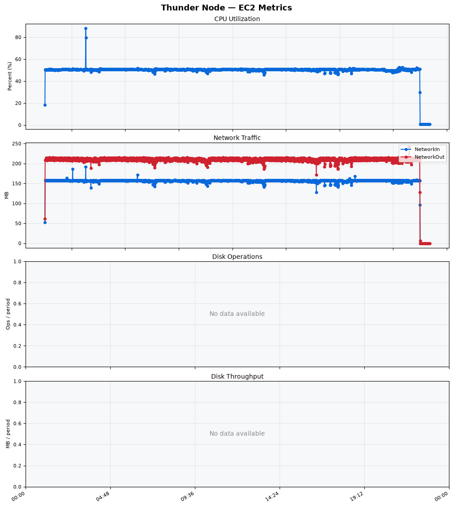

### Nginx (EC2)

| Metric | Unit | Min | Avg | Max |
| --- | --- | ---: | ---: | ---: |
| CPU Utilization | % | 0.113 | 15.55 | 64.405 |
| Network In | MB | 0.0 | 97.219 | 136.793 |
| Network Out | MB | 0.0 | 101.53 | 118.051 |
| Disk Read Ops | ops/period | — | — | — |
| Disk Write Ops | ops/period | — | — | — |
| Disk Read | MB/period | — | — | — |
| Disk Write | MB/period | — | — | — |

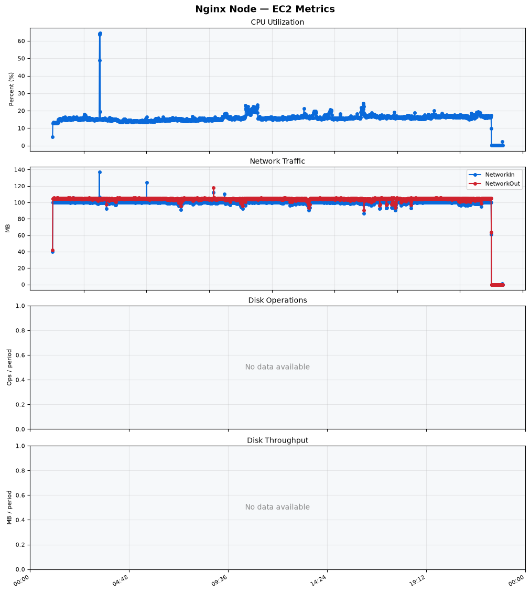

### Bastion (EC2)

| Metric | Unit | Min | Avg | Max |
| --- | --- | ---: | ---: | ---: |
| CPU Utilization | % | 0.286 | 9.926 | 33.347 |
| Network In | MB | 0.0 | 66.806 | 101.857 |
| Network Out | MB | 0.0 | 34.988 | 69.501 |
| Disk Read Ops | ops/period | — | — | — |
| Disk Write Ops | ops/period | — | — | — |
| Disk Read | MB/period | — | — | — |
| Disk Write | MB/period | — | — | — |

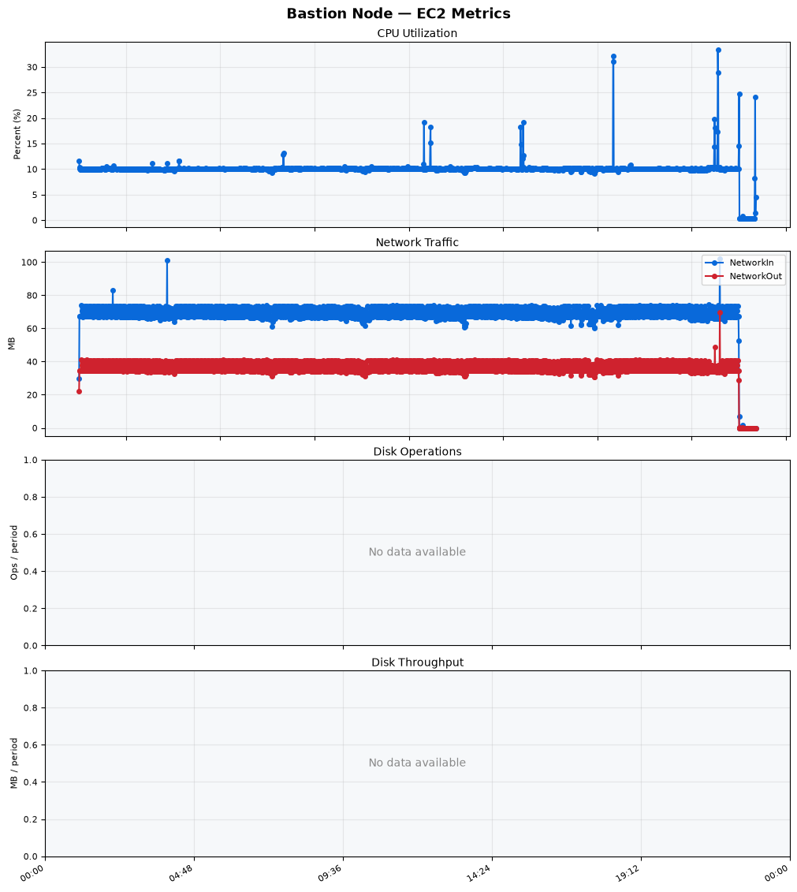

### RDS

| Metric | Unit | Min | Avg | Max |
| --- | --- | ---: | ---: | ---: |
| CPU Utilization | % | 1.058 | 24.135 | 62.928 |
| Freeable Memory | MB | 10299.617 | 10423.277 | 10622.074 |
| Read IOPS | ops/sec | 0.0 | 491.561 | 5787.563 |
| Write IOPS | ops/sec | 0.183 | 1166.509 | 4005.882 |
| Network Receive Throughput | MB/sec | 0.001 | 2.305 | 2.425 |
| Network Transmit Throughput | MB/sec | 0.009 | 1.948 | 2.075 |
| DB Connections | count | 0.0 | 43.616 | 81.0 |

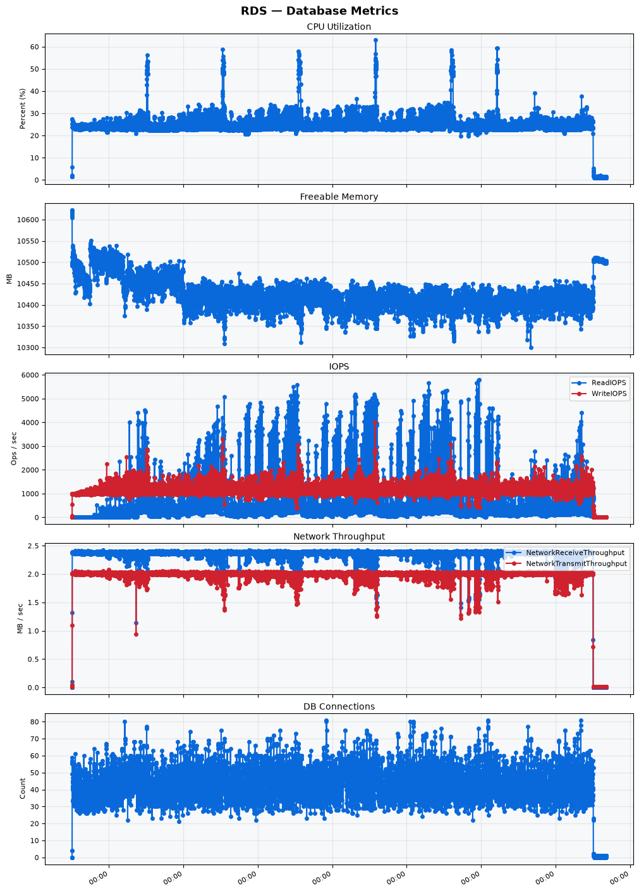

[`cloudwatch/rds-iops.csv`](cloudwatch/rds-iops.csv) adds per-minute `DiskQueueDepth`,
`ReadLatency`, `ReadThroughput`, `WriteLatency` and `WriteThroughput` — 9,775 rows,
2026-07-31T12:06Z → 2026-08-07T07:03Z, timestamps written with a +05:30 offset.

## Long-Running Resource & Data Growth

Sampled every ~5 minutes over the ~168.1-hour run (1871 samples). `Slope / hour` is the
least-squares linear trend and `R²` its goodness-of-fit. A cleanup job ran every 24 h, changed to
every 12 h at 2026-08-06T04:58Z, so the row-count and DB-size series rise and fall between runs.
Source data: [`long-run-summary.json`](long-run-summary.json) and
[`long-run-metrics.csv`](long-run-metrics.csv).

| Metric | Unit | First | Last | Min | Max | Slope / hour | R² |
| --- | --- | ---: | ---: | ---: | ---: | ---: | ---: |
| `thunder_rss_kb` | MB | 50.25 | 52.89 | 50.25 | 88.39 | 0.0187 | 0.1565 |
| `thunder_vsz_kb` | MB | 1,333.00 | 1,399.92 | 1,333.00 | 1,399.92 | 0.1687 | 0.2224 |
| `thunder_disk_used_bytes` | GB | 2.71 | 4.09 | 2.71 | 4.16 | 0.0043 | 0.5398 |
| `thunder_disk_avail_bytes` | GB | 16.47 | 15.09 | 15.03 | 16.47 | -0.0043 | 0.5398 |
| `thunder_log_bytes` | MB | 0.00 | 449.07 | 0.00 | 520.78 | 0.2480 | 0.0489 |
| `runtime_transient_bytes` | MB | 15.67 | 6,551.35 | 15.67 | 9,492.26 | 5.9971 | 0.0201 |
| `runtime_persistent_bytes` | MB | 9.50 | 26,976.75 | 9.50 | 33,202.37 | 75.9002 | 0.2159 |
| `count_authorization_code` | rows | 763 | 2,333,559 | 763 | 14,705,273 | -13,349.7134 | 0.0267 |
| `count_authorization_request` | rows | 999 | 1,000 | 753 | 1,999 | -0.4684 | 0.0283 |
| `count_runtime_store_flow_state` | rows | 998 | 993 | 531 | 1,996 | -0.4556 | 0.0263 |
| `count_runtime_store_attribute_cache` | rows | 2 | 0 | 0 | 2 | -0.0147 | 0.6233 |
| `count_sso_session` | rows | 775 | 6,948,215 | 775 | 19,277,312 | 12,944.0204 | 0.0240 |
| `count_sso_session_context` | rows | 775 | 6,948,215 | 775 | 19,278,253 | 12,942.7734 | 0.0240 |
| `count_sso_session_participant` | rows | 775 | 6,948,215 | 775 | 19,282,265 | 12,941.3764 | 0.0240 |
| `count_ciba_auth_request` | rows | 0 | 0 | 0 | 0 | 0.0000 | 0.0000 |
| `count_webauthn_session` | rows | 0 | 0 | 0 | 0 | 0.0000 | 0.0000 |
| `count_par_request` | rows | 0 | 0 | 0 | 0 | 0.0000 | 0.0000 |
| `count_jti_record` | rows | 0 | 0 | 0 | 0 | 0.0000 | 0.0000 |
| `count_runtime_store_authz_code` | rows | 0 | 0 | 0 | 0 | 0.0000 | 0.0000 |
| `count_runtime_store_authz_req` | rows | 0 | 0 | 0 | 0 | 0.0000 | 0.0000 |
| `count_runtime_store_logout_req` | rows | 0 | 0 | 0 | 0 | 0.0000 | 0.0000 |
| `count_runtime_store_par_req` | rows | 0 | 0 | 0 | 0 | 0.0000 | 0.0000 |
| `count_runtime_store_ciba_req` | rows | 0 | 0 | 0 | 0 | 0.0000 | 0.0000 |
| `count_runtime_store_jti_token` | rows | 0 | 0 | 0 | 0 | 0.0000 | 0.0000 |
| `count_runtime_store_vci_nonce` | rows | 0 | 0 | 0 | 0 | 0.0000 | 0.0000 |
| `count_runtime_store_vci_offer` | rows | 0 | 0 | 0 | 0 | 0.0000 | 0.0000 |
| `count_runtime_store_vp_state` | rows | 0 | 0 | 0 | 0 | 0.0000 | 0.0000 |
| `count_revoked_token` | rows | 0 | 0 | 0 | 0 | 0.0000 | 0.0000 |
| `count_consent` | rows | 0 | 0 | 0 | 0 | 0.0000 | 0.0000 |
| `count_consent_authorization` | rows | 0 | 0 | 0 | 0 | 0.0000 | 0.0000 |
| `count_consent_audit` | rows | 0 | 0 | 0 | 0 | 0.0000 | 0.0000 |

[`db-logs/`](db-logs) holds 95 hourly PostgreSQL logs covering 2026-08-03T10:00Z →
2026-08-07T08:00Z — a subset of the run — with 1,126 checkpoint cycles and 141 autovacuum events.

### Process & Resource Trends

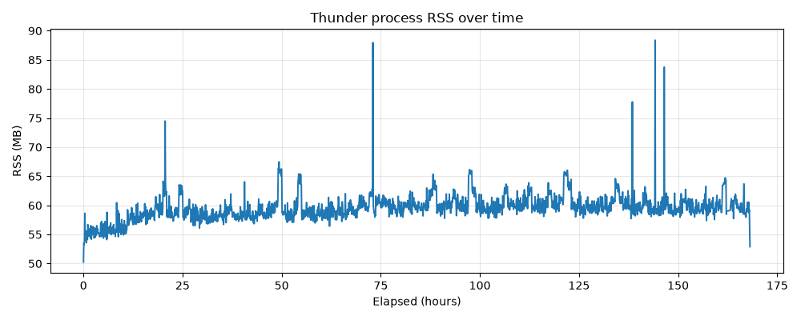
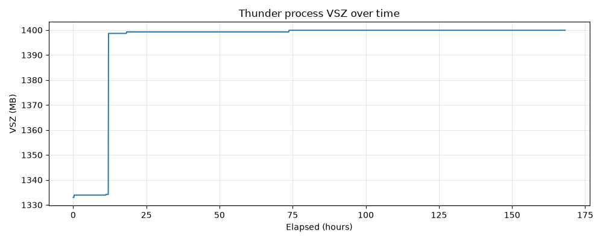
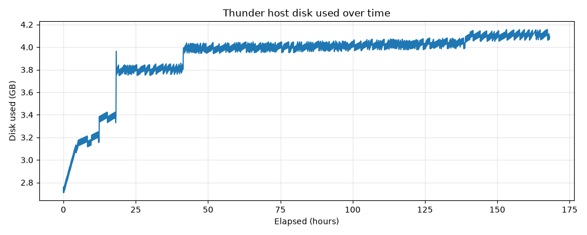
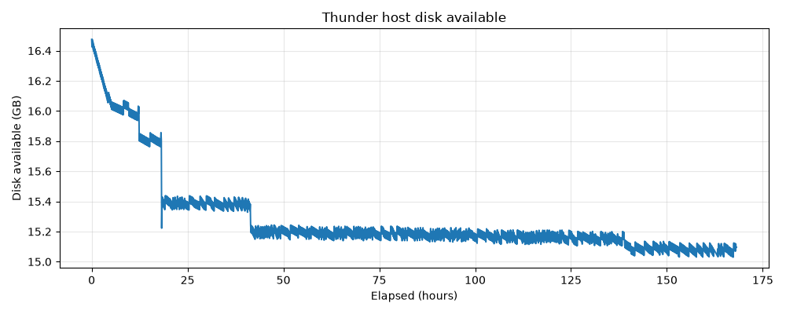
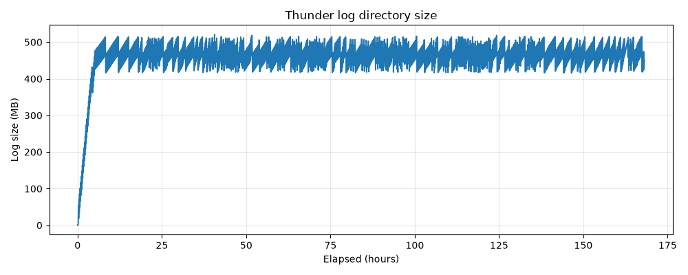
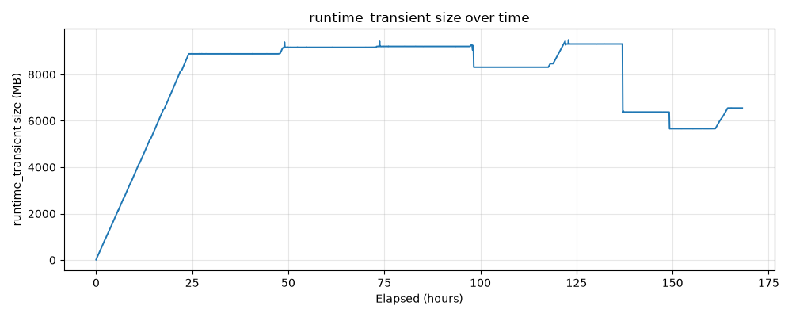
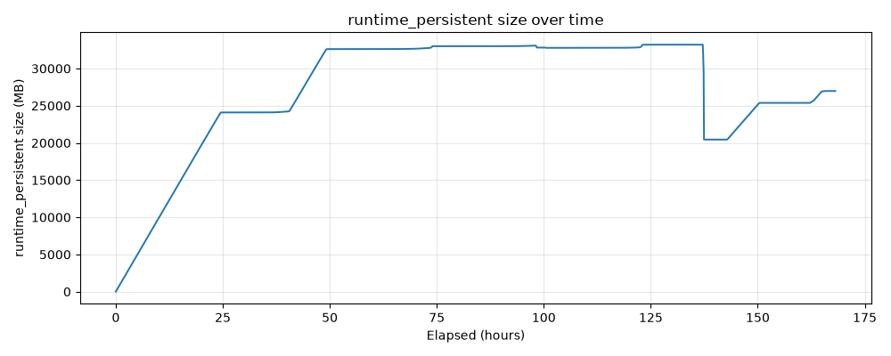

### Table Row-Count Trends

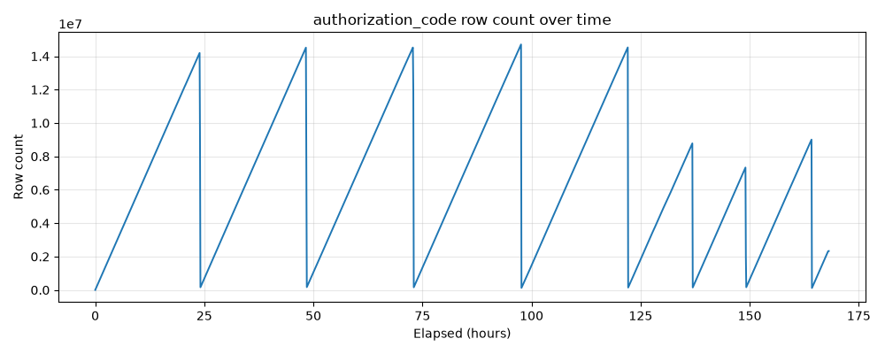
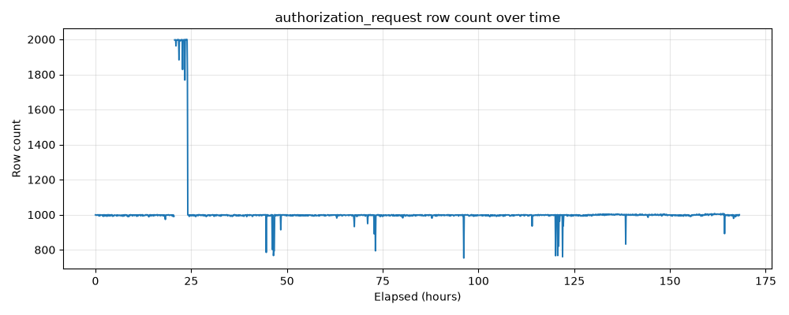
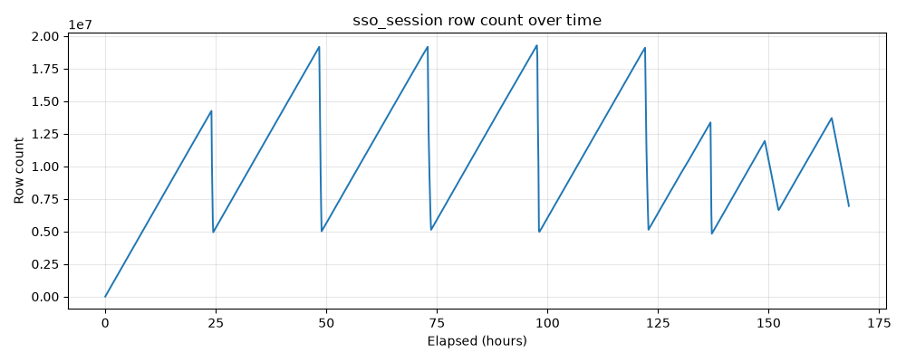
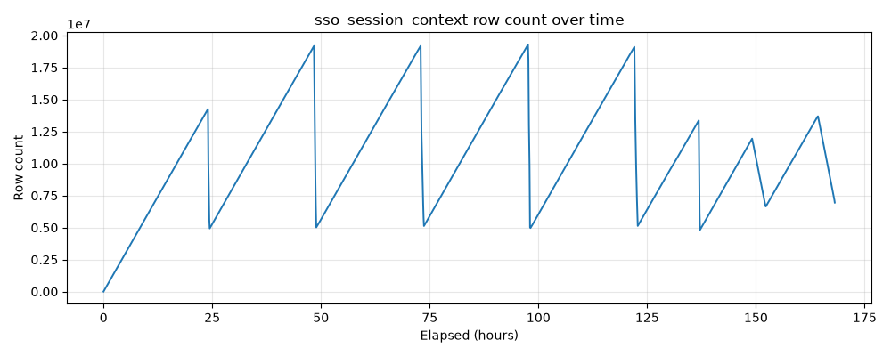
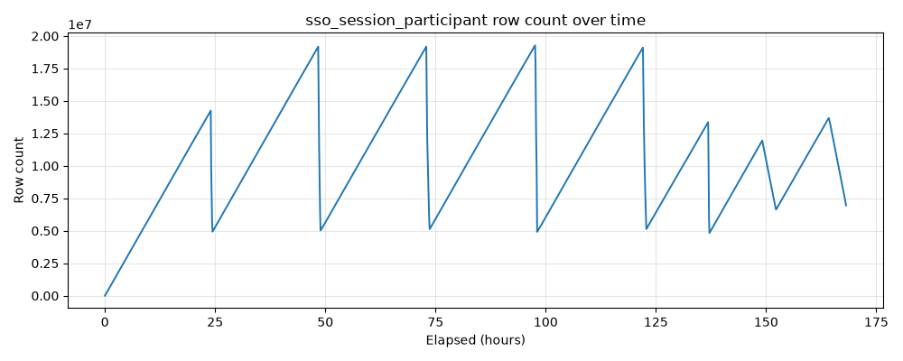
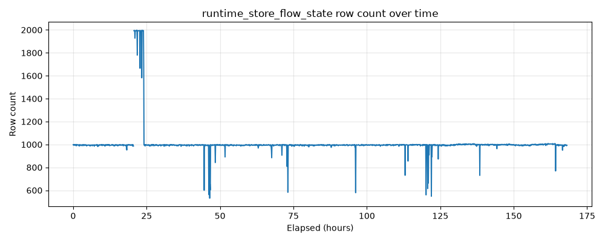
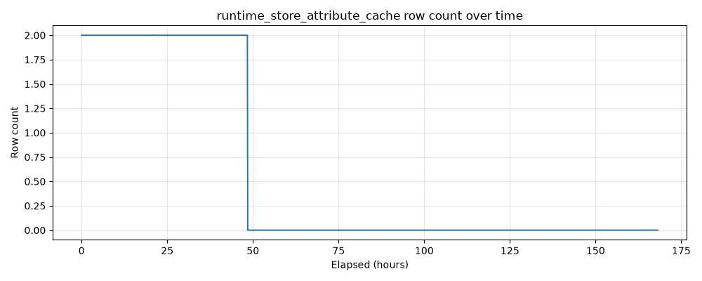
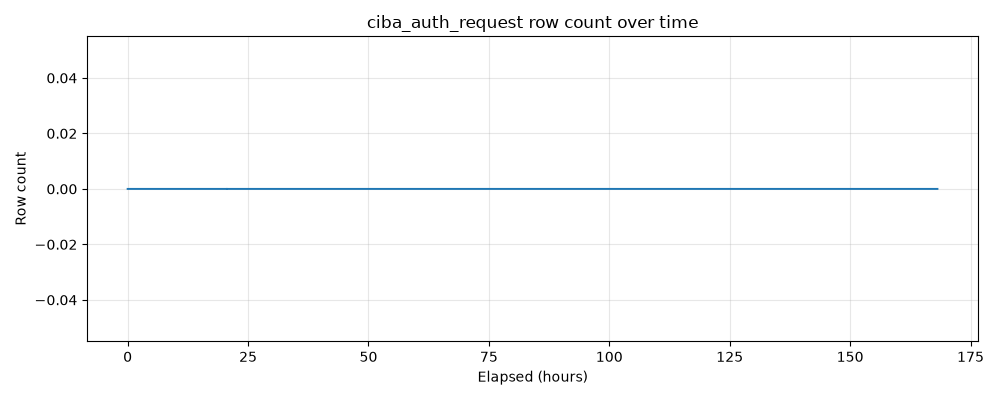
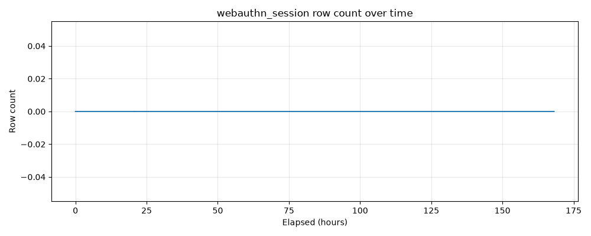

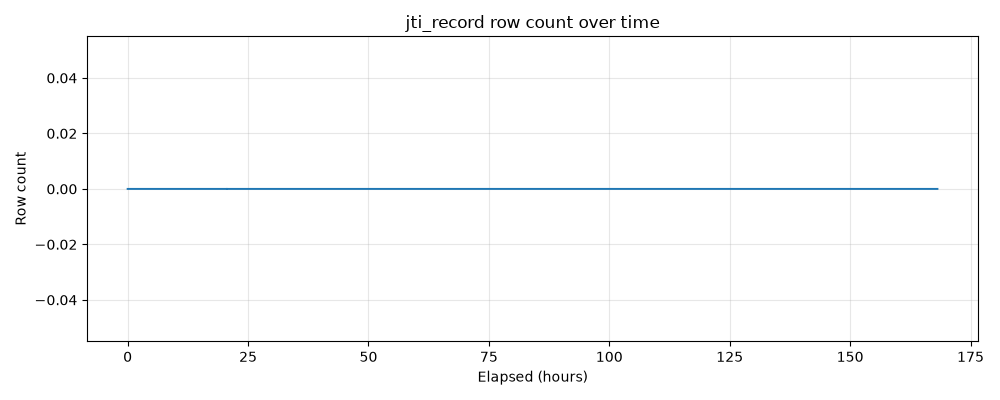

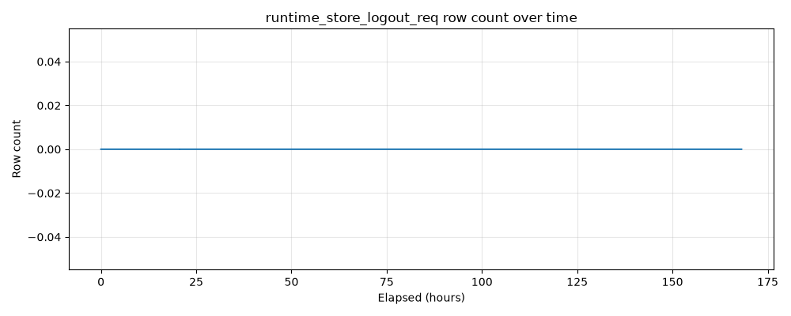

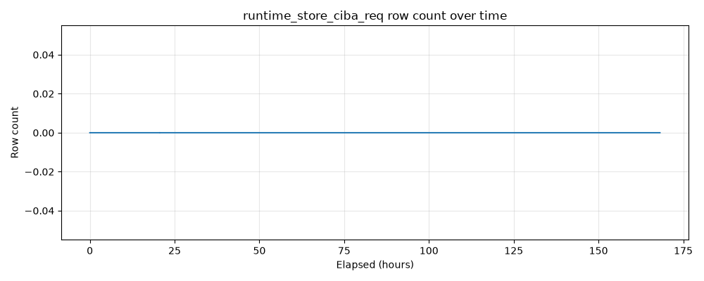

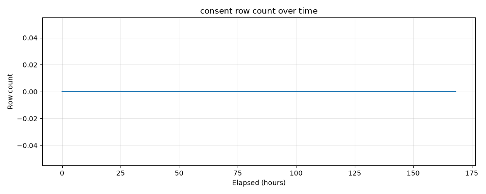

## Latency Drift

End-to-end latency of the full Authorization Code flow, bucketed into 300-second windows over the
run, to detect creep. Source data: [`latency-drift.json`](latency-drift.json) and
[`latency-drift/.../latency-drift.csv`](latency-drift/01-thunder_oauth_authorization_code_grant/default/1000_users/latency-drift.csv).

| Scenario | Buckets | Bucket Size | Total Requests | p95 First Bucket (ms) | p95 Last Bucket (ms) | p95 Slope (ms/hour) | p95 R² |
| --- | ---: | ---: | ---: | ---: | ---: | ---: | ---: |
| 01-thunder_oauth_authorization_code_grant / default / 1000_users | 1995 | 300s | 488,483,405 | 14 | 15 | 0.113 | 0.0044 |

Median across all buckets, by day — p50: 5 ms on all seven days. p95: 15, 16, 17, 17, 17, 15,
15 ms. p99: 27, 30, 161, 96, 81, 29, 24 ms.

Missing 22 of 2017 buckets — see [Note 1](#note-1-bastion-disk-filled-and-jtl-truncated).
[`salvaged/buckets.csv`](salvaged/buckets.csv) additionally carries p90, p99.9 and max, per
request step.

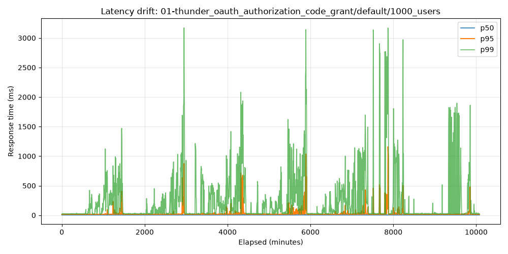

## Note 1: Bastion disk filled and JTL truncated

JMeter wrote every sample to one `results.jtl` on the bastion. It reached 85.7 GB / 473.8M rows and
filled the 97 GB disk. From **2026-08-07T04:05Z** JMeter could no longer record samples. The file
was scanned into 5-minute latency histograms, those were pulled off the box, and the file was then
truncated so the test could finish at 12:10Z.

Salvaged before truncation: [`salvaged/buckets.csv`](salvaged/buckets.csv) (per-5-minute
percentiles per request step, 07-31 12:05Z → 08-07 06:50Z) and [`errors.csv`](errors.csv)
(all 16,759 failed samples).

What this costs us:

- **Latency data is missing for a small window** — 22 of 2017 buckets, 08-07 04:05Z → 07:10Z.
- **No request-by-request data.** The raw JTL is gone; 5 minutes is the finest granularity left.
- **`summary.csv` covers only the last 5 hours** (08-07 07:10Z → 12:10Z), not the 7 days.
- **No whole-run percentiles** — that needs the merged histogram, which was not salvaged.
- **Throughput and errors between 04:05Z and 07:10Z are unknown.** Nothing was recorded, so no
  errors there does not mean no errors happened.
- **`errors.csv` stops at 08-07 03:49Z.**
- **Not affected:** the `long-run-*` data covers all 168 hours, and the load ran its full 7 days.

## Note 2: CloudWatch collection failed

`collect-cloudwatch-metrics.sh` asks for the whole test window in one call. The AWS API returns at
most 1440 datapoints and this run needed 2069, so every call failed. The error was suppressed and
the job wrote empty CSVs while reporting success. Runs under ~5 days are unaffected.

What this costs us:

- **`cloudwatch/*.csv` are a manual recovery**, re-fetched in smaller slices on 2026-08-13, not the
  collect job's output.
- **EBS volume metrics are lost for good.** Their volume IDs were only available from the instances,
  which were terminated at teardown. There are no `*-ebs.csv` files.
- **EC2 disk I/O rows are empty** because that data lives under EBS — the same data lost above.
