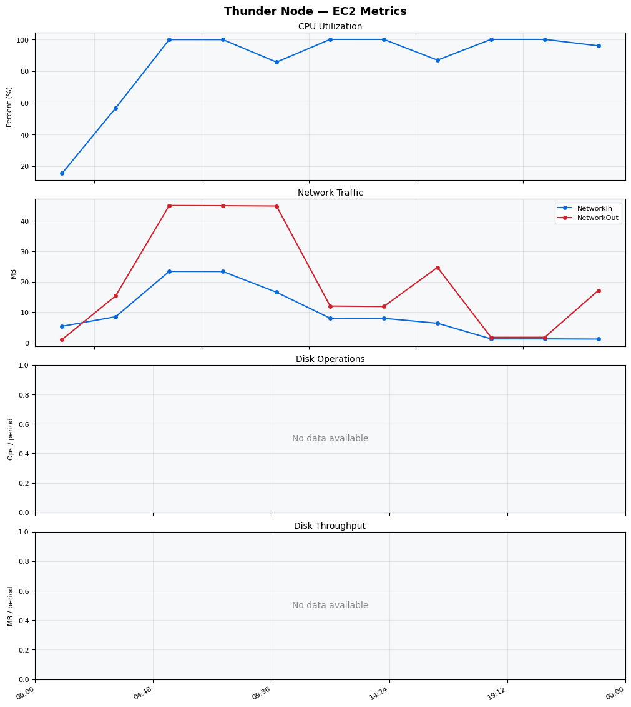
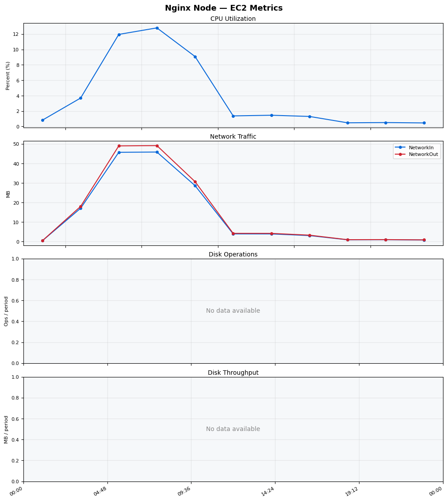
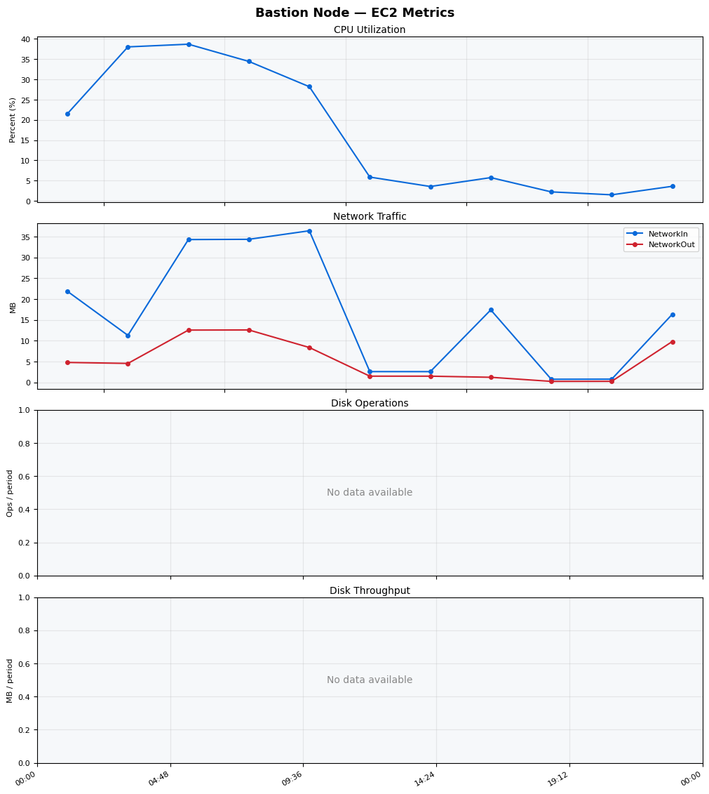
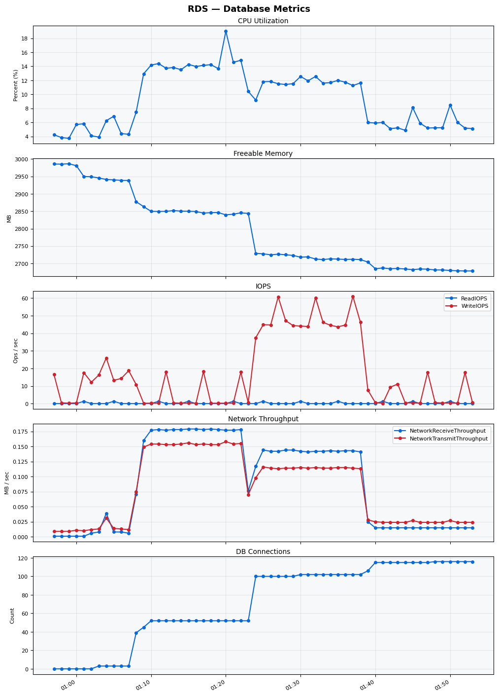

Build Number: 157

Build Date and Time: 2026-03-20--02-00-34

Thunder Pack URL: https://github.com/asgardeo/thunder/releases/download/v0.28.0/thunder-0.28.0-linux-x64.zip

Deployment Pattern: single-node

Thunder Instance Type: t3a.medium

Database Instance Type: db.t3.medium

Database Type: postgres

Concurrency: 50

Performance Repo: https://github.com/asgardeo/thunder-performance

Performance Repo Branch: improve-perf-tests

## CloudWatch Metrics

### Thunder (EC2)

### Nginx (EC2)

### Bastion (EC2)

### RDS

