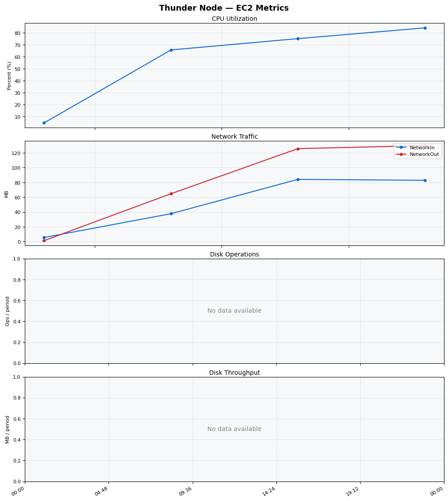
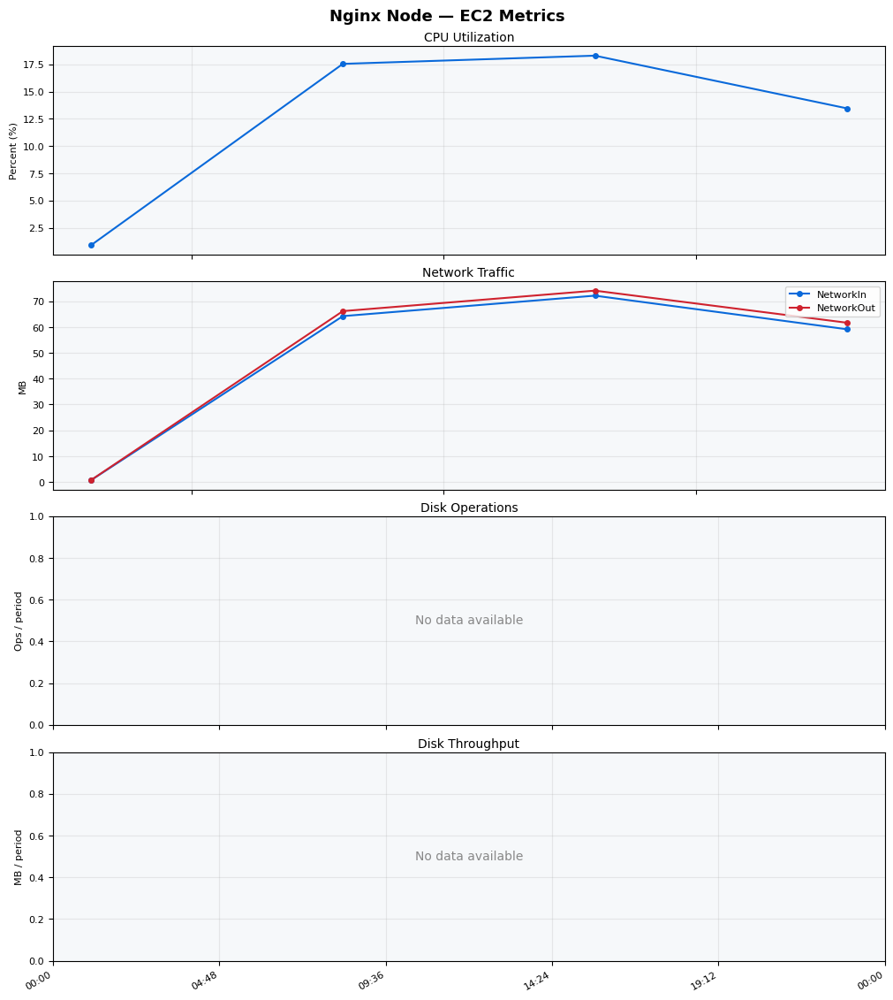
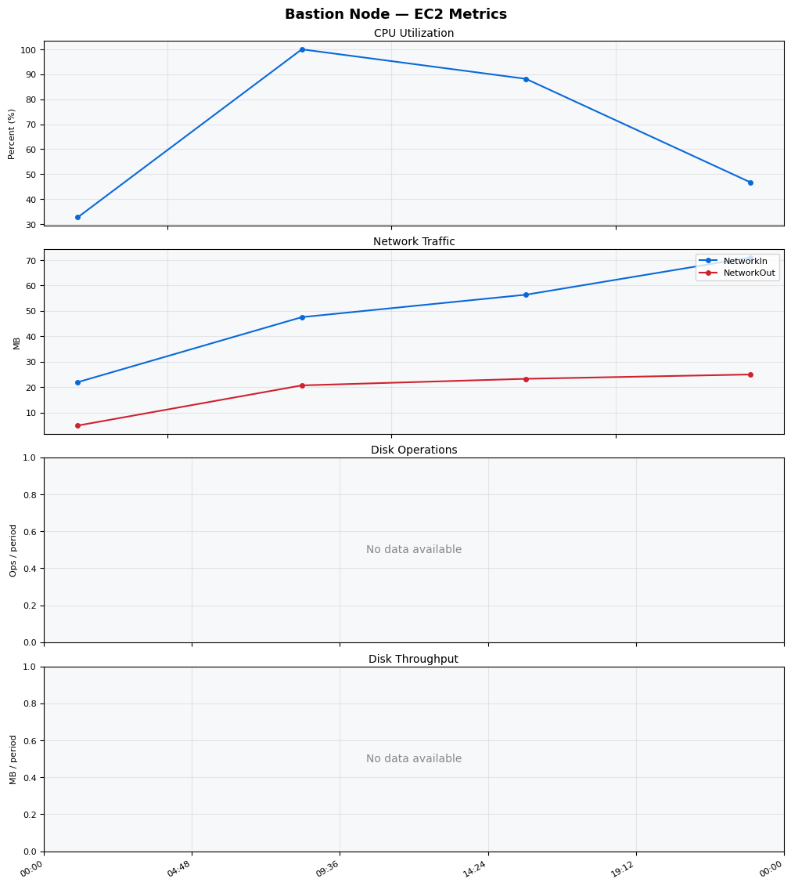
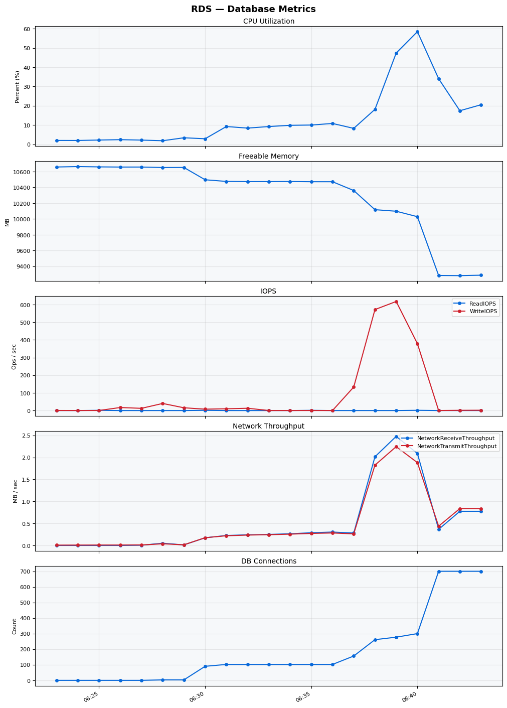

Build Number: 162

Build Date and Time: 2026-03-20--06-49-14

Thunder Pack URL: https://github.com/asgardeo/thunder/releases/download/v0.28.0/thunder-0.28.0-linux-x64.zip

Deployment Pattern: single-node

Thunder Instance Type: t3a.xlarge

Database Instance Type: db.t3.xlarge

Database Type: postgres

Concurrency: 1000

Performance Repo: https://github.com/asgardeo/thunder-performance

Performance Repo Branch: improve-perf-tests

## Summary

| Scenario Name | Heap Size | Concurrent Users | Label | # Samples | Error % | Throughput (Requests/sec) | Average Response Time (ms) | 95th Percentile of Response Time (ms) |
| --- | --- | --- | --- | --- | --- | --- | --- | --- |
| Client Credentials Grant Type | N/A | 1000 | 1 Get access token | 260199 | 0.00 | 823.07 | 86.46 | 202.00 |
| Authorization Code Grant Type | N/A | 1000 | 1 Send request to authorize endpoint | 11713 | 0.00 | 194.77 | 300.89 | 647.00 |
| Authorization Code Grant Type | N/A | 1000 | 2 Start Authentication Flow | 11577 | 0.00 | 193.24 | 225.05 | 465.00 |
| Authorization Code Grant Type | N/A | 1000 | 3 Perform authentication | 11491 | 0.00 | 191.64 | 386.62 | 867.00 |
| Authorization Code Grant Type | N/A | 1000 | 4 Obtain authorization code | 11427 | 0.00 | 190.83 | 184.53 | 347.00 |
| Authorization Code Grant Type | N/A | 1000 | 5 Obtain access token | 11425 | 0.00 | 190.81 | 220.04 | 399.00 |
| User Authentication with Credentials | N/A | 1000 | 1 Perform user authentication | 28917 | 0.00 | 471.62 | 2059.98 | 2927.00 |

## CloudWatch Metrics

### Thunder (EC2)

### Nginx (EC2)

### Bastion (EC2)

### RDS

