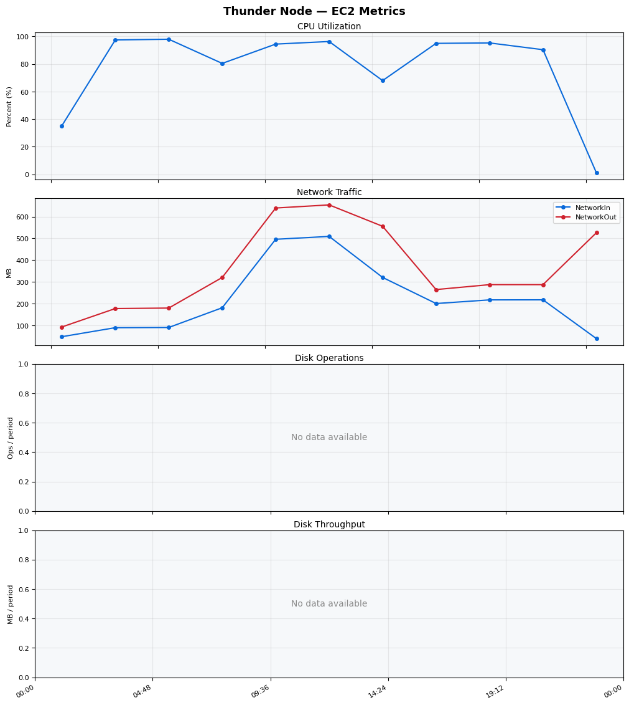
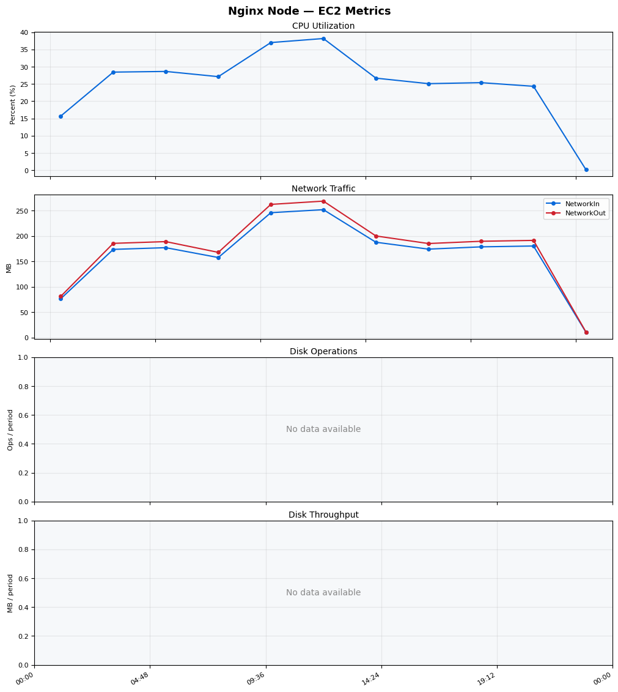
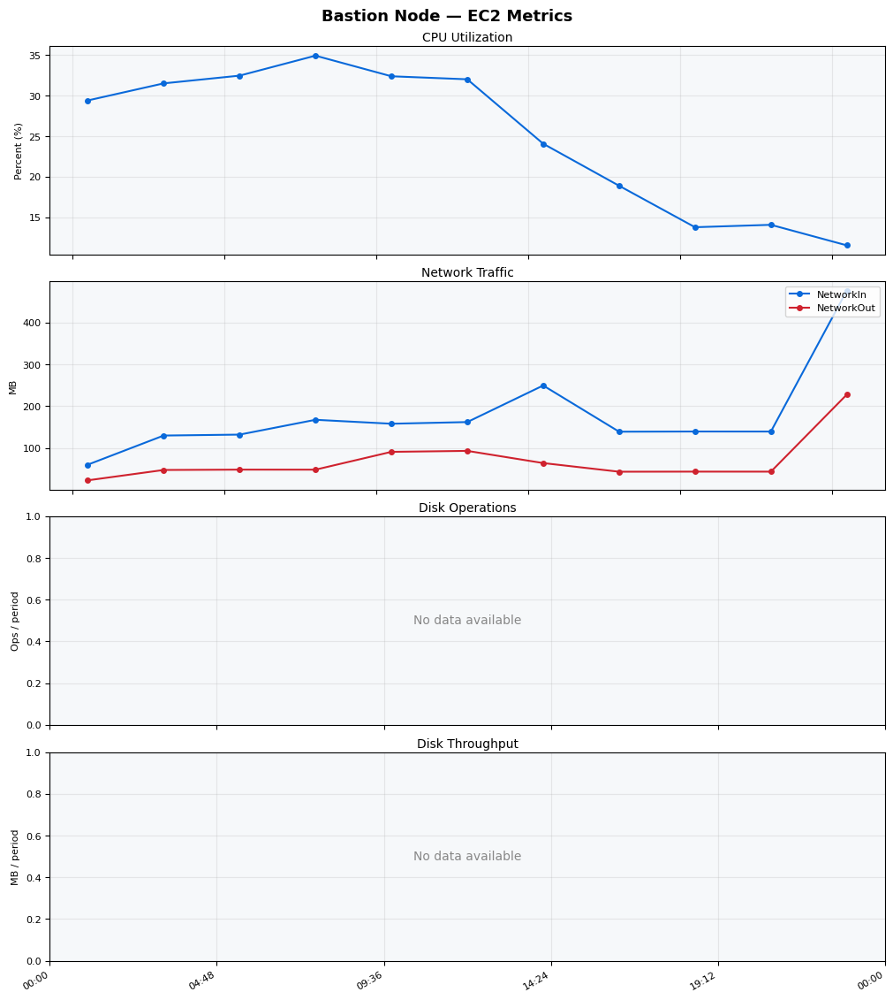
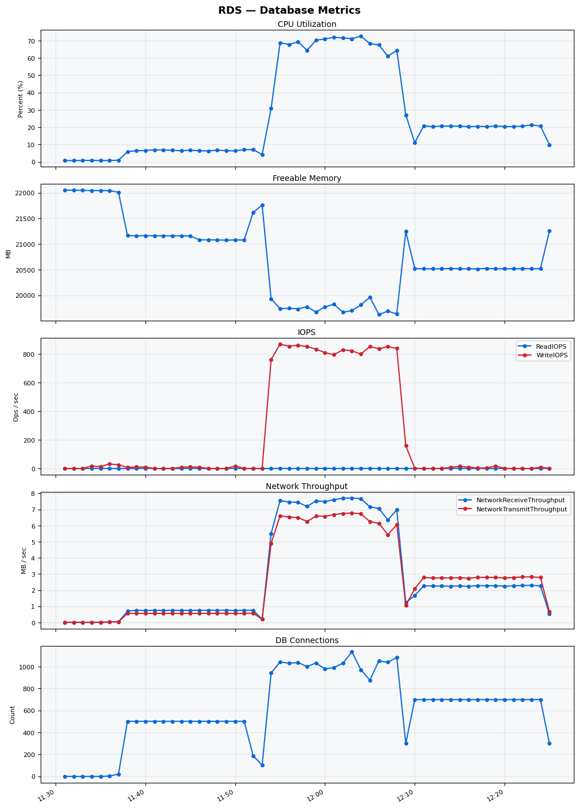

Build Number: 165

Build Date and Time: 2026-03-20--12-31-58

Thunder Pack URL: https://github.com/asgardeo/thunder/releases/download/v0.28.0/thunder-0.28.0-linux-x64.zip

Deployment Pattern: single-node

Thunder Instance Type: t3a.2xlarge

Database Instance Type: db.m6i.2xlarge

Database Type: postgres

Concurrency: 1000

Performance Repo: https://github.com/asgardeo/thunder-performance

Performance Repo Branch: improve-perf-tests

## Summary

| Scenario Name | Heap Size | Concurrent Users | Label | # Samples | Error % | Throughput (Requests/sec) | Average Response Time (ms) | 95th Percentile of Response Time (ms) |
| --- | --- | --- | --- | --- | --- | --- | --- | --- |
| Client Credentials Grant Type | N/A | 1000 | 1 Get access token | 1161079 | 0.00 | 1845.89 | 520.98 | 959.00 |
| Authorization Code Grant Type | N/A | 1000 | 1 Send request to authorize endpoint | 295649 | 0.00 | 492.67 | 483.99 | 683.00 |
| Authorization Code Grant Type | N/A | 1000 | 2 Start Authentication Flow | 295608 | 0.00 | 492.62 | 334.74 | 497.00 |
| Authorization Code Grant Type | N/A | 1000 | 3 Perform authentication | 295501 | 0.00 | 492.33 | 732.84 | 1019.00 |
| Authorization Code Grant Type | N/A | 1000 | 4 Obtain authorization code | 295551 | 0.00 | 492.56 | 233.22 | 347.00 |
| Authorization Code Grant Type | N/A | 1000 | 5 Obtain access token | 295608 | 0.00 | 492.64 | 242.63 | 373.00 |
| User Authentication with Credentials | N/A | 1000 | 1 Perform user authentication | 976591 | 0.00 | 1626.61 | 614.35 | 923.00 |

## CloudWatch Metrics

### Thunder (EC2)

### Nginx (EC2)

### Bastion (EC2)

### RDS

