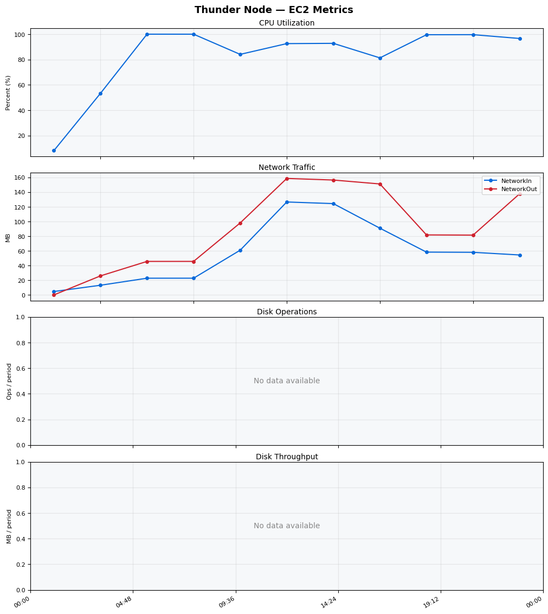
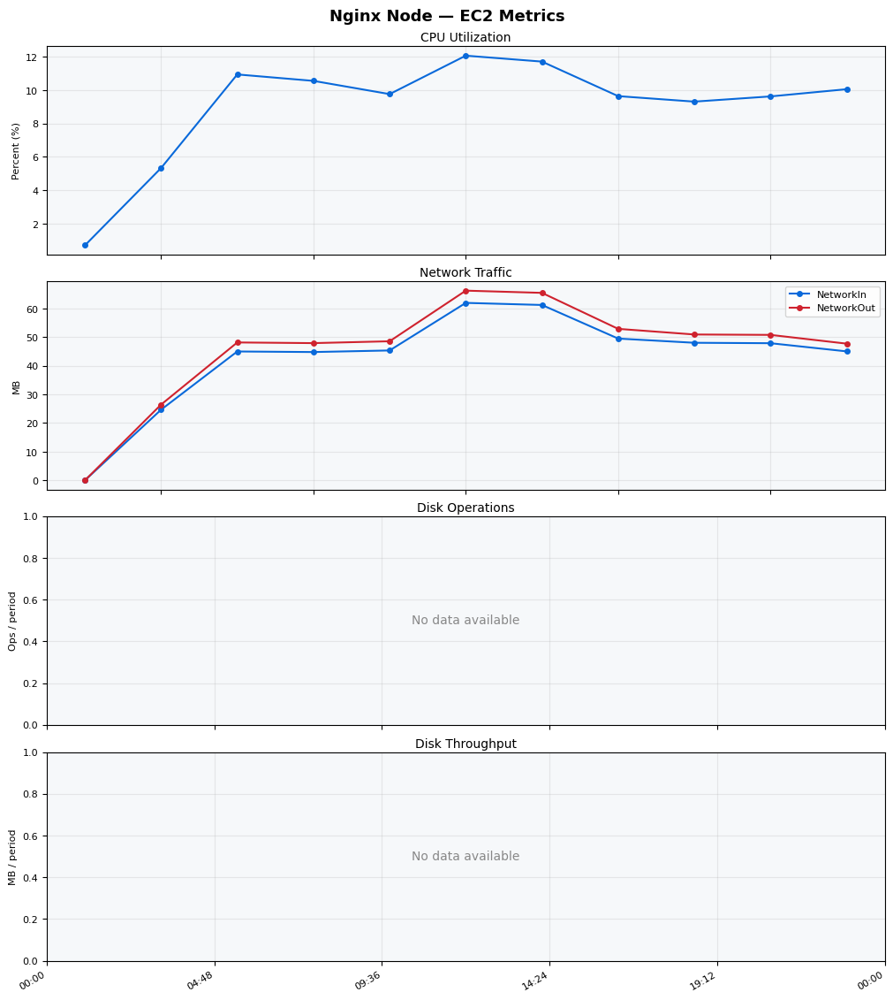
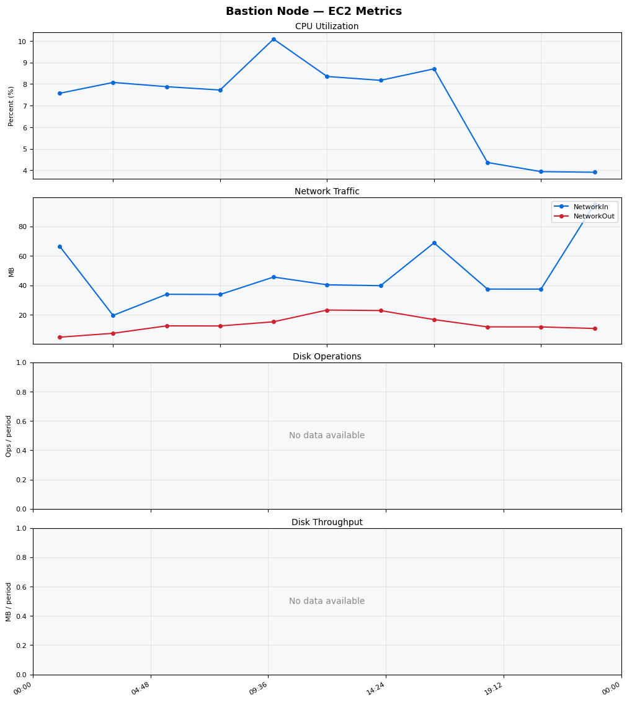
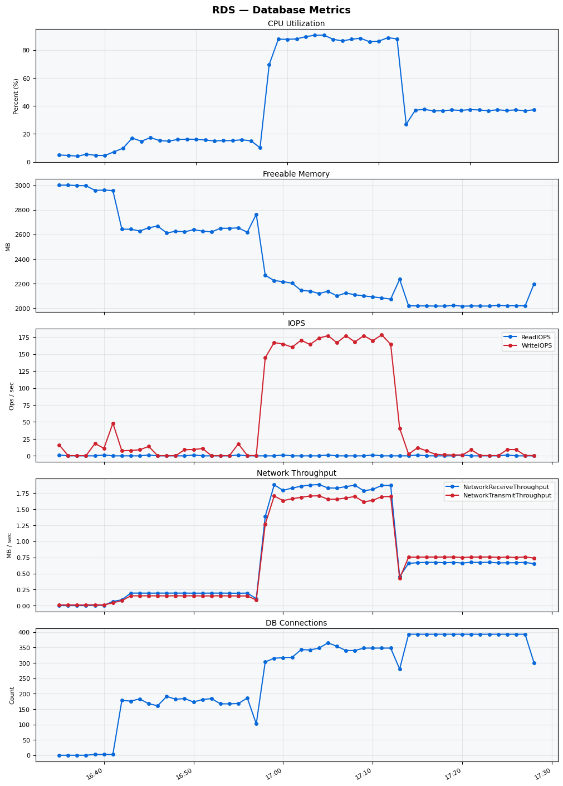

Build Number: 166

Build Date and Time: 2026-03-20--17-33-14

Thunder Pack URL: https://github.com/asgardeo/thunder/releases/download/v0.28.0/thunder-0.28.0-linux-x64.zip

Deployment Pattern: single-node

Thunder Instance Type: t3a.medium

Database Instance Type: db.t3.medium

Database Type: postgres

Concurrency: 200

Performance Repo: https://github.com/asgardeo/thunder-performance

Performance Repo Branch: improve-perf-tests

## Summary

| Scenario Name | Heap Size | Concurrent Users | Label | # Samples | Error % | Throughput (Requests/sec) | Average Response Time (ms) | 95th Percentile of Response Time (ms) |
| --- | --- | --- | --- | --- | --- | --- | --- | --- |
| Client Credentials Grant Type | N/A | 200 | 1 Get access token | 284997 | 0.00 | 473.82 | 421.12 | 527.00 |
| Authorization Code Grant Type | N/A | 200 | 1 Send request to authorize endpoint | 77196 | 0.00 | 128.64 | 377.74 | 481.00 |
| Authorization Code Grant Type | N/A | 200 | 2 Start Authentication Flow | 77200 | 0.00 | 128.66 | 254.09 | 345.00 |
| Authorization Code Grant Type | N/A | 200 | 3 Perform authentication | 77202 | 0.00 | 128.64 | 564.52 | 703.00 |
| Authorization Code Grant Type | N/A | 200 | 4 Obtain authorization code | 77203 | 0.00 | 128.67 | 176.24 | 244.00 |
| Authorization Code Grant Type | N/A | 200 | 5 Obtain access token | 77211 | 0.00 | 128.68 | 179.53 | 252.00 |
| User Authentication with Credentials | N/A | 200 | 1 Perform user authentication | 260990 | 0.06 | 434.76 | 459.91 | 535.00 |

## CloudWatch Metrics

### Thunder (EC2)

### Nginx (EC2)

### Bastion (EC2)

### RDS

