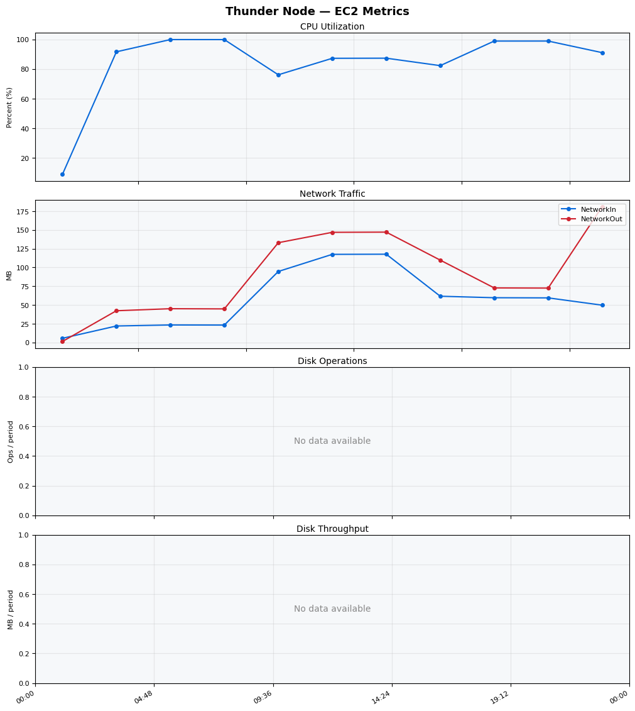
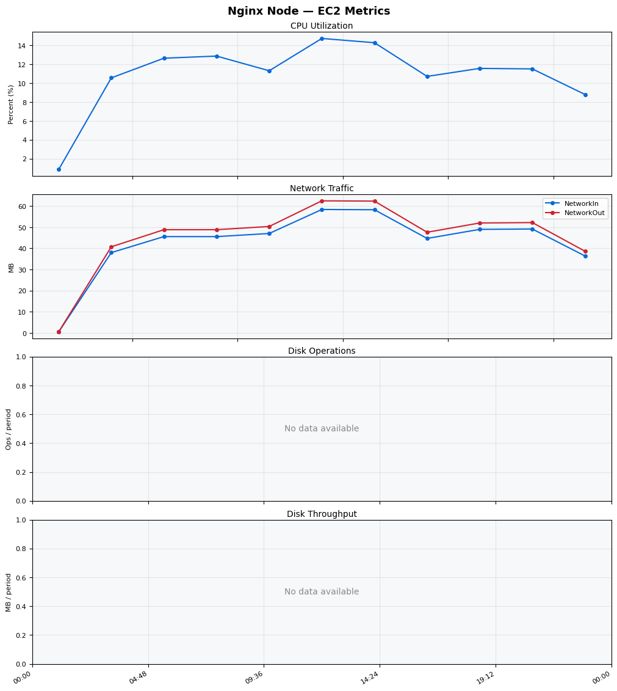
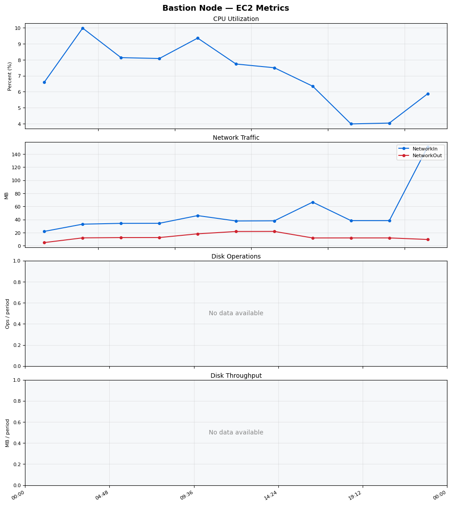
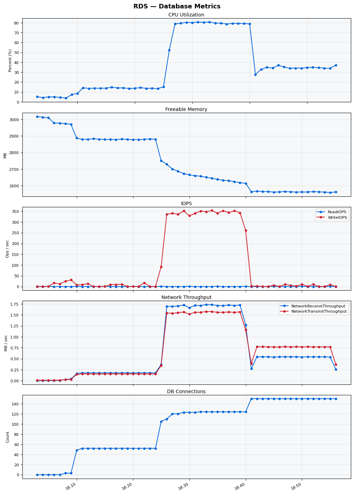

Build Number: 167

Build Date and Time: 2026-03-20--19-02-06

Thunder Pack URL: https://github.com/asgardeo/thunder/releases/download/v0.28.0/thunder-0.28.0-linux-x64.zip

Deployment Pattern: single-node

Thunder Instance Type: t3a.medium

Database Instance Type: db.t3.medium

Database Type: postgres

Concurrency: 50

Performance Repo: https://github.com/asgardeo/thunder-performance

Performance Repo Branch: improve-perf-tests

## Summary

| Scenario Name | Heap Size | Concurrent Users | Label | # Samples | Error % | Throughput (Requests/sec) | Average Response Time (ms) | 95th Percentile of Response Time (ms) |
| --- | --- | --- | --- | --- | --- | --- | --- | --- |
| Client Credentials Grant Type | N/A | 50 | 1 Get access token | 289012 | 0.00 | 481.47 | 102.89 | 137.00 |
| Authorization Code Grant Type | N/A | 50 | 1 Send request to authorize endpoint | 73184 | 0.00 | 121.98 | 98.05 | 130.00 |
| Authorization Code Grant Type | N/A | 50 | 2 Start Authentication Flow | 73188 | 0.00 | 121.99 | 65.57 | 91.00 |
| Authorization Code Grant Type | N/A | 50 | 3 Perform authentication | 73186 | 0.00 | 121.98 | 150.28 | 193.00 |
| Authorization Code Grant Type | N/A | 50 | 4 Obtain authorization code | 73186 | 0.00 | 121.99 | 44.67 | 65.00 |
| Authorization Code Grant Type | N/A | 50 | 5 Obtain access token | 73181 | 0.00 | 121.99 | 48.27 | 69.00 |
| User Authentication with Credentials | N/A | 50 | 1 Perform user authentication | 267804 | 0.00 | 446.35 | 111.66 | 146.00 |

## CloudWatch Metrics

### Thunder (EC2)

### Nginx (EC2)

### Bastion (EC2)

### RDS

