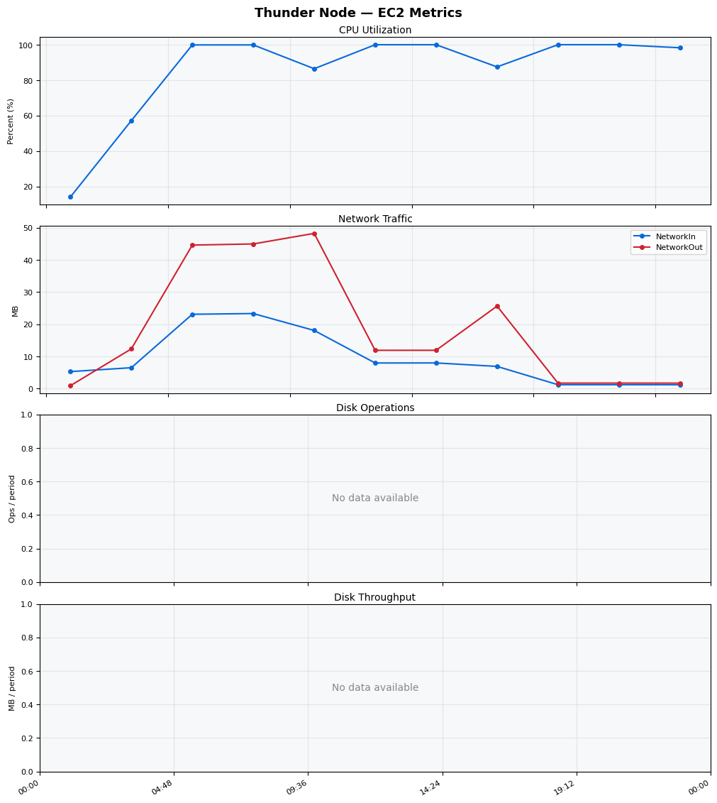
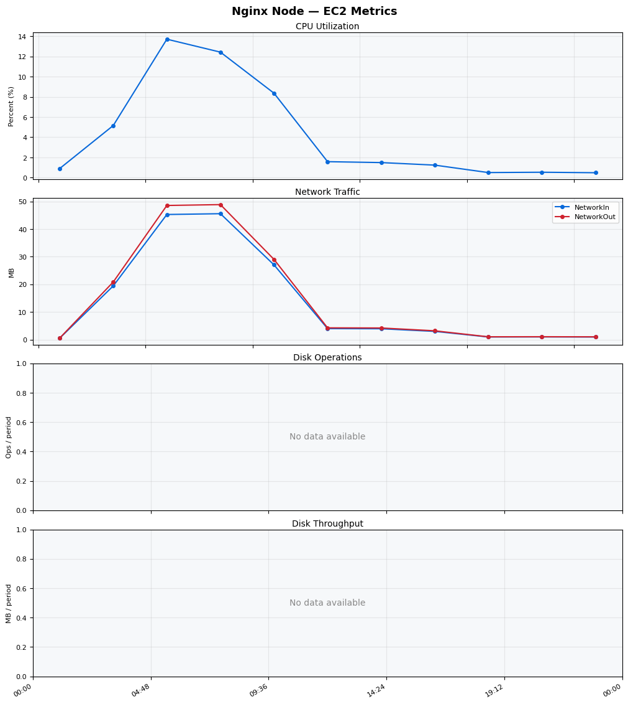
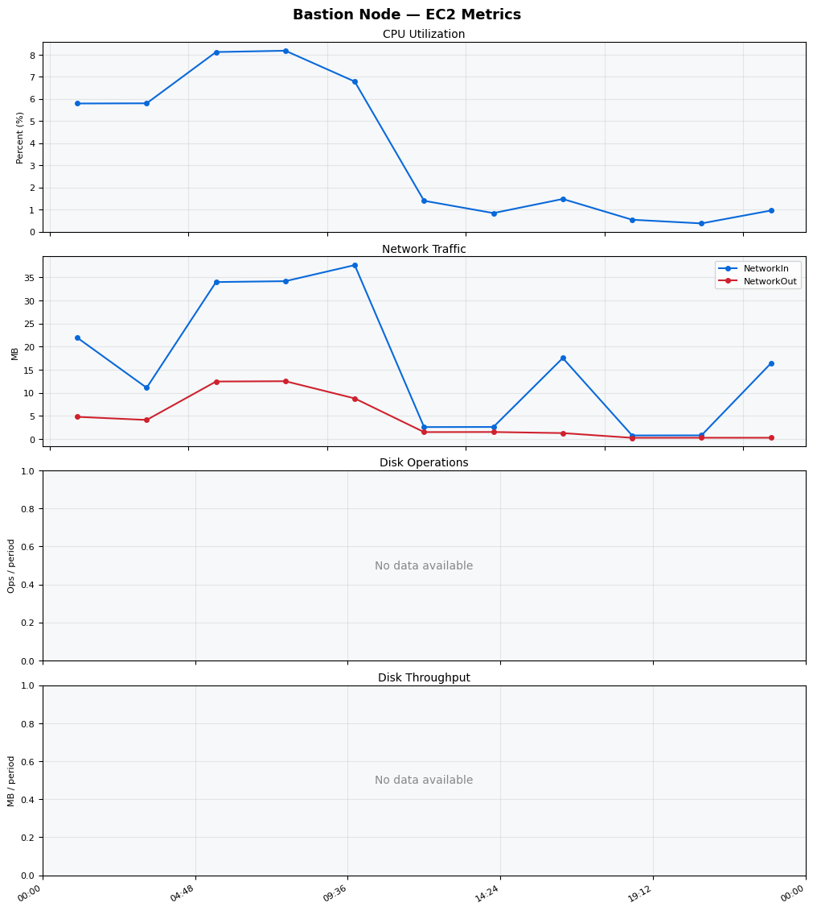
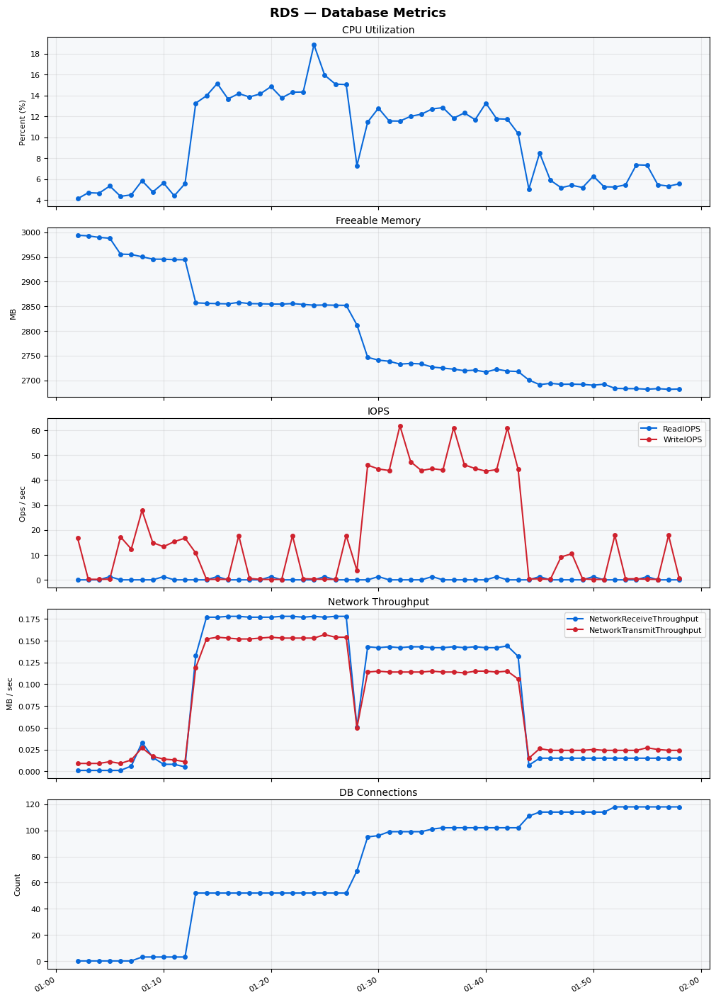

Build Number: 168

Build Date and Time: 2026-03-21--02-04-21

Thunder Pack URL: https://github.com/asgardeo/thunder/releases/download/v0.28.0/thunder-0.28.0-linux-x64.zip

Deployment Pattern: single-node

Thunder Instance Type: t3a.medium

Database Instance Type: db.t3.medium

Database Type: postgres

Concurrency: 50

Performance Repo: https://github.com/asgardeo/thunder-performance

Performance Repo Branch: improve-perf-tests

## Summary

| Scenario Name | Heap Size | Concurrent Users | Label | # Samples | Error % | Throughput (Requests/sec) | Average Response Time (ms) | 95th Percentile of Response Time (ms) |
| --- | --- | --- | --- | --- | --- | --- | --- | --- |
| Client Credentials Grant Type | N/A | 50 | 1 Get access token | 288637 | 0.00 | 480.83 | 103.00 | 137.00 |
| Authorization Code Grant Type | N/A | 50 | 1 Send request to authorize endpoint | 4936 | 0.00 | 8.22 | 1223.66 | 1695.00 |
| Authorization Code Grant Type | N/A | 50 | 2 Start Authentication Flow | 4932 | 0.00 | 8.22 | 831.90 | 1223.00 |
| Authorization Code Grant Type | N/A | 50 | 3 Perform authentication | 4935 | 0.00 | 8.21 | 2852.01 | 3407.00 |
| Authorization Code Grant Type | N/A | 50 | 4 Obtain authorization code | 4940 | 0.00 | 8.23 | 576.08 | 883.00 |
| Authorization Code Grant Type | N/A | 50 | 5 Obtain access token | 4935 | 0.00 | 8.22 | 586.89 | 895.00 |
| User Authentication with Credentials | N/A | 50 | 1 Perform user authentication | 5161 | 0.00 | 8.56 | 5800.66 | 6623.00 |

## CloudWatch Metrics

### Thunder (EC2)

### Nginx (EC2)

### Bastion (EC2)

### RDS

