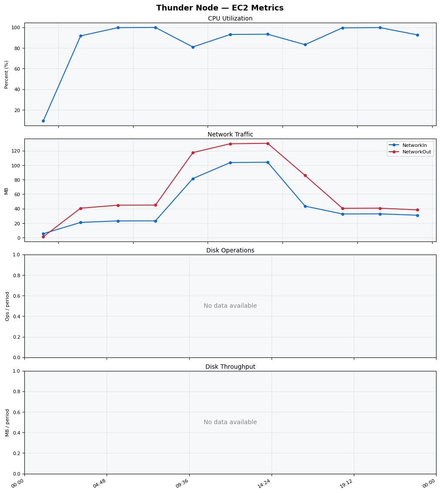
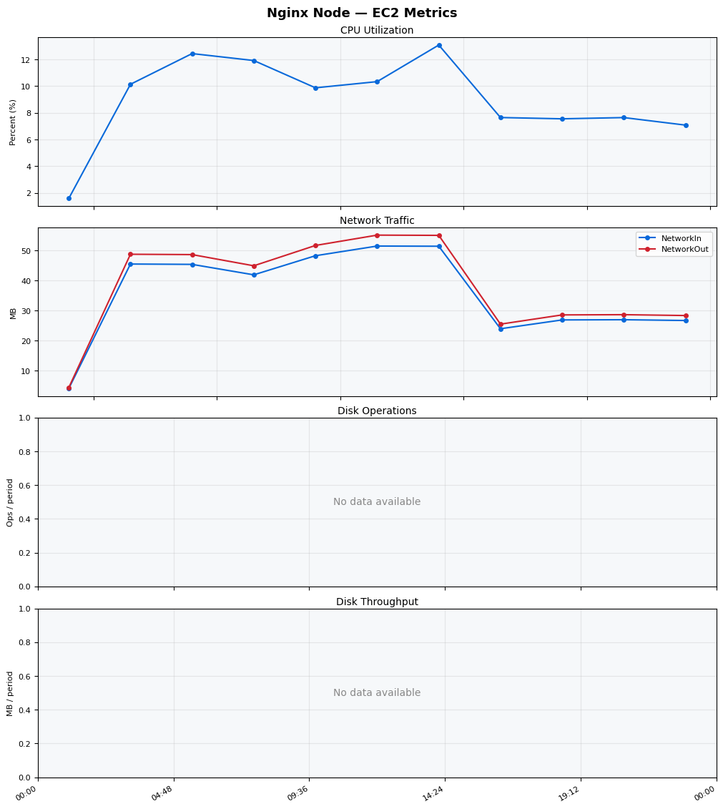
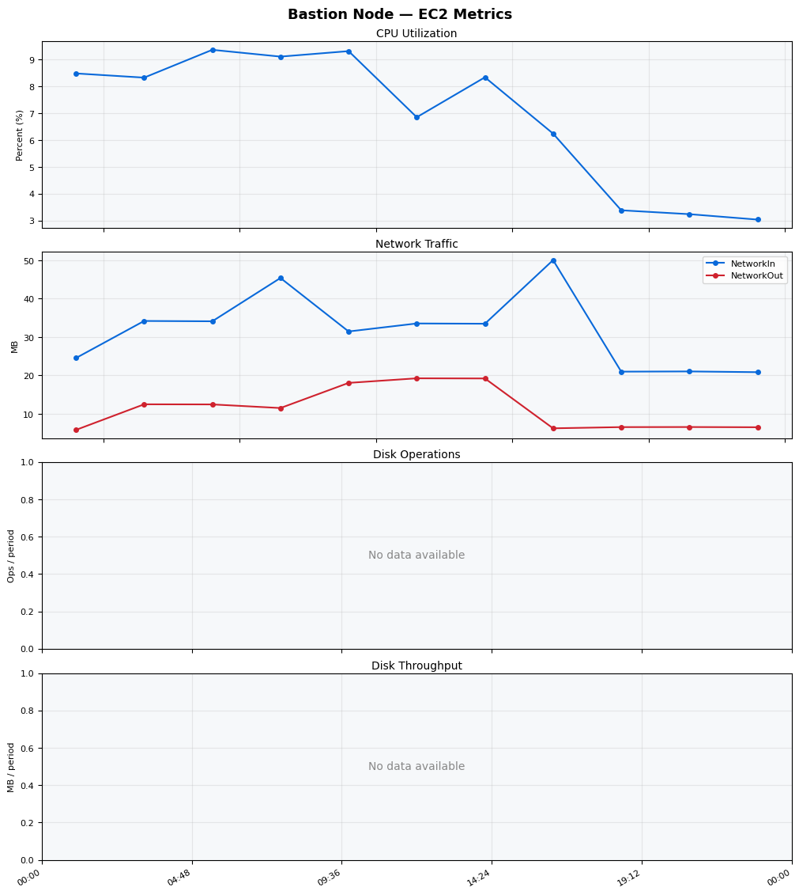
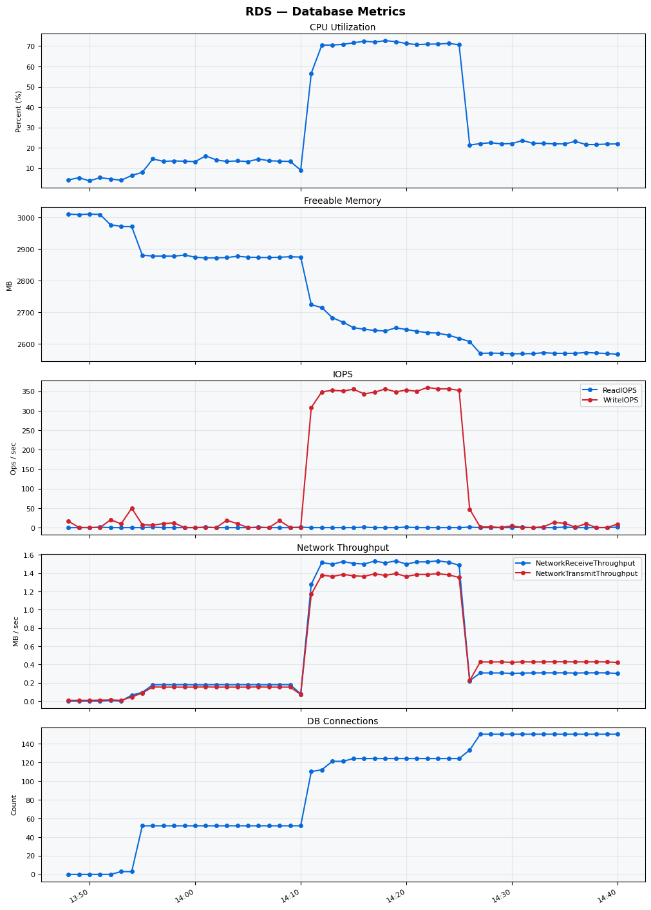

Build Number: 169

Build Date and Time: 2026-03-21--14-46-27

Thunder Pack URL: https://github.com/asgardeo/thunder/releases/download/v0.28.0/thunder-0.28.0-linux-x64.zip

Deployment Pattern: single-node

Thunder Instance Type: t3a.medium

Database Instance Type: db.t3.medium

Database Type: postgres

Concurrency: 50

Performance Repo: https://github.com/asgardeo/thunder-performance

Performance Repo Branch: improve-perf-tests

## Summary

| Scenario Name | Heap Size | Concurrent Users | Label | # Samples | Error % | Throughput (Requests/sec) | Average Response Time (ms) | 95th Percentile of Response Time (ms) |
| --- | --- | --- | --- | --- | --- | --- | --- | --- |
| Client Credentials Grant Type | N/A | 50 | 1 Get access token | 288619 | 0.00 | 480.81 | 102.82 | 138.00 |
| Authorization Code Grant Type | N/A | 50 | 1 Send request to authorize endpoint | 64544 | 0.00 | 107.59 | 110.34 | 146.00 |
| Authorization Code Grant Type | N/A | 50 | 2 Start Authentication Flow | 64548 | 0.00 | 107.60 | 74.07 | 102.00 |
| Authorization Code Grant Type | N/A | 50 | 3 Perform authentication | 64546 | 0.00 | 107.60 | 170.99 | 215.00 |
| Authorization Code Grant Type | N/A | 50 | 4 Obtain authorization code | 64554 | 0.00 | 107.61 | 51.36 | 74.00 |
| Authorization Code Grant Type | N/A | 50 | 5 Obtain access token | 64548 | 0.00 | 107.60 | 54.05 | 78.00 |
| User Authentication with Credentials | N/A | 50 | 1 Perform user authentication | 146868 | 0.00 | 244.79 | 203.72 | 250.00 |

## CloudWatch Metrics

### Thunder (EC2)

### Nginx (EC2)

### Bastion (EC2)

### RDS

