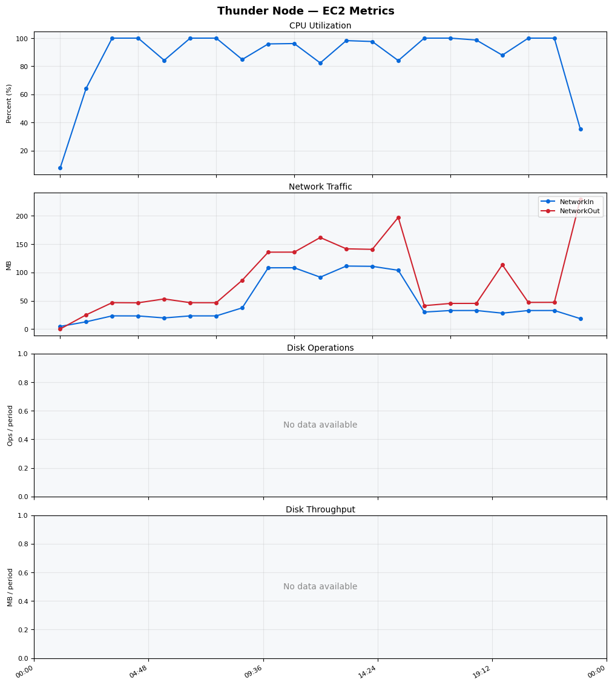
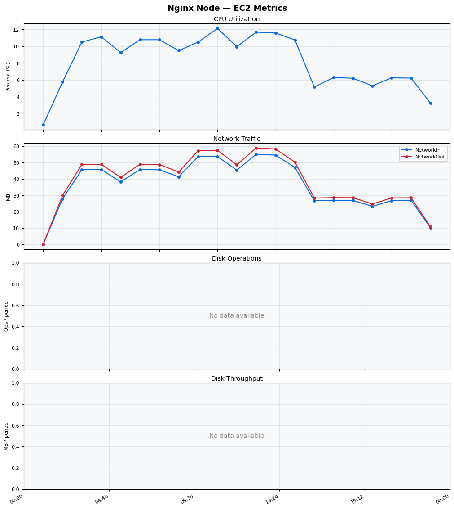
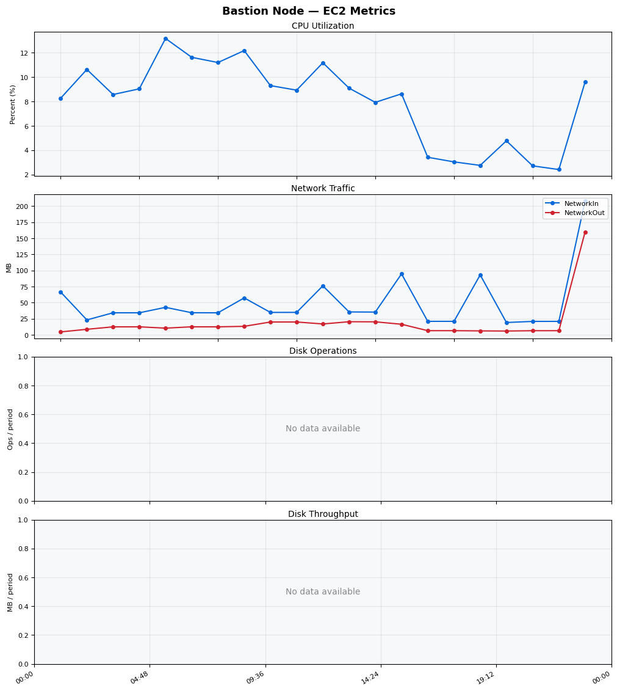
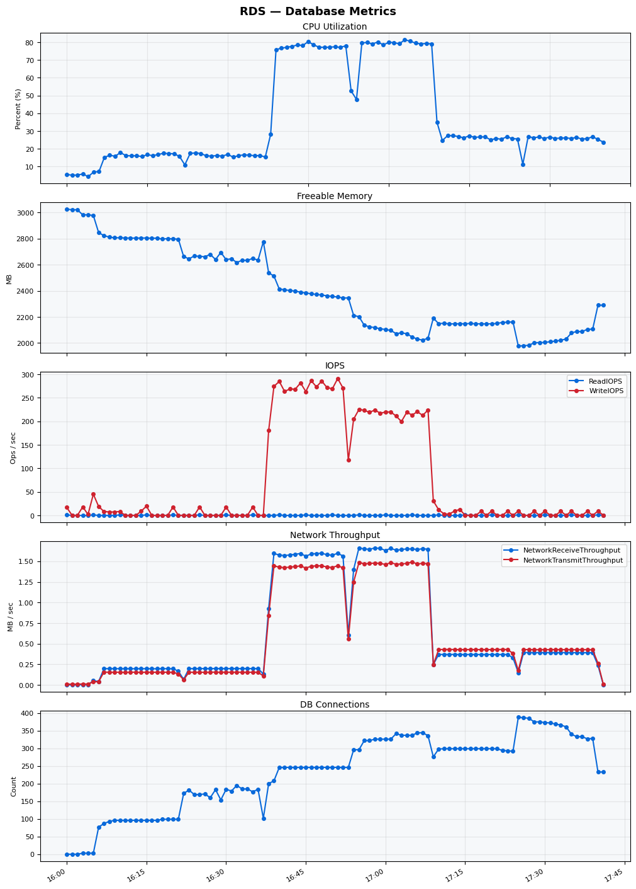

Build Number: 170

Build Date and Time: 2026-03-21--17-47-02

Thunder Pack URL: https://github.com/asgardeo/thunder/releases/download/v0.28.0/thunder-0.28.0-linux-x64.zip

Deployment Pattern: single-node

Thunder Instance Type: t3a.medium

Database Instance Type: db.t3.medium

Database Type: postgres

Concurrency: 100,200

Performance Repo: https://github.com/asgardeo/thunder-performance

Performance Repo Branch: improve-perf-tests

## Summary

| Scenario Name | Heap Size | Concurrent Users | Label | # Samples | Error % | Throughput (Requests/sec) | Average Response Time (ms) | 95th Percentile of Response Time (ms) |
| --- | --- | --- | --- | --- | --- | --- | --- | --- |
| Client Credentials Grant Type | N/A | 100 | 1 Get access token | 289963 | 0.00 | 482.65 | 205.98 | 261.00 |
| Client Credentials Grant Type | N/A | 200 | 1 Get access token | 290142 | 0.00 | 482.08 | 413.10 | 515.00 |
| Authorization Code Grant Type | N/A | 100 | 1 Send request to authorize endpoint | 67018 | 0.00 | 111.70 | 214.51 | 271.00 |
| Authorization Code Grant Type | N/A | 100 | 2 Start Authentication Flow | 67018 | 0.00 | 111.70 | 144.61 | 193.00 |
| Authorization Code Grant Type | N/A | 100 | 3 Perform authentication | 67023 | 0.00 | 111.72 | 327.99 | 399.00 |
| Authorization Code Grant Type | N/A | 100 | 4 Obtain authorization code | 67022 | 0.00 | 111.72 | 100.65 | 139.00 |
| Authorization Code Grant Type | N/A | 100 | 5 Obtain access token | 67023 | 0.00 | 111.72 | 103.49 | 143.00 |
| Authorization Code Grant Type | N/A | 200 | 1 Send request to authorize endpoint | 68127 | 0.00 | 113.53 | 427.08 | 523.00 |
| Authorization Code Grant Type | N/A | 200 | 2 Start Authentication Flow | 68123 | 0.00 | 113.54 | 287.15 | 367.00 |
| Authorization Code Grant Type | N/A | 200 | 3 Perform authentication | 68113 | 0.00 | 113.49 | 640.56 | 759.00 |
| Authorization Code Grant Type | N/A | 200 | 4 Obtain authorization code | 68124 | 0.00 | 113.55 | 199.85 | 263.00 |
| Authorization Code Grant Type | N/A | 200 | 5 Obtain access token | 68129 | 0.00 | 113.56 | 203.95 | 271.00 |
| User Authentication with Credentials | N/A | 100 | 1 Perform user authentication | 146837 | 0.00 | 244.65 | 408.60 | 473.00 |
| User Authentication with Credentials | N/A | 200 | 1 Perform user authentication | 146384 | 0.00 | 243.78 | 819.59 | 935.00 |

## CloudWatch Metrics

### Thunder (EC2)

### Nginx (EC2)

### Bastion (EC2)

### RDS

