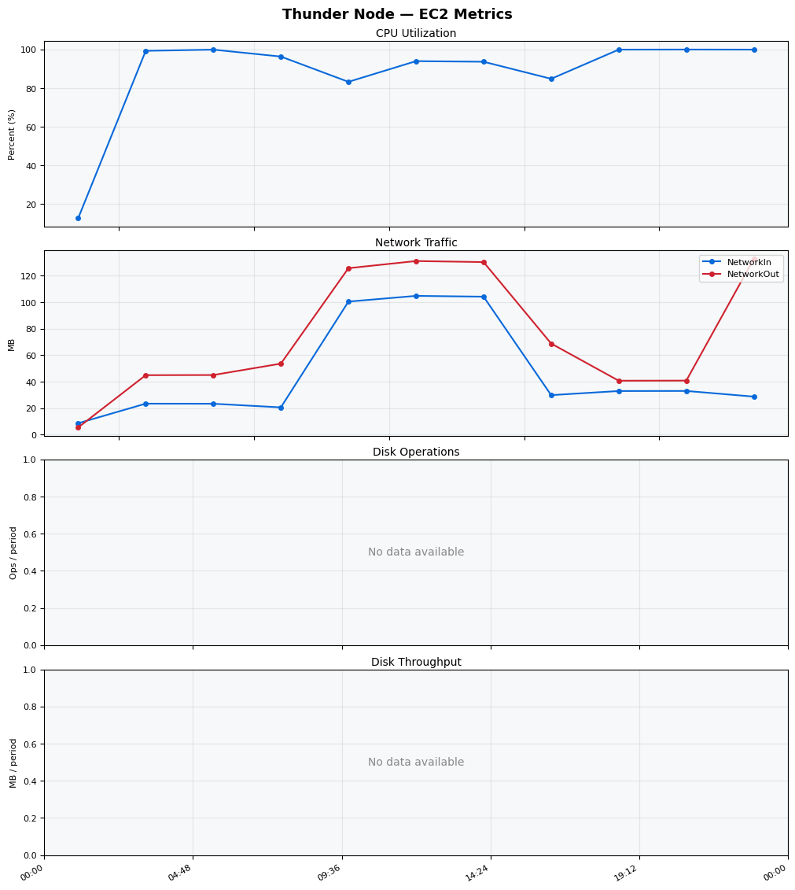
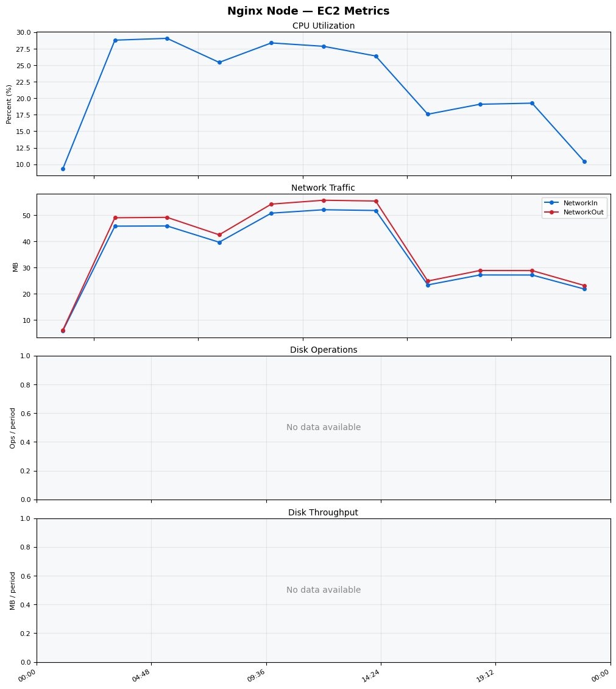
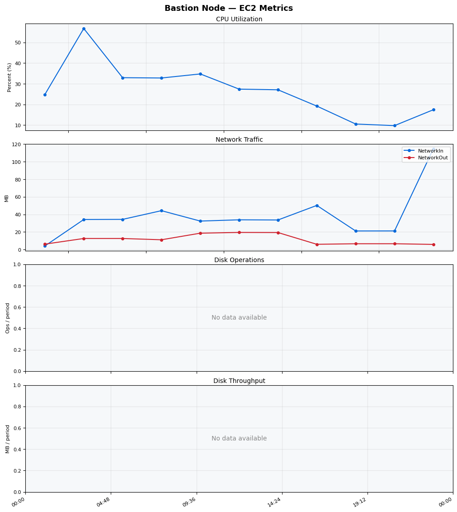
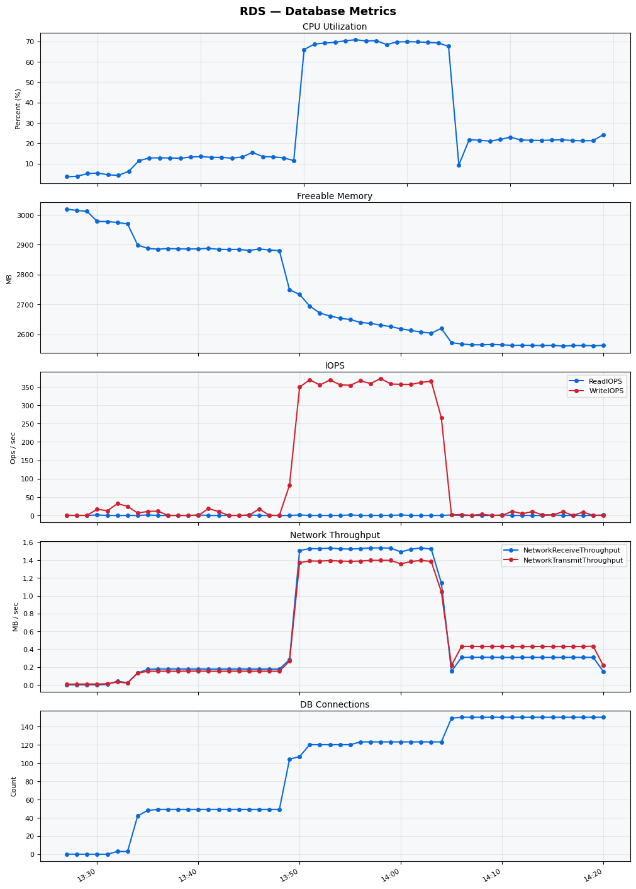

Build Number: 172

Build Date and Time: 2026-03-22--14-27-51

Thunder Pack URL: https://github.com/asgardeo/thunder/releases/download/v0.28.0/thunder-0.28.0-linux-x64.zip

Deployment Pattern: single-node

Thunder Instance Type: t3a.medium

Database Instance Type: db.t3.medium

Database Type: postgres

Concurrency: 50

Performance Repo: https://github.com/asgardeo/thunder-performance

Performance Repo Branch: improve-perf-tests

## Summary

| Scenario Name | Heap Size | Concurrent Users | Label | # Samples | Error % | Throughput (Requests/sec) | Average Response Time (ms) | 95th Percentile of Response Time (ms) |
| --- | --- | --- | --- | --- | --- | --- | --- | --- |
| Client Credentials Grant Type | N/A | 50 | 1 Get access token | 290112 | 0.00 | 483.20 | 101.79 | 136.00 |
| Authorization Code Grant Type | N/A | 50 | 1 Send request to authorize endpoint | 64954 | 0.00 | 108.27 | 109.29 | 140.00 |
| Authorization Code Grant Type | N/A | 50 | 2 Start Authentication Flow | 64958 | 0.00 | 108.28 | 73.79 | 99.00 |
| Authorization Code Grant Type | N/A | 50 | 3 Perform authentication | 64954 | 0.00 | 108.27 | 170.45 | 208.00 |
| Authorization Code Grant Type | N/A | 50 | 4 Obtain authorization code | 64951 | 0.00 | 108.27 | 50.96 | 72.00 |
| Authorization Code Grant Type | N/A | 50 | 5 Obtain access token | 64953 | 0.00 | 108.28 | 53.86 | 75.00 |
| User Authentication with Credentials | N/A | 50 | 1 Perform user authentication | 147811 | 0.00 | 246.35 | 202.54 | 248.00 |

## CloudWatch Metrics

### Thunder (EC2)

### Nginx (EC2)

### Bastion (EC2)

### RDS

