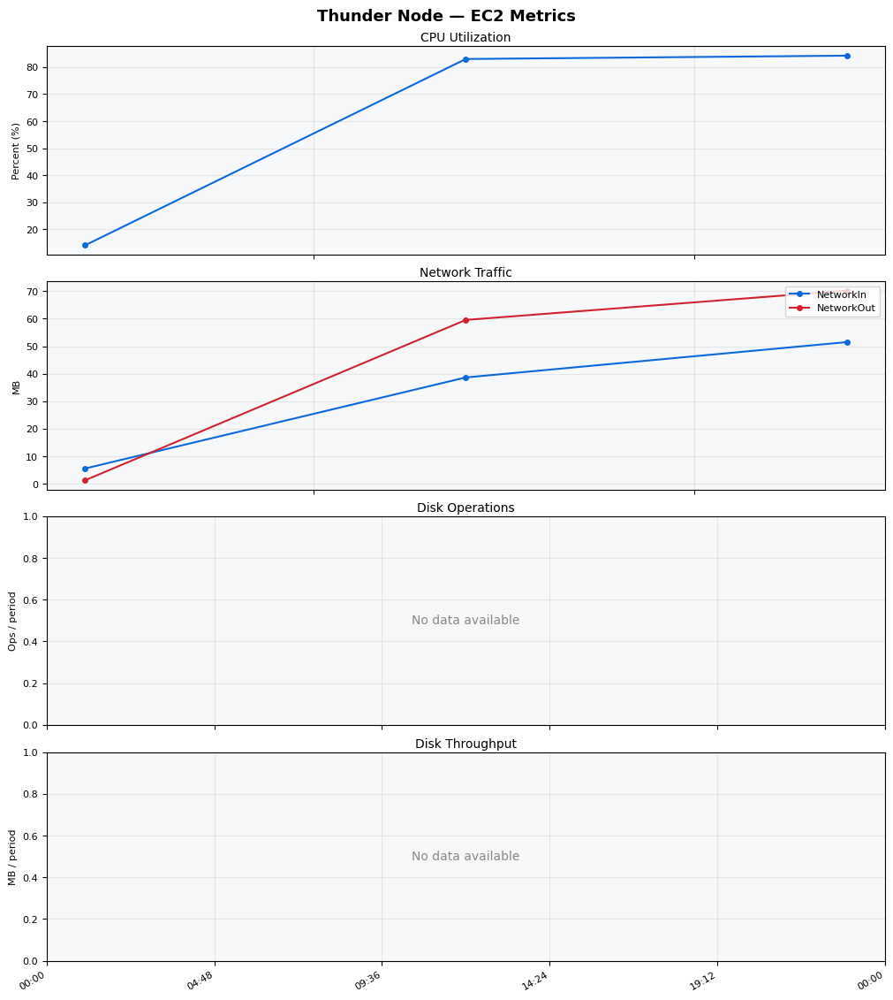
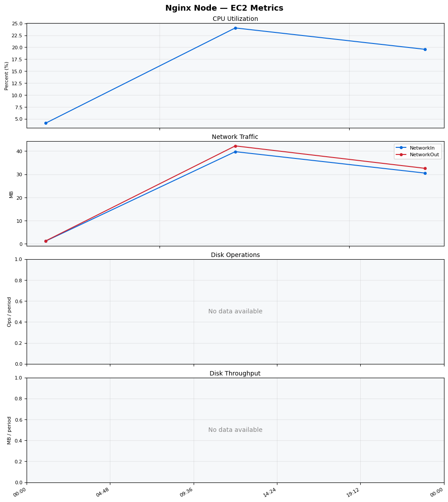
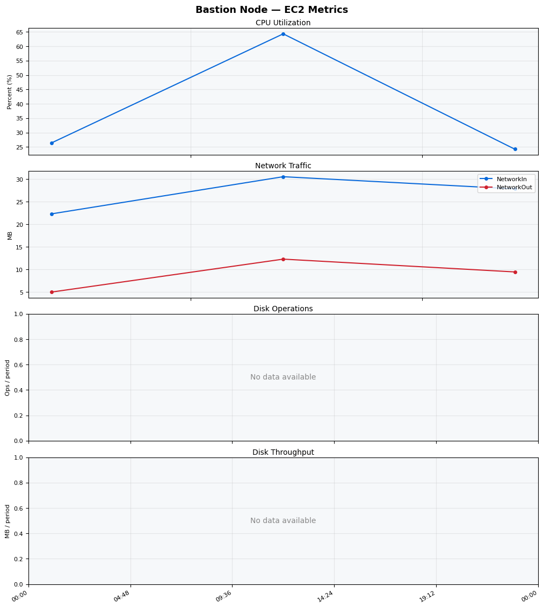
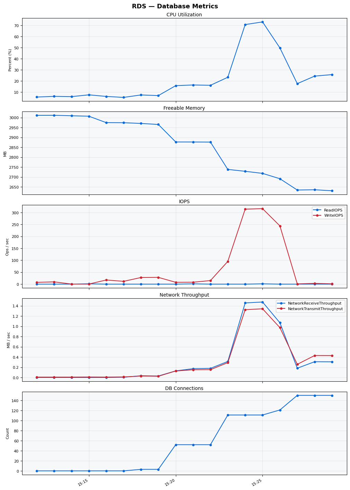

Build Number: 173

Build Date and Time: 2026-03-22--15-34-51

Thunder Pack URL: https://github.com/asgardeo/thunder/releases/download/v0.28.0/thunder-0.28.0-linux-x64.zip

Deployment Pattern: single-node

Thunder Instance Type: t3a.medium

Database Instance Type: db.t3.medium

Database Type: postgres

Concurrency: 50

Performance Repo: https://github.com/asgardeo/thunder-performance

Performance Repo Branch: improve-perf-tests

## Summary

| Scenario Name | Heap Size | Concurrent Users | Label | # Samples | Error % | Throughput (Requests/sec) | Average Response Time (ms) | 95th Percentile of Response Time (ms) |
| --- | --- | --- | --- | --- | --- | --- | --- | --- |
| Client Credentials Grant Type | N/A | 50 | 1 Get access token | 29100 | 0.00 | 481.74 | 102.18 | 137.00 |
| Authorization Code Grant Type | N/A | 50 | 1 Send request to authorize endpoint | 6281 | 0.00 | 104.87 | 113.74 | 154.00 |
| Authorization Code Grant Type | N/A | 50 | 2 Start Authentication Flow | 6291 | 0.00 | 105.08 | 75.99 | 110.00 |
| Authorization Code Grant Type | N/A | 50 | 3 Perform authentication | 6289 | 0.00 | 105.01 | 174.26 | 228.00 |
| Authorization Code Grant Type | N/A | 50 | 4 Obtain authorization code | 6282 | 0.00 | 104.96 | 52.78 | 78.00 |
| Authorization Code Grant Type | N/A | 50 | 5 Obtain access token | 6284 | 0.00 | 104.97 | 55.52 | 82.00 |
| User Authentication with Credentials | N/A | 50 | 1 Perform user authentication | 14641 | 0.00 | 244.07 | 203.82 | 251.00 |

## CloudWatch Metrics

### Thunder (EC2)

### Nginx (EC2)

### Bastion (EC2)

### RDS

