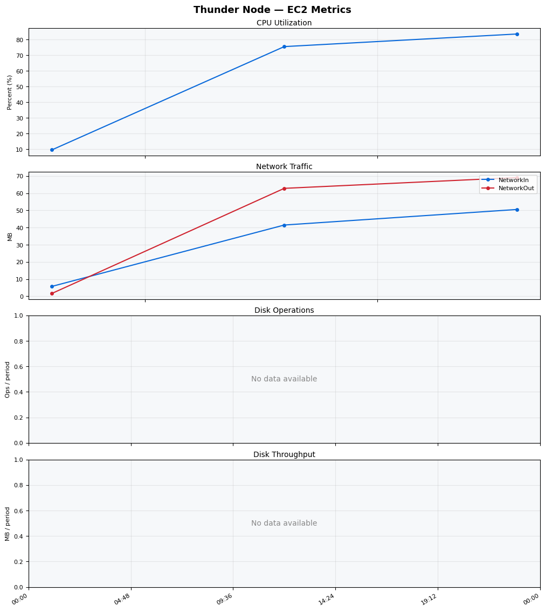
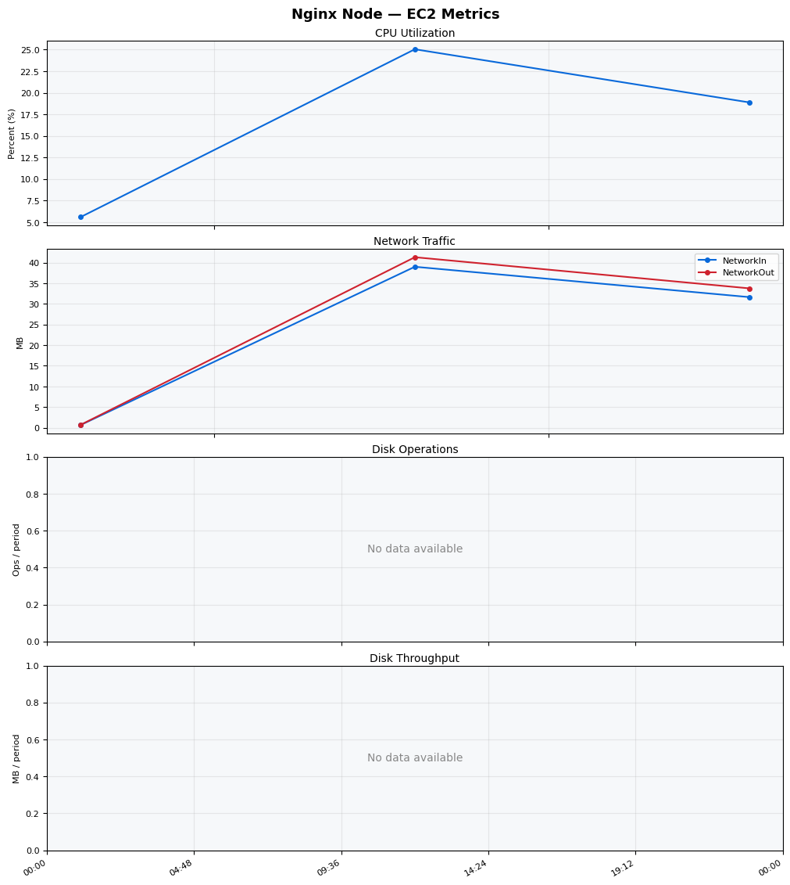
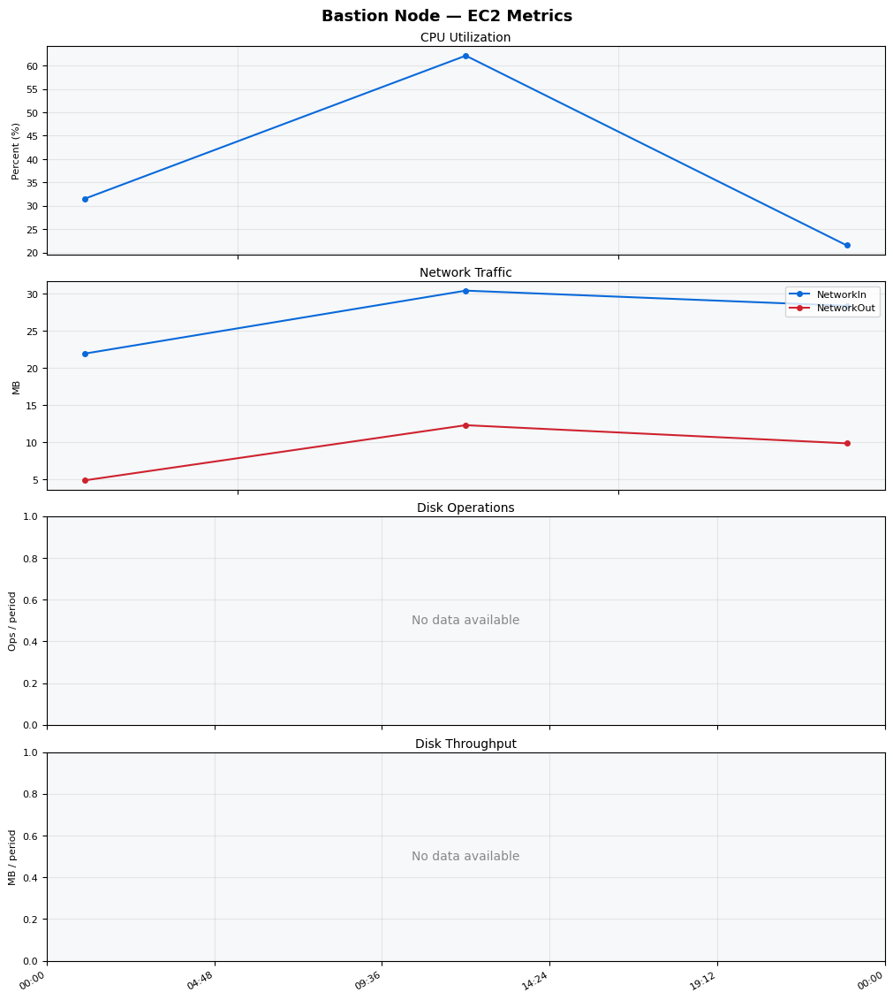
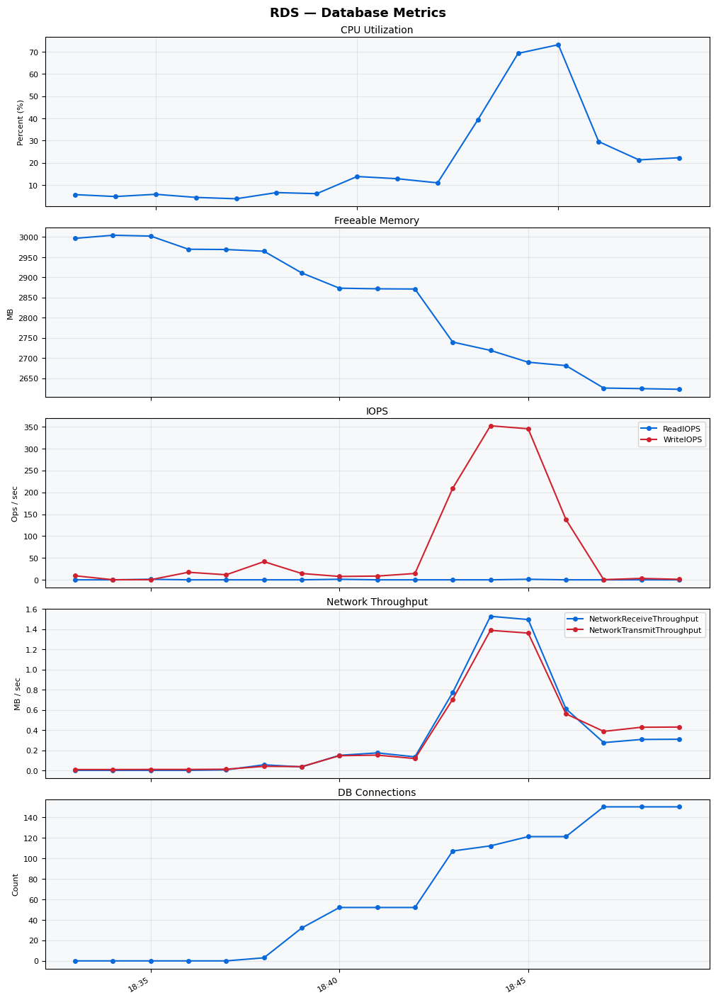

Build Number: 174

Build Date and Time: 2026-03-22--18-54-42

Thunder Pack URL: https://github.com/asgardeo/thunder/releases/download/v0.28.0/thunder-0.28.0-linux-x64.zip

Deployment Pattern: single-node

Thunder Instance Type: t3a.medium

Nginx Instance Type: t2.nano

Bastion Instance Type: t3a.large

Database Instance Type: db.t3.medium

Database Type: postgres

Concurrency: 50

Thunder Instance ID: i-047cc466906c19995

Nginx Instance ID: i-0e702c1202481a1a6

Bastion Instance ID: i-0e8f4e4efeaef80da

RDS Instance ID: wso2thunderdbinstance12637

Performance Repo: https://github.com/asgardeo/thunder-performance

Performance Repo Branch: improve-perf-tests

## Summary

| Scenario Name | Heap Size | Concurrent Users | Label | # Samples | Error % | Throughput (Requests/sec) | Average Response Time (ms) | 95th Percentile of Response Time (ms) |
| --- | --- | --- | --- | --- | --- | --- | --- | --- |
| Client Credentials Grant Type | N/A | 50 | 1 Get access token | 29098 | 0.00 | 481.06 | 101.80 | 138.00 |
| Authorization Code Grant Type | N/A | 50 | 1 Send request to authorize endpoint | 6418 | 0.00 | 107.18 | 110.26 | 147.00 |
| Authorization Code Grant Type | N/A | 50 | 2 Start Authentication Flow | 6419 | 0.00 | 107.24 | 74.52 | 104.00 |
| Authorization Code Grant Type | N/A | 50 | 3 Perform authentication | 6421 | 0.00 | 107.22 | 171.35 | 221.00 |
| Authorization Code Grant Type | N/A | 50 | 4 Obtain authorization code | 6419 | 0.00 | 107.23 | 51.92 | 77.00 |
| Authorization Code Grant Type | N/A | 50 | 5 Obtain access token | 6416 | 0.00 | 107.17 | 54.51 | 79.00 |
| User Authentication with Credentials | N/A | 50 | 1 Perform user authentication | 14705 | 0.00 | 245.12 | 202.96 | 248.00 |

## CloudWatch Metrics

### Thunder (EC2)

### Nginx (EC2)

### Bastion (EC2)

### RDS

