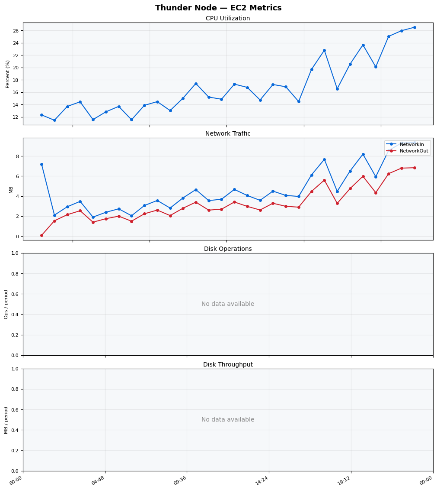
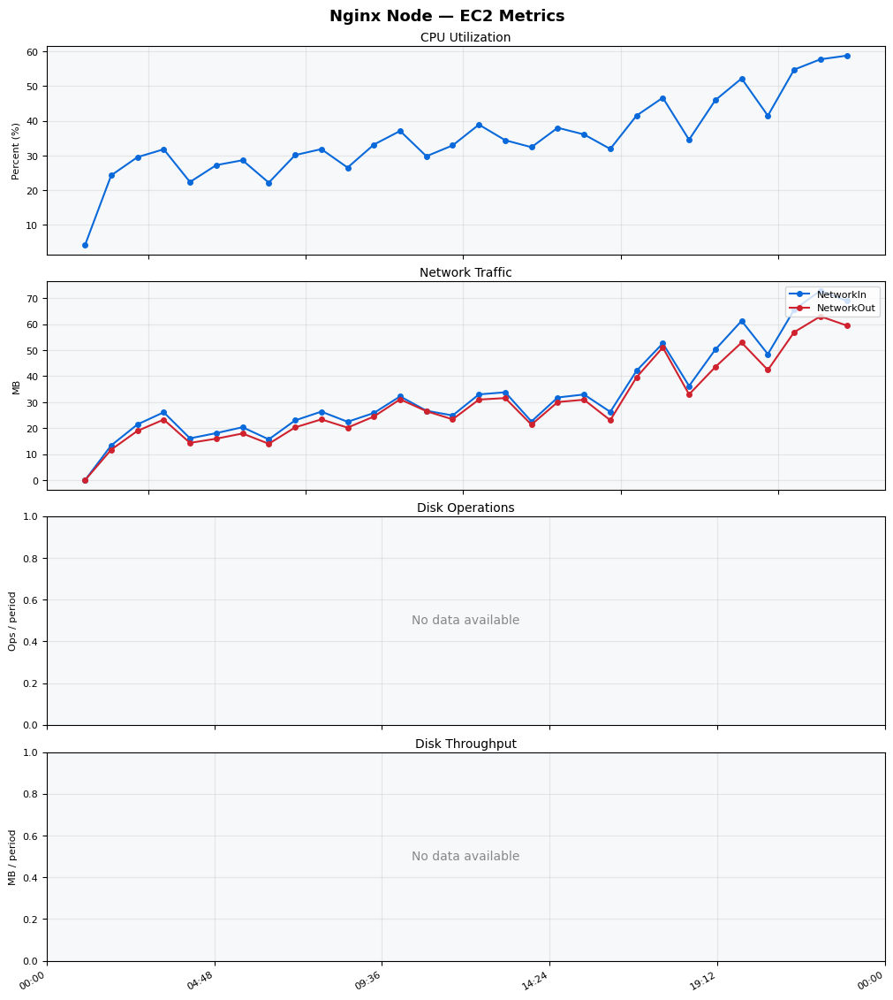
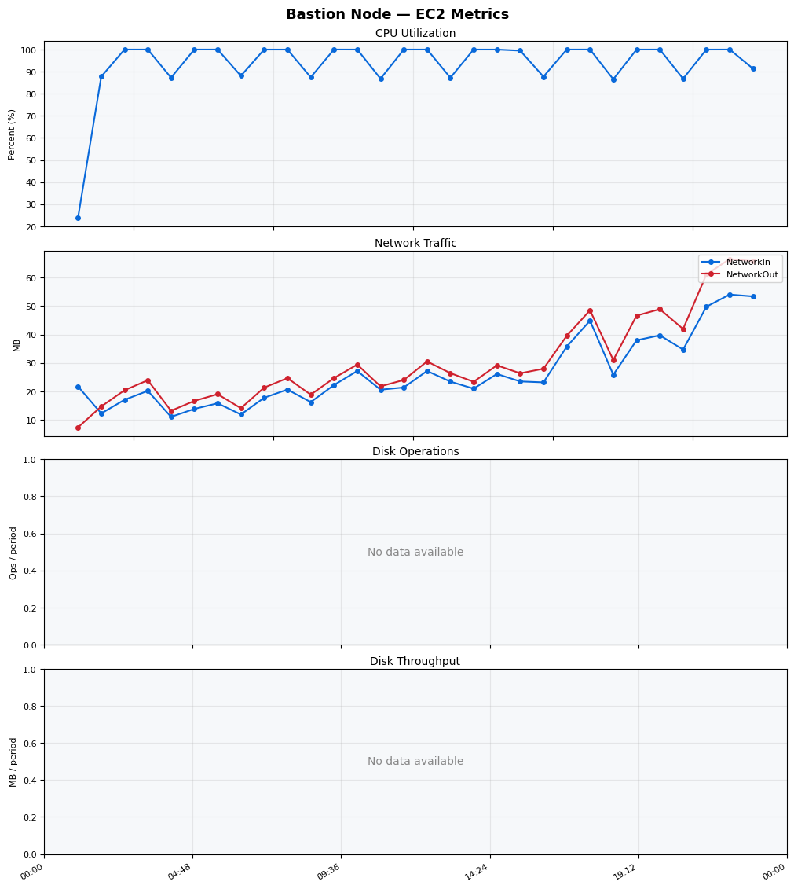
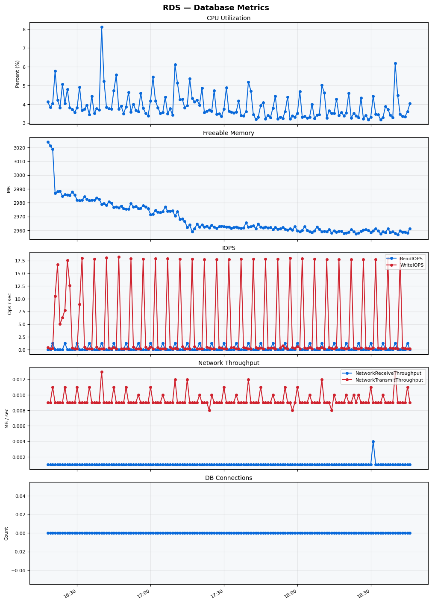

Build Number: 206

Build Date and Time: 2026-04-17--18-51-20

Thunder Pack URL: https://github.com/asgardeo/thunder/releases/download/v0.34.0/thunder-0.34.0-linux-x64.zip

Deployment Pattern: single-node

Thunder Instance Type: t2.nano

Nginx Instance Type: t2.nano

Bastion Instance Type: t3a.large

Database Instance Type: db.t3.medium

Database Type: postgres

Concurrency: 50,200,500

Thunder Instance ID: i-09daab6e46d5bc711

Nginx Instance ID: i-056c44103b7cc4852

Bastion Instance ID: i-0a2ca49b03cc676f4

RDS Instance ID: wso2thunderdbinstance32676

Performance Repo: https://github.com/asgardeo/thunder-performance

Pipeline Definition Branch: main

Checkout Ref (code under test): main

## Summary

| Scenario Name | Heap Size | Concurrent Users | Label | # Samples | Error % | Throughput (Requests/sec) | Average Response Time (ms) | 95th Percentile of Response Time (ms) |
| --- | --- | --- | --- | --- | --- | --- | --- | --- |
| Client Credentials Grant Type | N/A | 50 | 1 Get access token | 456940 | 100.00 | 761.06 | 22.87 | 57.00 |
| Client Credentials Grant Type | N/A | 200 | 1 Get access token | 373943 | 100.00 | 621.11 | 93.49 | 182.00 |
| Client Credentials Grant Type | N/A | 500 | 1 Get access token | 500209 | 100.00 | 827.07 | 76.08 | 194.00 |
| Authorization Code Grant Type | N/A | 50 | 1 Send request to authorize endpoint | 132739 | 100.00 | 221.30 | 42.21 | 96.00 |
| Authorization Code Grant Type | N/A | 50 | 2 Start Authentication Flow | 132742 | 100.00 | 221.31 | 36.68 | 49.00 |
| Authorization Code Grant Type | N/A | 50 | 3 Perform authentication | 132739 | 100.00 | 221.31 | 36.61 | 49.00 |
| Authorization Code Grant Type | N/A | 50 | 4 Obtain authorization code | 132743 | 100.00 | 221.31 | 37.09 | 50.00 |
| Authorization Code Grant Type | N/A | 50 | 5 Obtain access token | 132744 | 100.00 | 221.31 | 43.47 | 57.00 |
| Authorization Code Grant Type | N/A | 200 | 1 Send request to authorize endpoint | 136087 | 100.00 | 226.87 | 96.04 | 204.00 |
| Authorization Code Grant Type | N/A | 200 | 2 Start Authentication Flow | 136075 | 100.00 | 226.87 | 84.45 | 150.00 |
| Authorization Code Grant Type | N/A | 200 | 3 Perform authentication | 136056 | 100.00 | 226.84 | 84.50 | 149.00 |
| Authorization Code Grant Type | N/A | 200 | 4 Obtain authorization code | 136049 | 100.00 | 226.83 | 85.51 | 152.00 |
| Authorization Code Grant Type | N/A | 200 | 5 Obtain access token | 136036 | 100.00 | 226.81 | 105.77 | 177.00 |
| Authorization Code Grant Type | N/A | 500 | 1 Send request to authorize endpoint | 127219 | 100.00 | 211.92 | 71.03 | 155.00 |
| Authorization Code Grant Type | N/A | 500 | 2 Start Authentication Flow | 127065 | 100.00 | 211.63 | 64.04 | 119.00 |
| Authorization Code Grant Type | N/A | 500 | 3 Perform authentication | 127122 | 100.00 | 211.73 | 64.65 | 119.00 |
| Authorization Code Grant Type | N/A | 500 | 4 Obtain authorization code | 127143 | 100.00 | 211.77 | 65.40 | 123.00 |
| Authorization Code Grant Type | N/A | 500 | 5 Obtain access token | 127170 | 100.00 | 211.81 | 107.43 | 143.00 |
| User Authentication with Credentials | N/A | 50 | 1 Perform user authentication | 988557 | 100.00 | 1648.04 | 28.99 | 39.00 |
| User Authentication with Credentials | N/A | 200 | 1 Perform user authentication | 1088340 | 100.00 | 1814.46 | 96.63 | 158.00 |
| User Authentication with Credentials | N/A | 500 | 1 Perform user authentication | 1301595 | 100.00 | 2169.50 | 115.80 | 207.00 |

## CloudWatch Metrics

### Thunder (EC2)

### Nginx (EC2)

### Bastion (EC2)

### RDS

