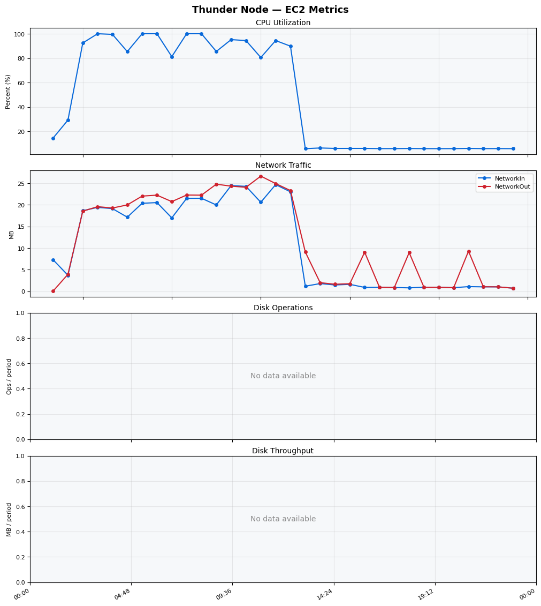
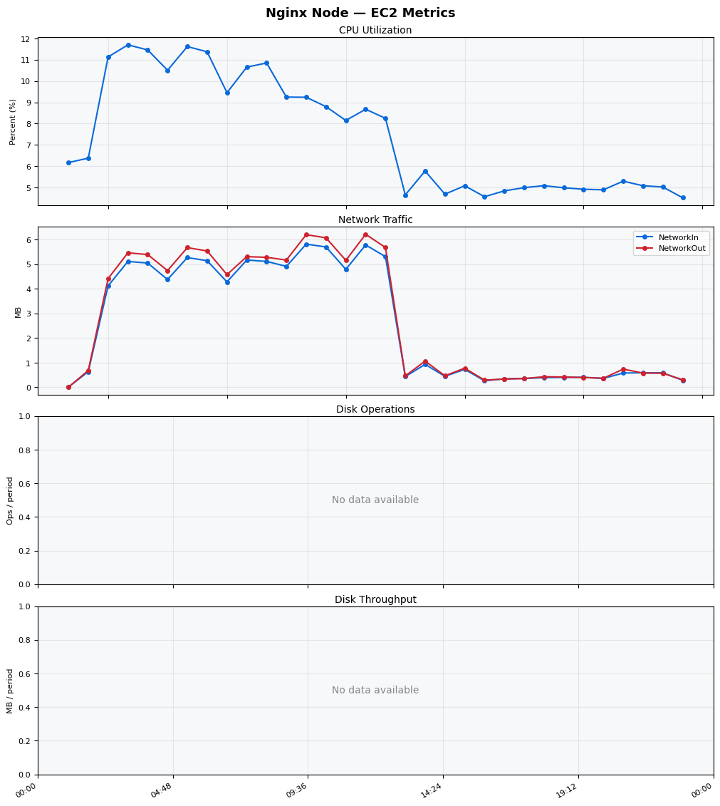
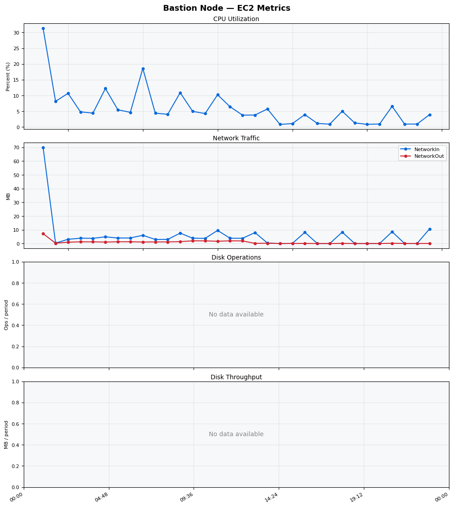
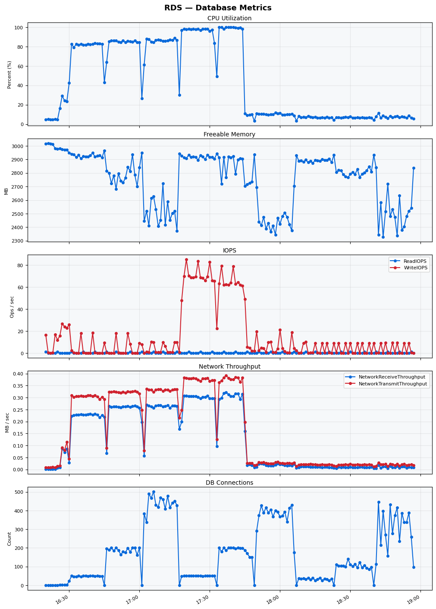

Build Number: 212

Build Date and Time: 2026-04-30--19-02-28

Thunder Pack URL: https://github.com/asgardeo/thunder/releases/download/v0.36.0/thunder-0.36.0-linux-x64.zip

Deployment Pattern: single-node

Thunder Instance Type: t2.nano

Nginx Instance Type: t2.nano

Bastion Instance Type: t3a.large

Database Instance Type: db.t3.medium

Database Type: postgres

Concurrency: 50,200,500

Thunder Instance ID: i-07d494651e4a17257

Nginx Instance ID: i-072a72823f60afbc5

Bastion Instance ID: i-00879ade3bb91a0a1

RDS Instance ID: wso2thunderdbinstance20835

Performance Repo: https://github.com/asgardeo/thunder-performance

Pipeline Definition Branch: main

Checkout Ref (code under test): main

## Summary

| Scenario Name | Heap Size | Concurrent Users | Label | # Samples | Error % | Throughput (Requests/sec) | Average Response Time (ms) | 95th Percentile of Response Time (ms) |
| --- | --- | --- | --- | --- | --- | --- | --- | --- |
| Client Credentials Grant Type | N/A | 50 | 1 Get access token | 30080 | 0.00 | 50.02 | 997.23 | 1175.00 |
| Client Credentials Grant Type | N/A | 200 | 1 Get access token | 31125 | 0.00 | 51.58 | 3858.21 | 4255.00 |
| Client Credentials Grant Type | N/A | 500 | 1 Get access token | 30063 | 28.19 | 49.42 | 9992.37 | 11903.00 |
| Authorization Code Grant Type | N/A | 50 | 1 Send request to authorize endpoint | 6431 | 0.00 | 10.72 | 1314.35 | 1599.00 |
| Authorization Code Grant Type | N/A | 50 | 2 Start Authentication Flow | 6432 | 0.00 | 10.72 | 436.88 | 555.00 |
| Authorization Code Grant Type | N/A | 50 | 3 Perform authentication | 6437 | 0.00 | 10.72 | 1384.74 | 1663.00 |
| Authorization Code Grant Type | N/A | 50 | 4 Obtain authorization code | 6439 | 0.00 | 10.73 | 625.40 | 775.00 |
| Authorization Code Grant Type | N/A | 50 | 5 Obtain access token | 6438 | 0.00 | 10.73 | 896.55 | 1087.00 |
| Authorization Code Grant Type | N/A | 200 | 1 Send request to authorize endpoint | 4354 | 4.80 | 6.95 | 9187.31 | 7295.00 |
| Authorization Code Grant Type | N/A | 200 | 2 Start Authentication Flow | 4363 | 3.90 | 7.14 | 2318.28 | 2207.00 |
| Authorization Code Grant Type | N/A | 200 | 3 Perform authentication | 4367 | 4.60 | 7.10 | 6607.59 | 7999.00 |
| Authorization Code Grant Type | N/A | 200 | 4 Obtain authorization code | 4374 | 5.12 | 7.13 | 3583.51 | 12927.00 |
| Authorization Code Grant Type | N/A | 200 | 5 Obtain access token | 4392 | 5.19 | 7.03 | 6314.11 | 31743.00 |
| Authorization Code Grant Type | N/A | 500 | 1 Send request to authorize endpoint | 738 | 100.00 | 1.08 | 174117.68 | 209919.00 |
| Authorization Code Grant Type | N/A | 500 | 2 Start Authentication Flow | 506 | 100.00 | 0.91 | 39870.61 | 49151.00 |
| Authorization Code Grant Type | N/A | 500 | 3 Perform authentication | 502 | 100.00 | 0.84 | 41204.65 | 49407.00 |
| Authorization Code Grant Type | N/A | 500 | 4 Obtain authorization code | 504 | 100.00 | 0.81 | 42760.19 | 53503.00 |
| Authorization Code Grant Type | N/A | 500 | 5 Obtain access token | 588 | 100.00 | 0.86 | 158229.01 | 184319.00 |
| User Authentication with Credentials | N/A | 50 | 1 Perform user authentication | 1864 | 97.96 | 3.06 | 15947.55 | 21375.00 |
| User Authentication with Credentials | N/A | 200 | 1 Perform user authentication | 1972 | 100.00 | 3.09 | 59729.69 | 70143.00 |
| User Authentication with Credentials | N/A | 500 | 1 Perform user authentication | 2510 | 100.00 | 3.62 | 119389.58 | 172031.00 |

## CloudWatch Metrics

### Thunder (EC2)

### Nginx (EC2)

### Bastion (EC2)

### RDS

