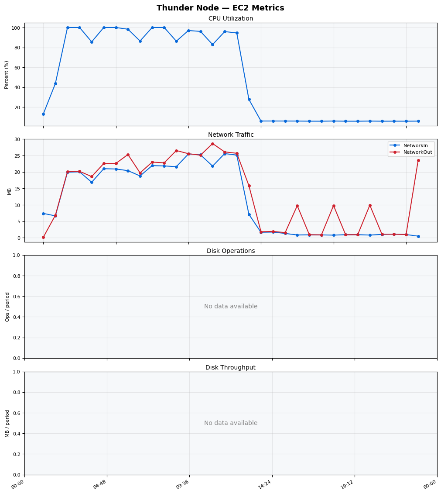
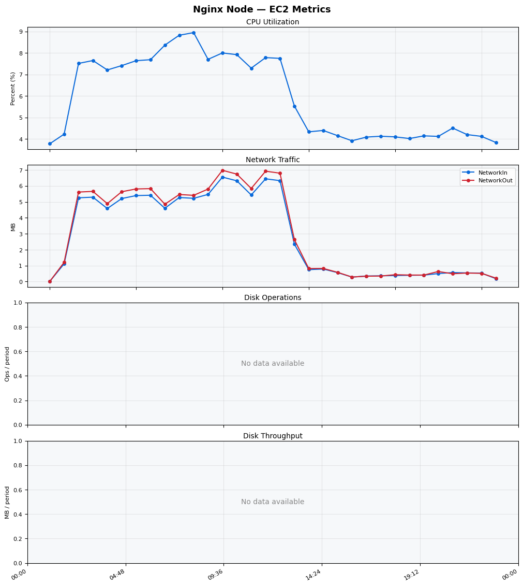
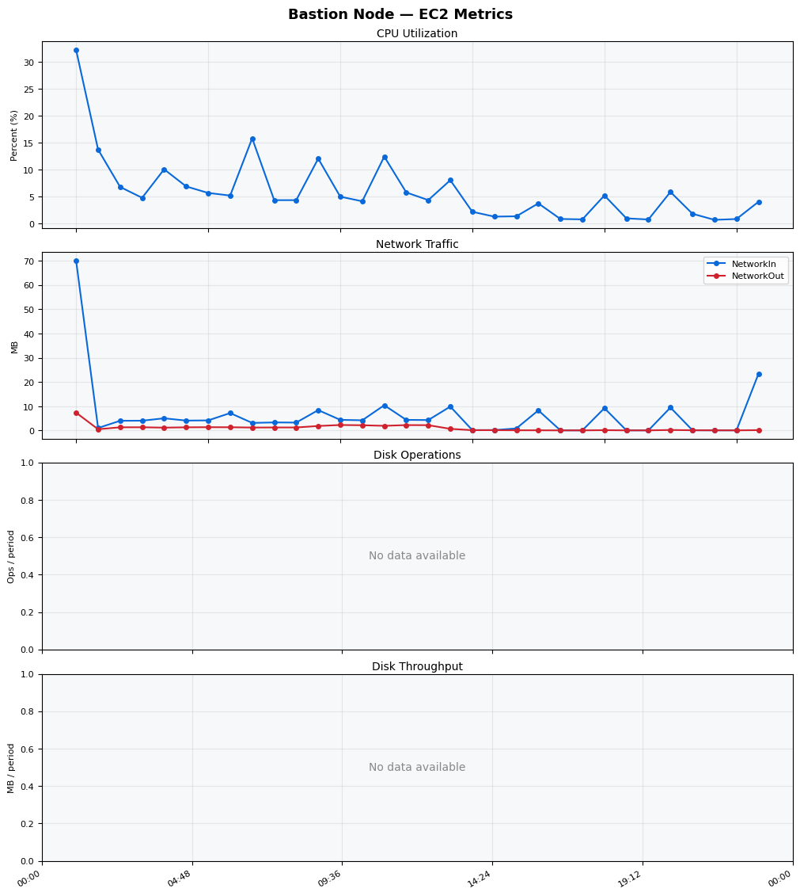
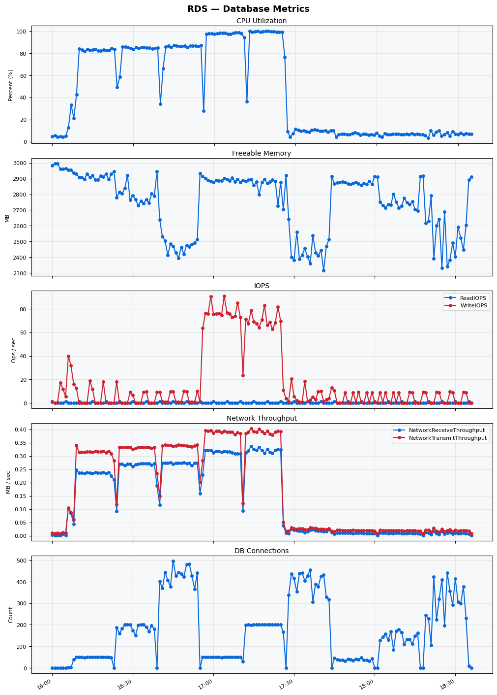

Build Number: 218

Build Date and Time: 2026-05-08--18-40-48

Thunder Pack URL: https://github.com/asgardeo/thunder/releases/download/v0.37.0/thunderid-0.37.0-linux-x64.zip

Deployment Pattern: single-node

Thunder Instance Type: t2.nano

Nginx Instance Type: t2.nano

Bastion Instance Type: t3a.large

Database Instance Type: db.t3.medium

Database Type: postgres

Concurrency: 50,200,500

Thunder Instance ID: i-092cfccbb7d16a265

Nginx Instance ID: i-008714c557dff0707

Bastion Instance ID: i-0524b57091ea2eb58

RDS Instance ID: wso2thunderdbinstance17951

Performance Repo: https://github.com/asgardeo/thunder-performance

Pipeline Definition Branch: main

Checkout Ref (code under test): main

## Summary

| Scenario Name | Heap Size | Concurrent Users | Label | # Samples | Error % | Throughput (Requests/sec) | Average Response Time (ms) | 95th Percentile of Response Time (ms) |
| --- | --- | --- | --- | --- | --- | --- | --- | --- |
| Client Credentials Grant Type | N/A | 50 | 1 Get access token | 31214 | 0.00 | 51.95 | 960.52 | 1111.00 |
| Client Credentials Grant Type | N/A | 200 | 1 Get access token | 32030 | 0.00 | 53.05 | 3751.98 | 4063.00 |
| Client Credentials Grant Type | N/A | 500 | 1 Get access token | 30751 | 23.50 | 50.56 | 9767.15 | 11775.00 |
| Authorization Code Grant Type | N/A | 50 | 1 Send request to authorize endpoint | 7217 | 0.00 | 12.02 | 904.53 | 1255.00 |
| Authorization Code Grant Type | N/A | 50 | 2 Start Authentication Flow | 7224 | 0.00 | 12.04 | 428.73 | 539.00 |
| Authorization Code Grant Type | N/A | 50 | 3 Perform authentication | 7222 | 0.00 | 12.03 | 1338.12 | 1591.00 |
| Authorization Code Grant Type | N/A | 50 | 4 Obtain authorization code | 7229 | 0.00 | 12.04 | 607.33 | 743.00 |
| Authorization Code Grant Type | N/A | 50 | 5 Obtain access token | 7225 | 0.00 | 12.04 | 870.72 | 1047.00 |
| Authorization Code Grant Type | N/A | 200 | 1 Send request to authorize endpoint | 6639 | 1.05 | 10.57 | 3974.25 | 3743.00 |
| Authorization Code Grant Type | N/A | 200 | 2 Start Authentication Flow | 6584 | 0.32 | 11.35 | 1790.35 | 2079.00 |
| Authorization Code Grant Type | N/A | 200 | 3 Perform authentication | 6600 | 0.85 | 10.52 | 5843.98 | 6207.00 |
| Authorization Code Grant Type | N/A | 200 | 4 Obtain authorization code | 6632 | 0.75 | 10.66 | 2713.25 | 2863.00 |
| Authorization Code Grant Type | N/A | 200 | 5 Obtain access token | 6650 | 1.68 | 10.60 | 4271.24 | 4063.00 |
| Authorization Code Grant Type | N/A | 500 | 1 Send request to authorize endpoint | 940 | 100.00 | 1.47 | 112775.11 | 157695.00 |
| Authorization Code Grant Type | N/A | 500 | 2 Start Authentication Flow | 648 | 100.00 | 1.07 | 39372.69 | 53247.00 |
| Authorization Code Grant Type | N/A | 500 | 3 Perform authentication | 582 | 100.00 | 1.01 | 39994.12 | 50175.00 |
| Authorization Code Grant Type | N/A | 500 | 4 Obtain authorization code | 529 | 100.00 | 1.02 | 40863.76 | 50175.00 |
| Authorization Code Grant Type | N/A | 500 | 5 Obtain access token | 514 | 100.00 | 0.81 | 166155.89 | 190463.00 |
| User Authentication with Credentials | N/A | 50 | 1 Perform user authentication | 1845 | 98.10 | 3.01 | 16155.92 | 21631.00 |
| User Authentication with Credentials | N/A | 200 | 1 Perform user authentication | 1970 | 100.00 | 3.07 | 60163.49 | 70655.00 |
| User Authentication with Credentials | N/A | 500 | 1 Perform user authentication | 2383 | 100.00 | 3.39 | 126544.65 | 175103.00 |

## CloudWatch Metrics

### Thunder (EC2)

### Nginx (EC2)

### Bastion (EC2)

### RDS

