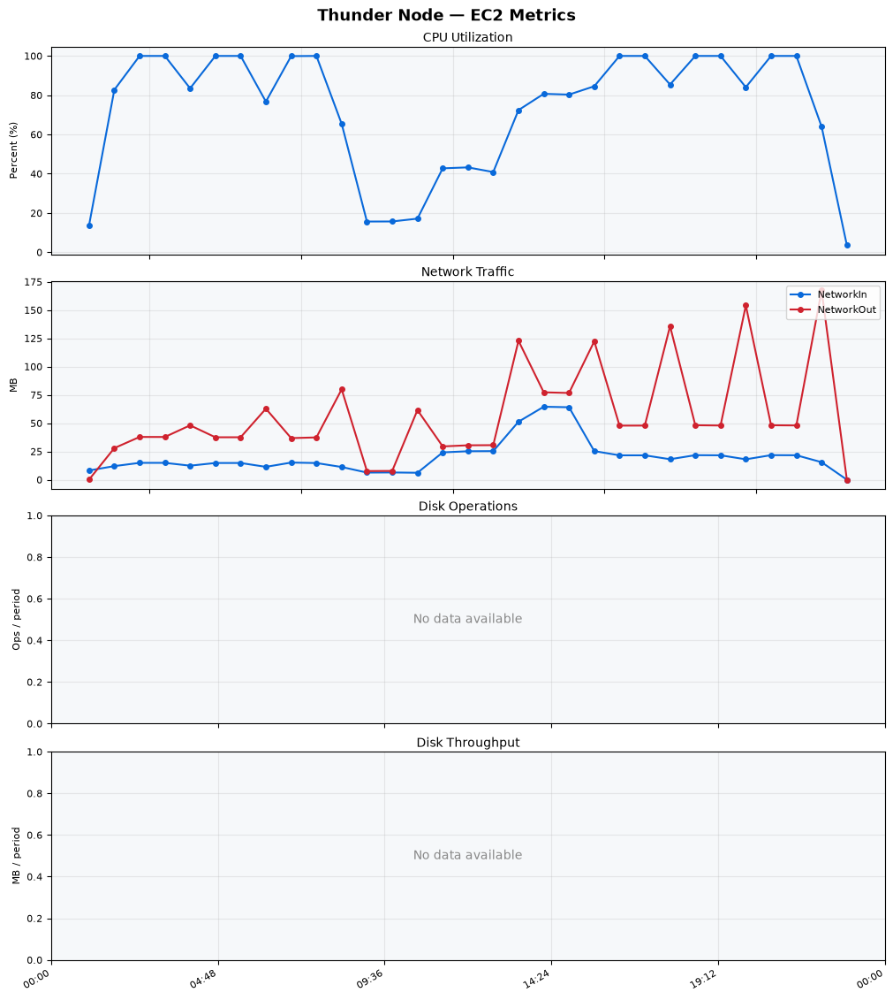
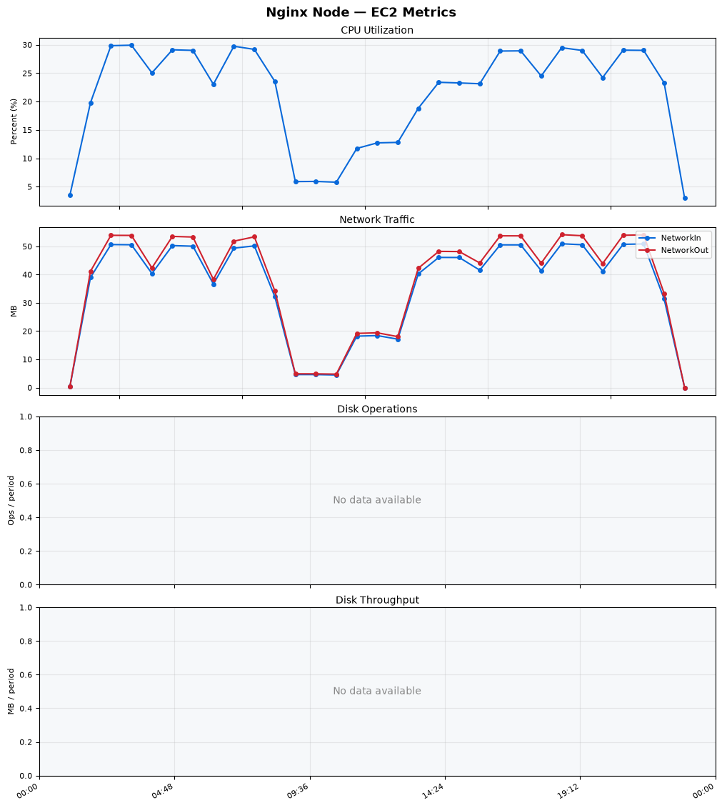
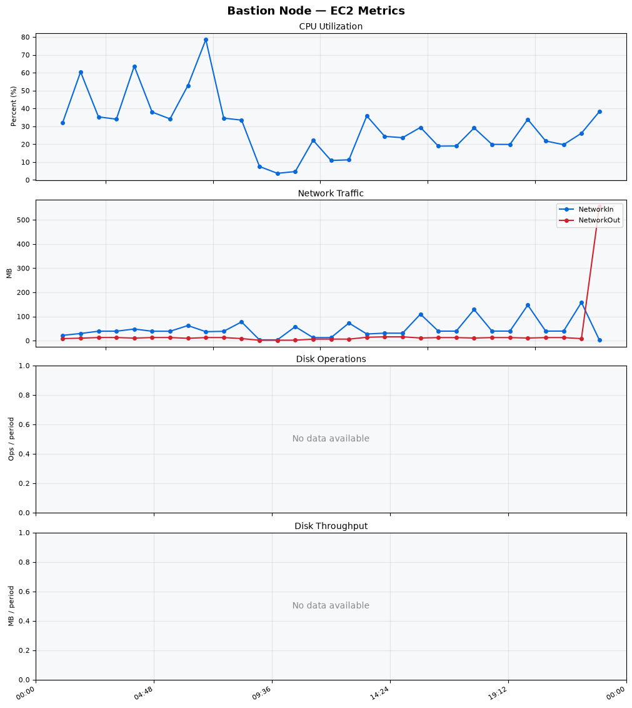
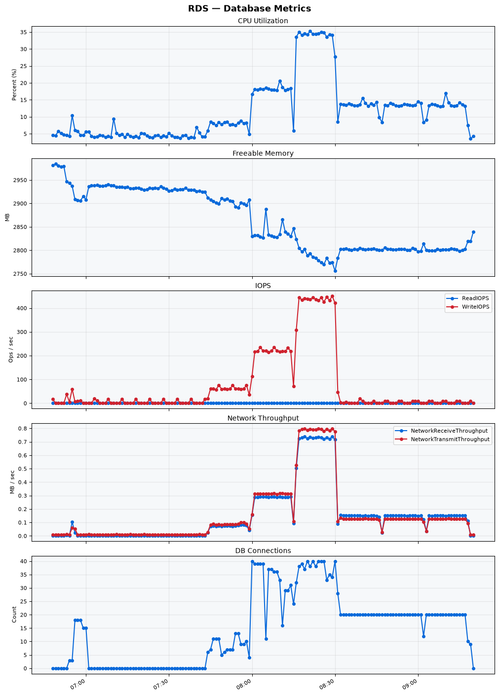

Build Number: 292

Build Date and Time: 2026-06-15--09-26-06

Thunder Pack URL: https://github.com/thunder-id/thunderid/releases/download/v0.44.0/thunderid-0.44.0-linux-x64.zip

Deployment Pattern: single-node

Thunder Instance Type: t2.nano

Nginx Instance Type: t2.nano

Bastion Instance Type: t3a.large

Database Instance Type: db.t3.medium

Database Type: postgres

Concurrency: 50,200,500

Thunder Instance ID: i-0dc92bfb9c16508b9

Nginx Instance ID: i-07e90c3c304f73c04

Bastion Instance ID: i-07487697301ee098f

RDS Instance ID: wso2thunderdbinstance12211

Performance Repo: https://github.com/asgardeo/thunder-performance

Pipeline Definition Branch: main

Checkout Ref (code under test): main

## Summary

| Scenario Name | Heap Size | Concurrent Users | Label | # Samples | Error % | Throughput (Requests/sec) | Average Response Time (ms) | 95th Percentile of Response Time (ms) |
| --- | --- | --- | --- | --- | --- | --- | --- | --- |
| Client Credentials Grant Type | N/A | 50 | 1 Get access token | 295483 | 0.00 | 492.10 | 100.44 | 121.00 |
| Client Credentials Grant Type | N/A | 200 | 1 Get access token | 293753 | 0.00 | 487.79 | 408.54 | 439.00 |
| Client Credentials Grant Type | N/A | 500 | 1 Get access token | 303665 | 0.00 | 485.65 | 991.85 | 1071.00 |
| Authorization Code Grant Type | N/A | 50 | 1 Send request to authorize endpoint | 5003 | 0.00 | 8.35 | 8.52 | 14.00 |
| Authorization Code Grant Type | N/A | 50 | 2 Start Authentication Flow | 5003 | 0.00 | 8.35 | 5.44 | 8.00 |
| Authorization Code Grant Type | N/A | 50 | 3 Perform authentication | 5003 | 0.00 | 8.35 | 11.81 | 16.00 |
| Authorization Code Grant Type | N/A | 50 | 4 Obtain authorization code | 5003 | 0.00 | 8.35 | 6.67 | 9.00 |
| Authorization Code Grant Type | N/A | 50 | 5 Obtain access token | 5003 | 0.00 | 8.35 | 8.36 | 11.00 |
| Authorization Code Grant Type | N/A | 200 | 1 Send request to authorize endpoint | 19816 | 0.00 | 33.04 | 11.49 | 18.00 |
| Authorization Code Grant Type | N/A | 200 | 2 Start Authentication Flow | 19816 | 0.00 | 33.04 | 7.96 | 12.00 |
| Authorization Code Grant Type | N/A | 200 | 3 Perform authentication | 19814 | 0.00 | 33.04 | 17.37 | 26.00 |
| Authorization Code Grant Type | N/A | 200 | 4 Obtain authorization code | 19815 | 0.00 | 33.04 | 10.94 | 16.00 |
| Authorization Code Grant Type | N/A | 200 | 5 Obtain access token | 19815 | 0.00 | 33.04 | 11.62 | 18.00 |
| Authorization Code Grant Type | N/A | 500 | 1 Send request to authorize endpoint | 49053 | 0.00 | 81.79 | 21.83 | 55.00 |
| Authorization Code Grant Type | N/A | 500 | 2 Start Authentication Flow | 49054 | 0.00 | 81.79 | 16.97 | 42.00 |
| Authorization Code Grant Type | N/A | 500 | 3 Perform authentication | 49041 | 0.00 | 81.78 | 32.92 | 93.00 |
| Authorization Code Grant Type | N/A | 500 | 4 Obtain authorization code | 49042 | 0.00 | 81.78 | 23.78 | 58.00 |
| Authorization Code Grant Type | N/A | 500 | 5 Obtain access token | 49046 | 0.00 | 81.78 | 19.56 | 49.00 |
| User Authentication with Credentials | N/A | 50 | 1 Perform user authentication | 279503 | 0.00 | 465.88 | 106.91 | 198.00 |
| User Authentication with Credentials | N/A | 200 | 1 Perform user authentication | 280343 | 0.00 | 467.06 | 427.66 | 1159.00 |
| User Authentication with Credentials | N/A | 500 | 1 Perform user authentication | 281111 | 0.01 | 467.86 | 1066.04 | 3087.00 |

## CloudWatch Metrics

### Thunder (EC2)

### Nginx (EC2)

### Bastion (EC2)

### RDS

