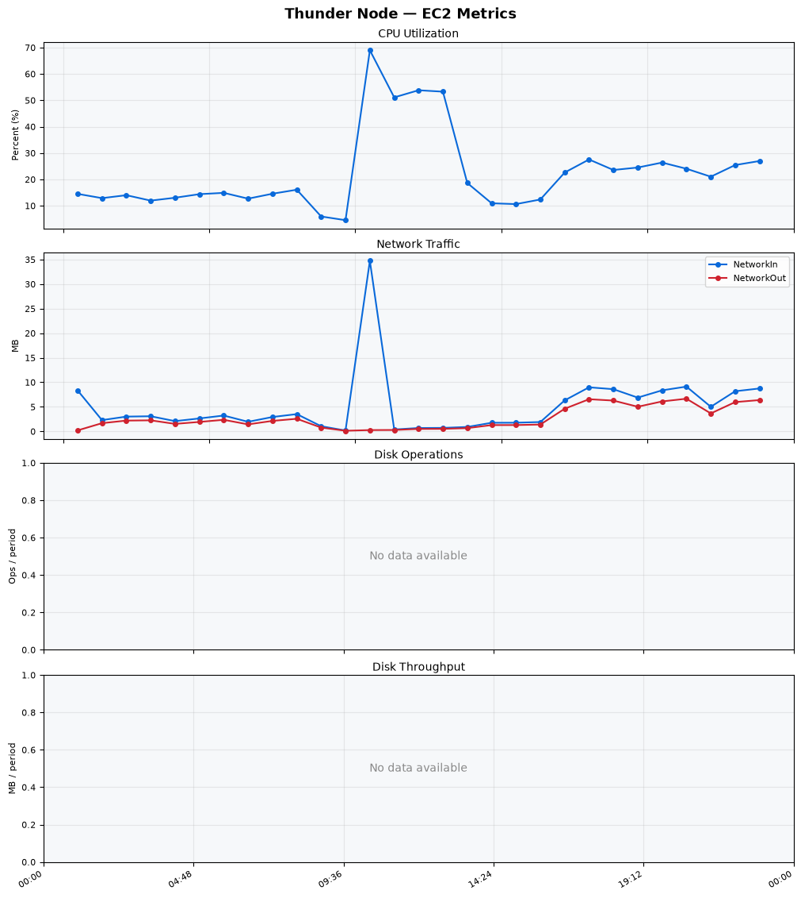
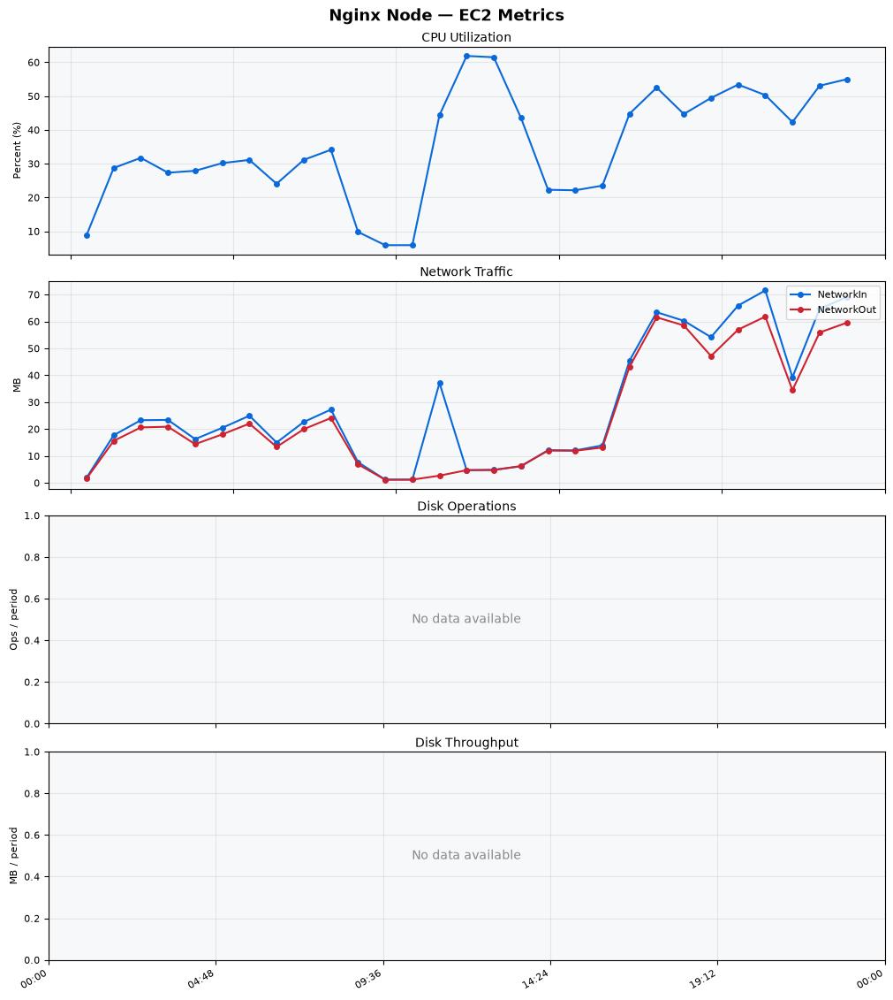
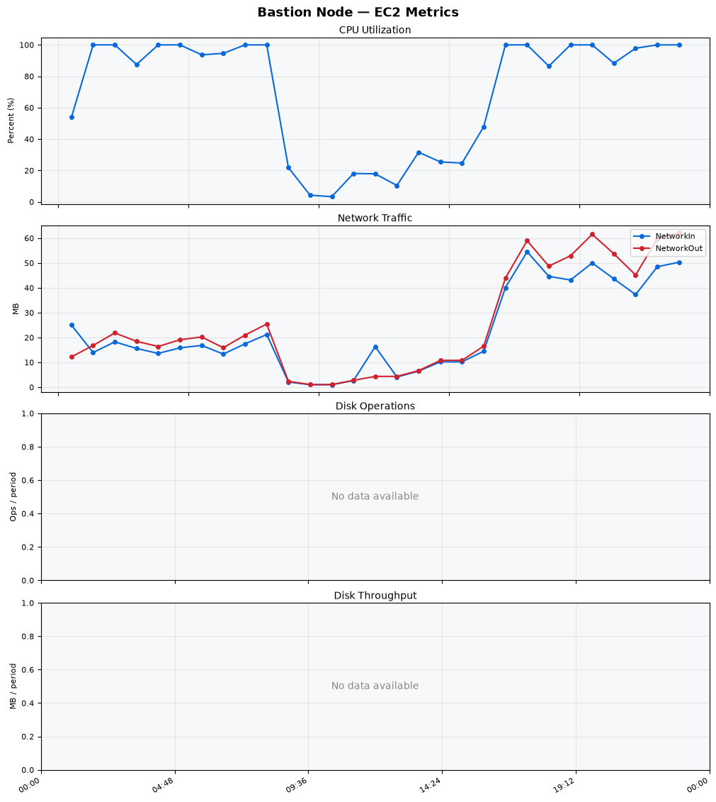
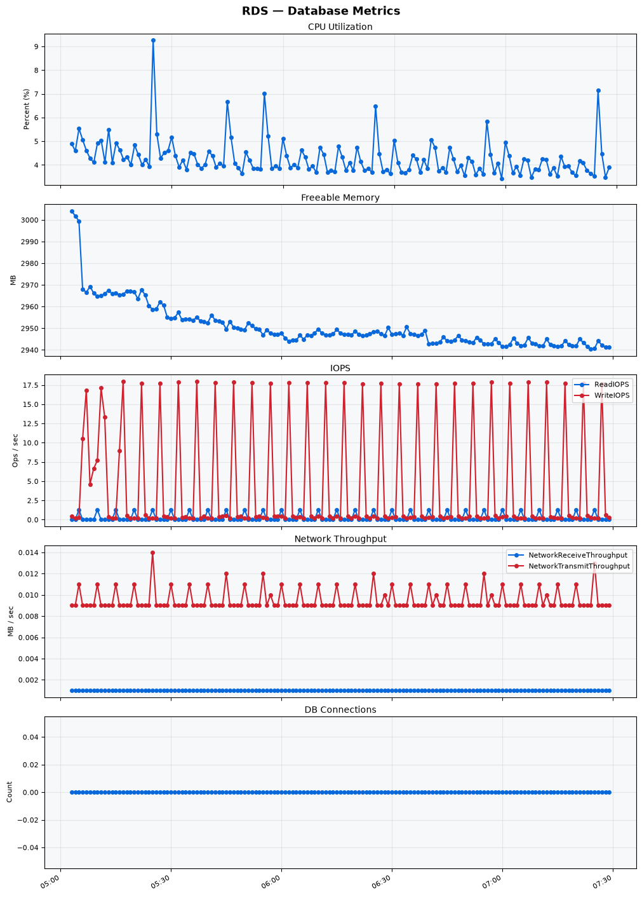

Build Number: 293

Build Date and Time: 2026-06-24--07-36-05

Thunder Pack URL: https://github.com/thunder-id/thunderid/releases/download/v0.45.0/thunderid-0.45.0-linux-x64.zip

Deployment Pattern: single-node

Thunder Instance Type: t2.nano

Nginx Instance Type: t2.nano

Bastion Instance Type: t3a.large

Database Instance Type: db.t3.medium

Database Type: postgres

Concurrency: 50,200,500

Thunder Instance ID: i-059ac8765c7b7a186

Nginx Instance ID: i-010ffef152c6ab3bb

Bastion Instance ID: i-0efea4c79d53c61a7

RDS Instance ID: wso2thunderdbinstance8116

Performance Repo: https://github.com/asgardeo/thunder-performance

Pipeline Definition Branch: main

Checkout Ref (code under test): main

## Summary

| Scenario Name | Heap Size | Concurrent Users | Label | # Samples | Error % | Throughput (Requests/sec) | Average Response Time (ms) | 95th Percentile of Response Time (ms) |
| --- | --- | --- | --- | --- | --- | --- | --- | --- |
| Client Credentials Grant Type | N/A | 50 | 1 Get access token | 450583 | 100.00 | 750.36 | 22.61 | 58.00 |
| Client Credentials Grant Type | N/A | 200 | 1 Get access token | 420239 | 100.00 | 697.97 | 73.65 | 178.00 |
| Client Credentials Grant Type | N/A | 500 | 1 Get access token | 478280 | 100.00 | 789.19 | 75.84 | 216.00 |
| Authorization Code Grant Type | N/A | 50 | 1 Send request to authorize endpoint | 4946 | 100.00 | 8.25 | 1.32 | 5.00 |
| Authorization Code Grant Type | N/A | 50 | 2 Start Authentication Flow | 4946 | 100.00 | 8.25 | 1.02 | 2.00 |
| Authorization Code Grant Type | N/A | 50 | 3 Perform authentication | 4946 | 100.00 | 8.25 | 2.32 | 4.00 |
| Authorization Code Grant Type | N/A | 50 | 4 Obtain authorization code | 4946 | 100.00 | 8.25 | 1.07 | 2.00 |
| Authorization Code Grant Type | N/A | 50 | 5 Obtain access token | 4946 | 100.00 | 8.25 | 1.25 | 2.00 |
| Authorization Code Grant Type | N/A | 200 | 1 Send request to authorize endpoint | 19925 | 100.00 | 33.22 | 1.48 | 5.00 |
| Authorization Code Grant Type | N/A | 200 | 2 Start Authentication Flow | 19925 | 100.00 | 33.22 | 1.11 | 2.00 |
| Authorization Code Grant Type | N/A | 200 | 3 Perform authentication | 19925 | 100.00 | 33.22 | 2.34 | 4.00 |
| Authorization Code Grant Type | N/A | 200 | 4 Obtain authorization code | 19925 | 100.00 | 33.22 | 1.17 | 2.00 |
| Authorization Code Grant Type | N/A | 200 | 5 Obtain access token | 19925 | 100.00 | 33.22 | 1.29 | 2.00 |
| Authorization Code Grant Type | N/A | 500 | 1 Send request to authorize endpoint | 49739 | 100.00 | 82.94 | 1.27 | 4.00 |
| Authorization Code Grant Type | N/A | 500 | 2 Start Authentication Flow | 49739 | 100.00 | 82.94 | 1.02 | 2.00 |
| Authorization Code Grant Type | N/A | 500 | 3 Perform authentication | 49739 | 100.00 | 82.94 | 1.98 | 3.00 |
| Authorization Code Grant Type | N/A | 500 | 4 Obtain authorization code | 49739 | 100.00 | 82.94 | 0.99 | 2.00 |
| Authorization Code Grant Type | N/A | 500 | 5 Obtain access token | 49739 | 100.00 | 82.94 | 1.18 | 2.00 |
| User Authentication with Credentials | N/A | 50 | 1 Perform user authentication | 1342291 | 100.00 | 2237.62 | 21.36 | 28.00 |
| User Authentication with Credentials | N/A | 200 | 1 Perform user authentication | 1244433 | 100.00 | 2074.37 | 83.66 | 121.00 |
| User Authentication with Credentials | N/A | 500 | 1 Perform user authentication | 1209534 | 100.00 | 2015.22 | 114.89 | 210.00 |

## CloudWatch Metrics

### Thunder (EC2)

### Nginx (EC2)

### Bastion (EC2)

### RDS

