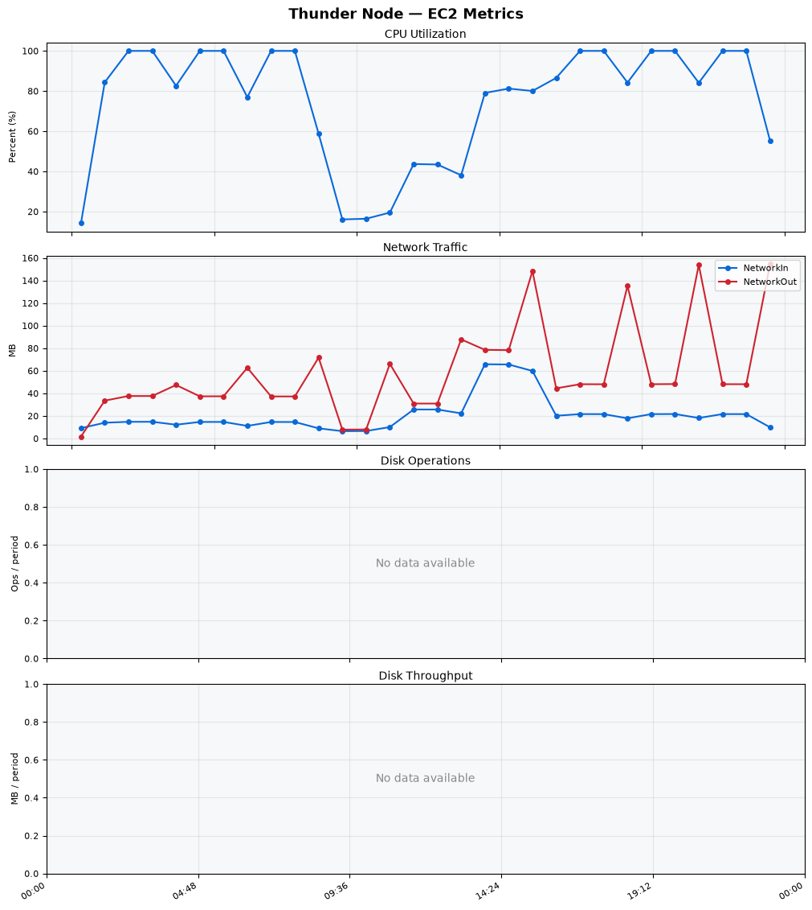
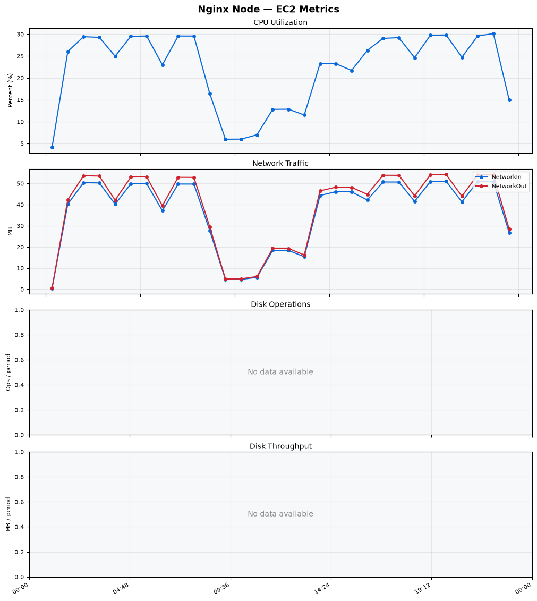
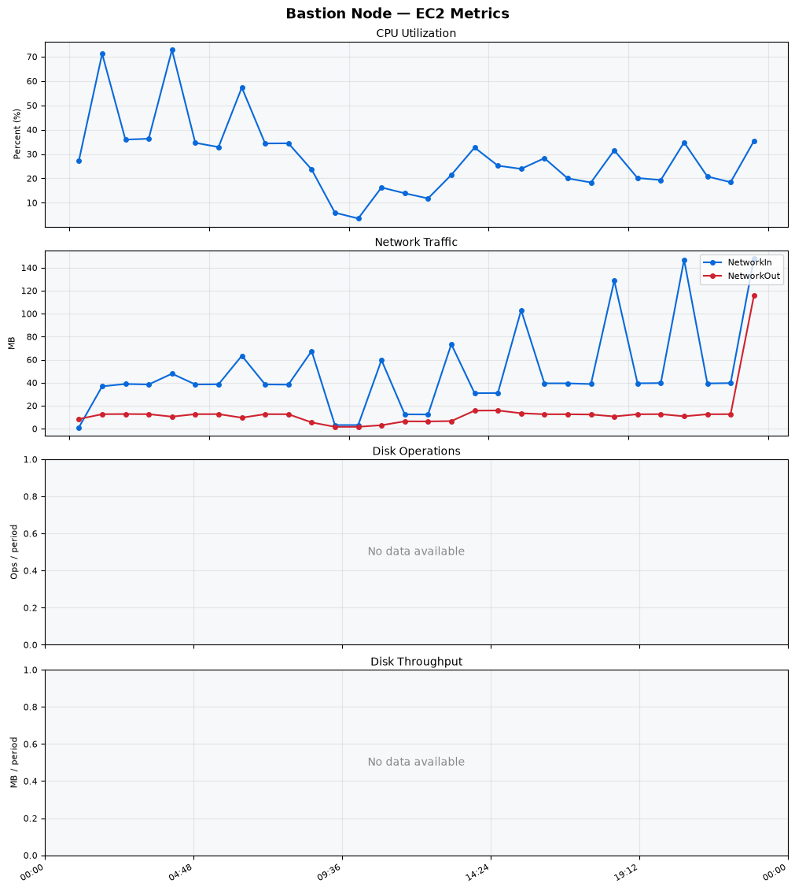
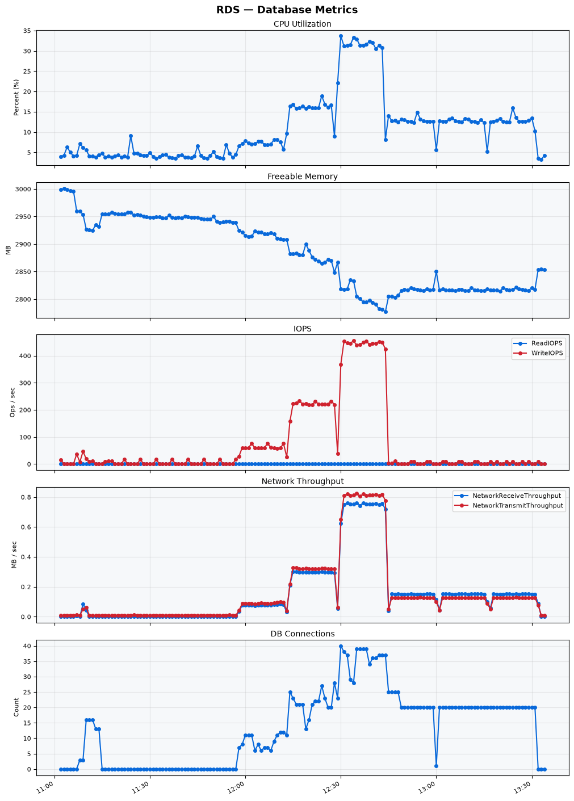

Build Number: 300

Build Date and Time: 2026-06-26--13-42-10

Thunder Pack URL: https://github.com/thunder-id/thunderid/releases/download/v0.46.0/thunderid-0.46.0-linux-x64.zip

Deployment Pattern: single-node

Thunder Instance Type: t2.nano

Nginx Instance Type: t2.nano

Bastion Instance Type: t3a.large

Database Instance Type: db.t3.medium

Database Type: postgres

Concurrency: 50,200,500

Thunder Instance ID: i-0749e2e3410698eba

Nginx Instance ID: i-0ff3ebfe11cac6278

Bastion Instance ID: i-0e550783b819ba90f

RDS Instance ID: wso2thunderdbinstance939

Performance Repo: https://github.com/asgardeo/thunder-performance

Pipeline Definition Branch: main

Checkout Ref (code under test): main

## Summary

| Scenario Name | Heap Size | Concurrent Users | Label | # Samples | Error % | Throughput (Requests/sec) | Average Response Time (ms) | 95th Percentile of Response Time (ms) |
| --- | --- | --- | --- | --- | --- | --- | --- | --- |
| Client Credentials Grant Type | N/A | 50 | 1 Get access token | 294351 | 0.00 | 490.22 | 100.51 | 120.00 |
| Client Credentials Grant Type | N/A | 200 | 1 Get access token | 292753 | 0.00 | 486.18 | 409.98 | 441.00 |
| Client Credentials Grant Type | N/A | 500 | 1 Get access token | 293062 | 0.00 | 483.25 | 1026.62 | 1079.00 |
| Authorization Code Grant Type | N/A | 50 | 1 Send request to authorize endpoint | 5001 | 0.00 | 8.34 | 8.54 | 14.00 |
| Authorization Code Grant Type | N/A | 50 | 2 Start Authentication Flow | 5001 | 0.00 | 8.34 | 5.47 | 8.00 |
| Authorization Code Grant Type | N/A | 50 | 3 Perform authentication | 5001 | 0.00 | 8.34 | 11.88 | 16.00 |
| Authorization Code Grant Type | N/A | 50 | 4 Obtain authorization code | 5001 | 0.00 | 8.34 | 6.60 | 9.00 |
| Authorization Code Grant Type | N/A | 50 | 5 Obtain access token | 5001 | 0.00 | 8.34 | 8.25 | 11.00 |
| Authorization Code Grant Type | N/A | 200 | 1 Send request to authorize endpoint | 19804 | 0.00 | 33.02 | 8.79 | 15.00 |
| Authorization Code Grant Type | N/A | 200 | 2 Start Authentication Flow | 19804 | 0.00 | 33.02 | 6.15 | 10.00 |
| Authorization Code Grant Type | N/A | 200 | 3 Perform authentication | 19804 | 0.00 | 33.02 | 12.71 | 20.00 |
| Authorization Code Grant Type | N/A | 200 | 4 Obtain authorization code | 19804 | 0.00 | 33.02 | 7.55 | 12.00 |
| Authorization Code Grant Type | N/A | 200 | 5 Obtain access token | 19804 | 0.00 | 33.02 | 9.17 | 14.00 |
| Authorization Code Grant Type | N/A | 500 | 1 Send request to authorize endpoint | 49266 | 0.00 | 82.16 | 15.46 | 32.00 |
| Authorization Code Grant Type | N/A | 500 | 2 Start Authentication Flow | 49263 | 0.00 | 82.16 | 11.71 | 25.00 |
| Authorization Code Grant Type | N/A | 500 | 3 Perform authentication | 49278 | 0.00 | 82.18 | 23.96 | 53.00 |
| Authorization Code Grant Type | N/A | 500 | 4 Obtain authorization code | 49275 | 0.00 | 82.18 | 14.54 | 28.00 |
| Authorization Code Grant Type | N/A | 500 | 5 Obtain access token | 49272 | 0.00 | 82.17 | 15.28 | 32.00 |
| User Authentication with Credentials | N/A | 50 | 1 Perform user authentication | 280629 | 0.00 | 467.74 | 106.47 | 196.00 |
| User Authentication with Credentials | N/A | 200 | 1 Perform user authentication | 281606 | 0.00 | 469.16 | 425.76 | 1151.00 |
| User Authentication with Credentials | N/A | 500 | 1 Perform user authentication | 281407 | 0.00 | 468.37 | 1064.80 | 3071.00 |

## CloudWatch Metrics

### Thunder (EC2)

### Nginx (EC2)

### Bastion (EC2)

### RDS

