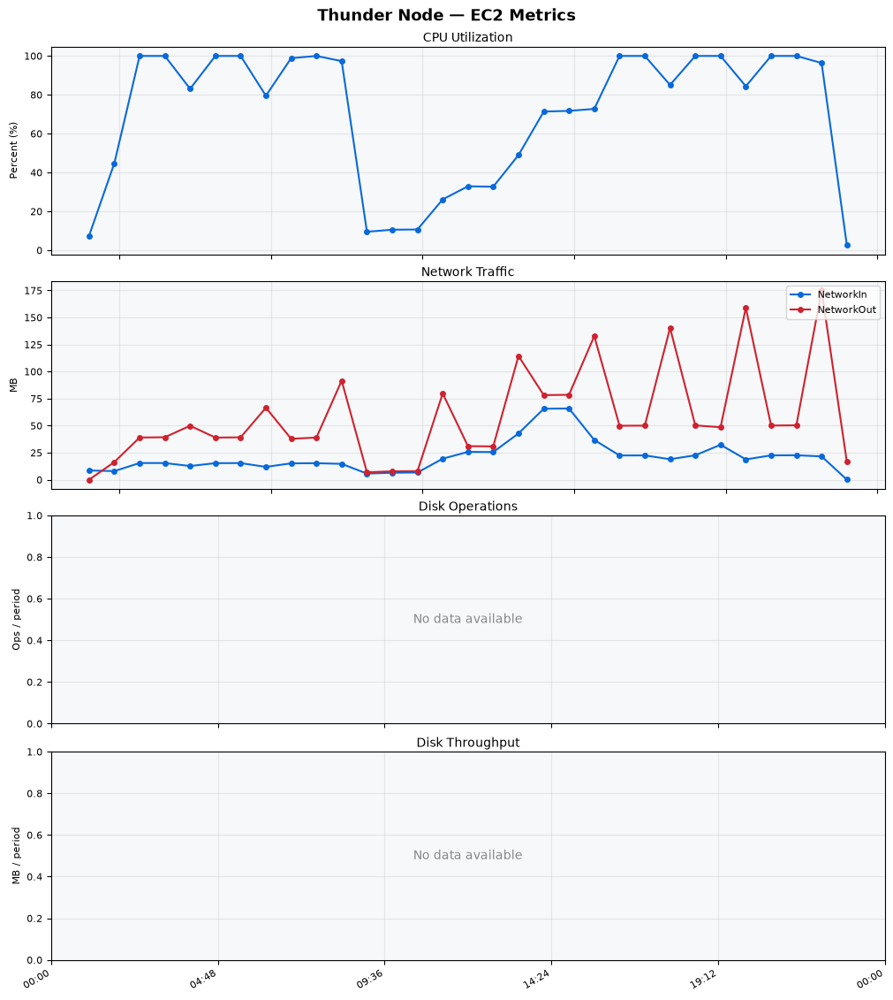
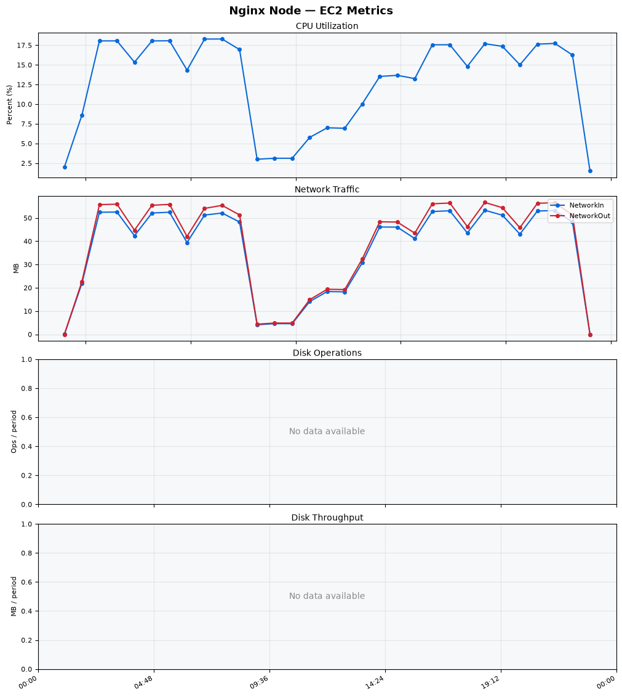
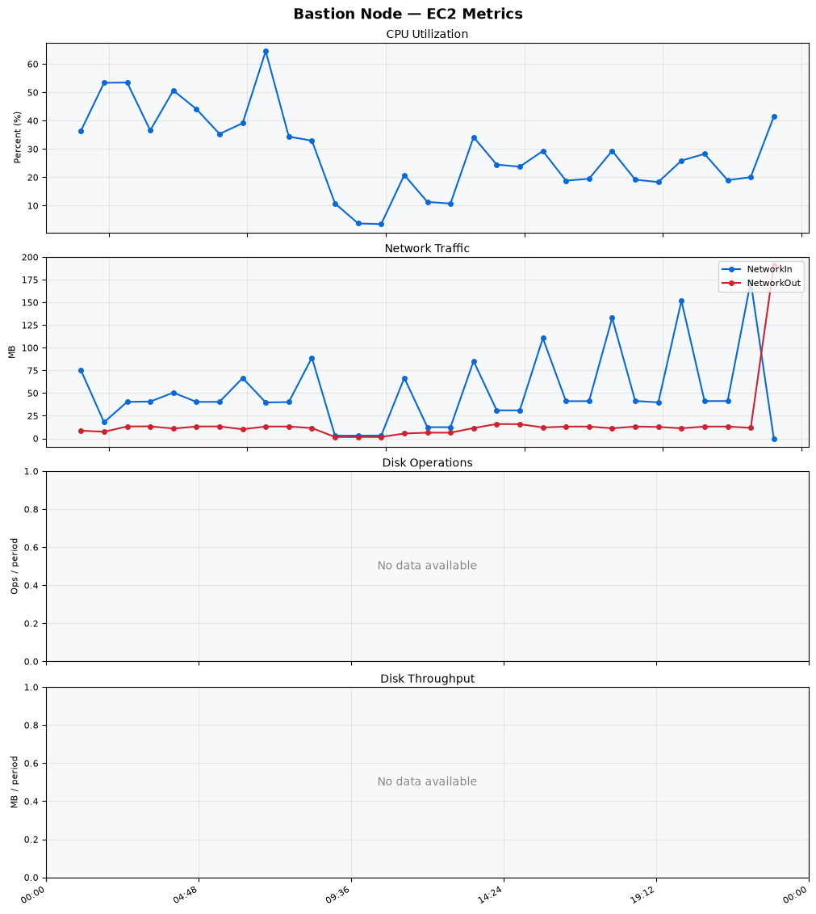
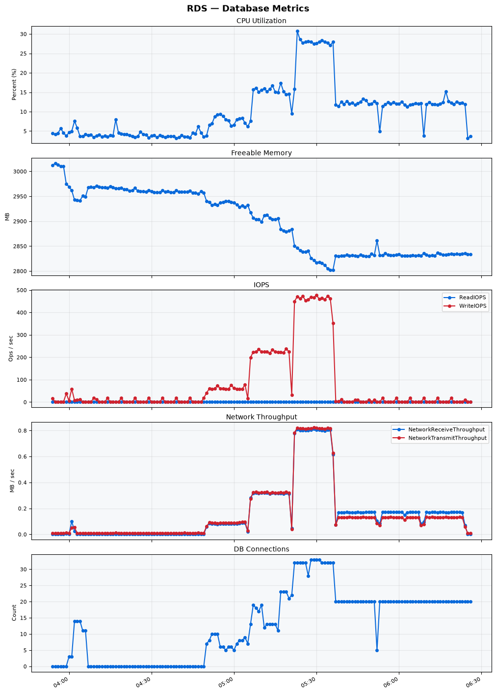

Build Number: 351

Build Date and Time: 2026-08-11--06-34-35

Thunder Pack URL: https://github.com/thunder-id/thunderid/releases/download/v0.47.0/thunderid-0.47.0-linux-x64.zip

Deployment Pattern: single-node

Thunder Instance Type: t2.nano

Nginx Instance Type: t2.nano

Bastion Instance Type: t3a.large

Database Instance Type: db.t3.medium

Database Type: postgres

Concurrency: 50,200,500

Thunder Instance ID: i-0b808f24dd48a2b29

Nginx Instance ID: i-0dcde231573ef8fa7

Bastion Instance ID: i-08c4221c89f546786

RDS Instance ID: wso2thunderdbinstance14226

Performance Repo: https://github.com/asgardeo/thunder-performance

Pipeline Definition Branch: azure-perf-fixes-v47

Checkout Ref (code under test): azure-perf-fixes-v47

## Summary

| Scenario Name | Heap Size | Concurrent Users | Label | # Samples | Error % | Throughput (Requests/sec) | Average Response Time (ms) | 95th Percentile of Response Time (ms) |
| --- | --- | --- | --- | --- | --- | --- | --- | --- |
| Client Credentials Grant Type | N/A | 50 | 1 Get access token | 307613 | 0.00 | 512.26 | 96.21 | 116.00 |
| Client Credentials Grant Type | N/A | 200 | 1 Get access token | 306421 | 0.00 | 508.80 | 391.64 | 421.00 |
| Client Credentials Grant Type | N/A | 500 | 1 Get access token | 306234 | 0.00 | 506.73 | 982.21 | 1031.00 |
| Authorization Code Grant Type | N/A | 50 | 1 Send request to authorize endpoint | 4958 | 0.00 | 8.27 | 6.73 | 12.00 |
| Authorization Code Grant Type | N/A | 50 | 2 Start Authentication Flow | 4958 | 0.00 | 8.27 | 4.35 | 8.00 |
| Authorization Code Grant Type | N/A | 50 | 3 Perform authentication | 4958 | 0.00 | 8.27 | 9.95 | 16.00 |
| Authorization Code Grant Type | N/A | 50 | 4 Obtain authorization code | 4958 | 0.00 | 8.27 | 5.50 | 9.00 |
| Authorization Code Grant Type | N/A | 50 | 5 Obtain access token | 4958 | 0.00 | 8.27 | 6.92 | 11.00 |
| Authorization Code Grant Type | N/A | 200 | 1 Send request to authorize endpoint | 19807 | 0.00 | 33.03 | 6.51 | 11.00 |
| Authorization Code Grant Type | N/A | 200 | 2 Start Authentication Flow | 19807 | 0.00 | 33.03 | 4.45 | 8.00 |
| Authorization Code Grant Type | N/A | 200 | 3 Perform authentication | 19807 | 0.00 | 33.03 | 9.73 | 15.00 |
| Authorization Code Grant Type | N/A | 200 | 4 Obtain authorization code | 19807 | 0.00 | 33.02 | 5.69 | 9.00 |
| Authorization Code Grant Type | N/A | 200 | 5 Obtain access token | 19808 | 0.00 | 33.03 | 7.02 | 11.00 |
| Authorization Code Grant Type | N/A | 500 | 1 Send request to authorize endpoint | 49521 | 0.00 | 82.57 | 10.21 | 22.00 |
| Authorization Code Grant Type | N/A | 500 | 2 Start Authentication Flow | 49519 | 0.00 | 82.57 | 7.47 | 17.00 |
| Authorization Code Grant Type | N/A | 500 | 3 Perform authentication | 49520 | 0.00 | 82.57 | 15.90 | 36.00 |
| Authorization Code Grant Type | N/A | 500 | 4 Obtain authorization code | 49520 | 0.00 | 82.57 | 9.16 | 20.00 |
| Authorization Code Grant Type | N/A | 500 | 5 Obtain access token | 49520 | 0.00 | 82.57 | 10.54 | 23.00 |
| User Authentication with Credentials | N/A | 50 | 1 Perform user authentication | 292924 | 0.00 | 488.26 | 102.01 | 188.00 |
| User Authentication with Credentials | N/A | 200 | 1 Perform user authentication | 288428 | 0.00 | 480.55 | 415.71 | 1135.00 |
| User Authentication with Credentials | N/A | 500 | 1 Perform user authentication | 293827 | 0.00 | 489.10 | 1019.74 | 2959.00 |

## CloudWatch Metrics

### Thunder (EC2)

### Nginx (EC2)

### Bastion (EC2)

### RDS

