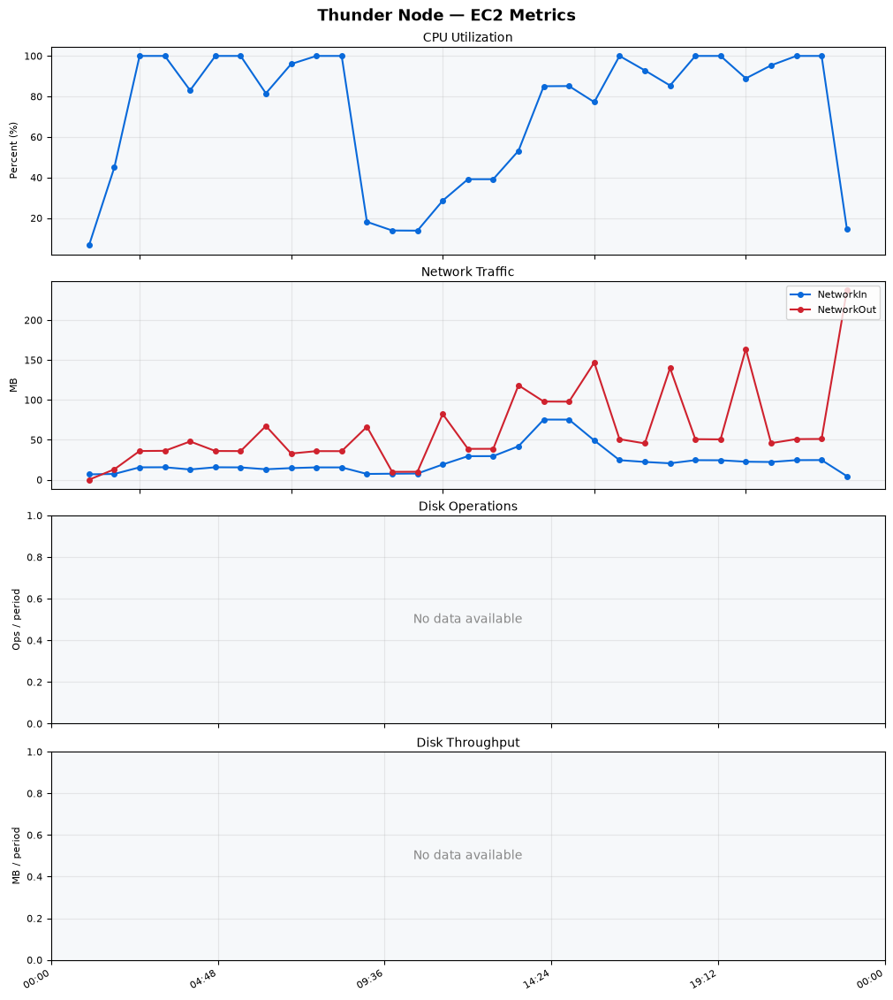
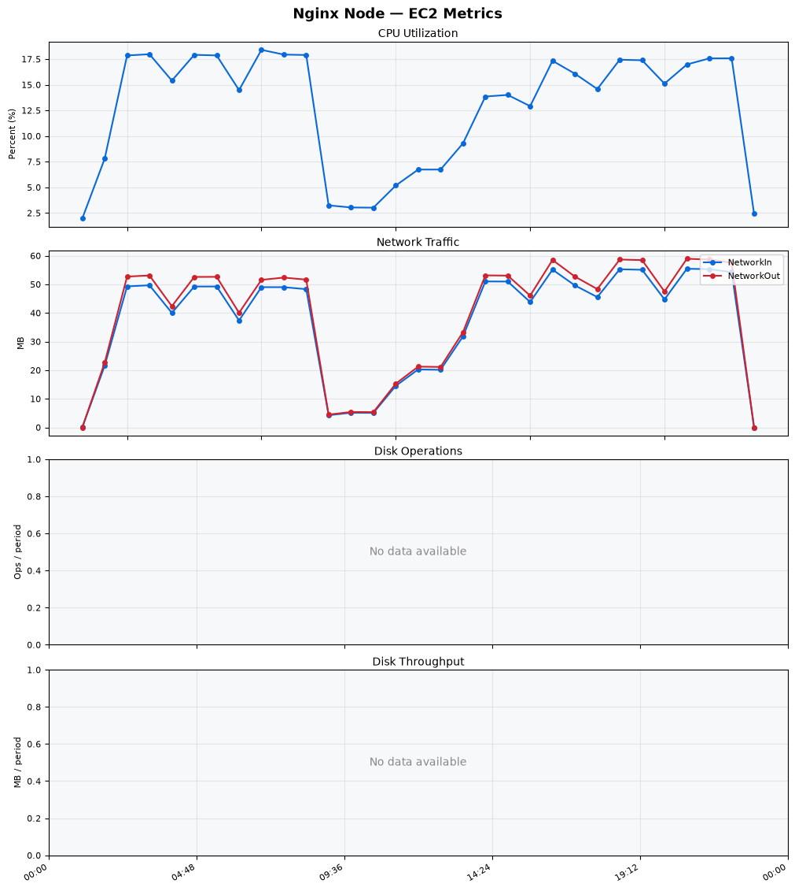
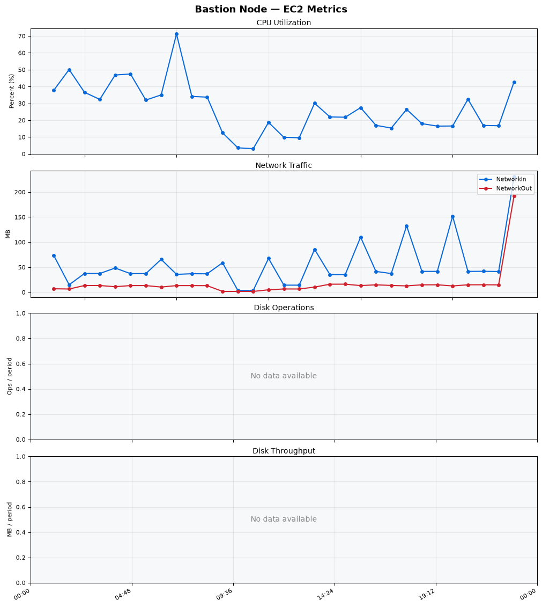
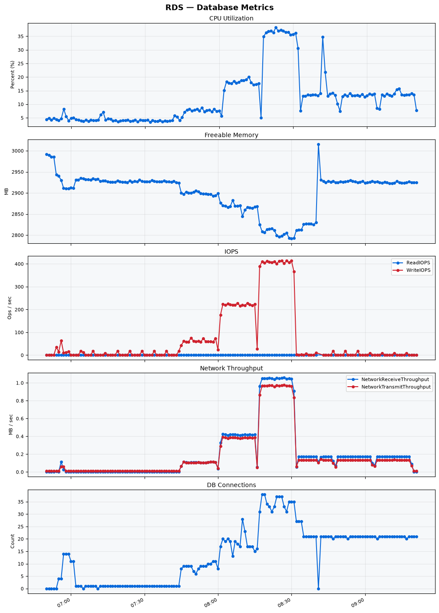

Build Number: 342

Build Date and Time: 2026-08-06--09-29-32

Thunder Pack URL: https://github.com/thunder-id/thunderid/releases/download/v1.0.0-alpha2/thunderid-1.0.0-alpha2-linux-x64.zip

Deployment Pattern: single-node

Thunder Instance Type: t2.nano

Nginx Instance Type: t2.nano

Bastion Instance Type: t3a.large

Database Instance Type: db.t3.medium

Database Type: postgres

Concurrency: 50,200,500

Thunder Instance ID: i-049a53d7a6febb2b9

Nginx Instance ID: i-08dd2810791c79653

Bastion Instance ID: i-0bfc079212312c19a

RDS Instance ID: wso2thunderdbinstance31343

Performance Repo: https://github.com/asgardeo/thunder-performance

Pipeline Definition Branch: main

Checkout Ref (code under test): main

## Summary

| Scenario Name | Heap Size | Concurrent Users | Label | # Samples | Error % | Throughput (Requests/sec) | Average Response Time (ms) | 95th Percentile of Response Time (ms) |
| --- | --- | --- | --- | --- | --- | --- | --- | --- |
| Client Credentials Grant Type | N/A | 50 | 1 Get access token | 309789 | 0.00 | 515.91 | 95.67 | 117.00 |
| Client Credentials Grant Type | N/A | 200 | 1 Get access token | 307876 | 0.00 | 511.46 | 389.79 | 423.00 |
| Client Credentials Grant Type | N/A | 500 | 1 Get access token | 318439 | 0.00 | 508.40 | 945.67 | 1023.00 |
| Authorization Code Grant Type | N/A | 50 | 1 Send request to authorize endpoint | 4995 | 0.00 | 8.33 | 6.60 | 11.00 |
| Authorization Code Grant Type | N/A | 50 | 2 Start Authentication Flow | 4995 | 0.00 | 8.33 | 4.13 | 7.00 |
| Authorization Code Grant Type | N/A | 50 | 3 Perform authentication | 4995 | 0.00 | 8.33 | 9.70 | 13.00 |
| Authorization Code Grant Type | N/A | 50 | 4 Obtain authorization code | 4995 | 0.00 | 8.33 | 5.40 | 8.00 |
| Authorization Code Grant Type | N/A | 50 | 5 Obtain access token | 4995 | 0.00 | 8.33 | 9.29 | 13.00 |
| Authorization Code Grant Type | N/A | 200 | 1 Send request to authorize endpoint | 19757 | 0.00 | 32.94 | 8.04 | 15.00 |
| Authorization Code Grant Type | N/A | 200 | 2 Start Authentication Flow | 19757 | 0.00 | 32.94 | 5.35 | 11.00 |
| Authorization Code Grant Type | N/A | 200 | 3 Perform authentication | 19755 | 0.00 | 32.95 | 11.09 | 19.00 |
| Authorization Code Grant Type | N/A | 200 | 4 Obtain authorization code | 19755 | 0.00 | 32.95 | 6.79 | 13.00 |
| Authorization Code Grant Type | N/A | 200 | 5 Obtain access token | 19755 | 0.00 | 32.94 | 10.96 | 18.00 |
| Authorization Code Grant Type | N/A | 500 | 1 Send request to authorize endpoint | 49017 | 0.00 | 81.74 | 20.12 | 48.00 |
| Authorization Code Grant Type | N/A | 500 | 2 Start Authentication Flow | 49019 | 0.00 | 81.74 | 15.54 | 38.00 |
| Authorization Code Grant Type | N/A | 500 | 3 Perform authentication | 49017 | 0.00 | 81.73 | 29.62 | 71.00 |
| Authorization Code Grant Type | N/A | 500 | 4 Obtain authorization code | 49017 | 0.00 | 81.73 | 17.72 | 42.00 |
| Authorization Code Grant Type | N/A | 500 | 5 Obtain access token | 49018 | 0.00 | 81.73 | 24.88 | 57.00 |
| User Authentication with Credentials | N/A | 50 | 1 Perform user authentication | 283460 | 1.37 | 472.48 | 105.51 | 198.00 |
| User Authentication with Credentials | N/A | 200 | 1 Perform user authentication | 296530 | 0.00 | 494.02 | 404.43 | 1103.00 |
| User Authentication with Credentials | N/A | 500 | 1 Perform user authentication | 297903 | 0.00 | 495.87 | 1005.96 | 2911.00 |

## CloudWatch Metrics

### Thunder (EC2)

### Nginx (EC2)

### Bastion (EC2)

### RDS

