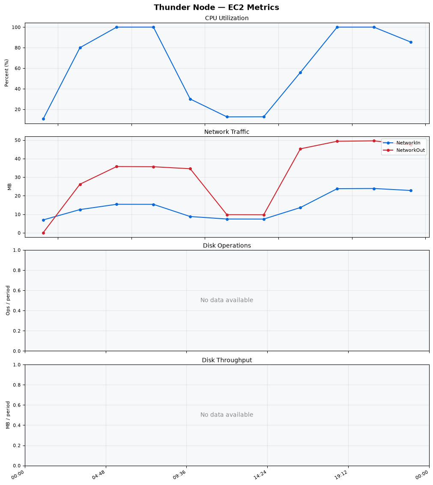
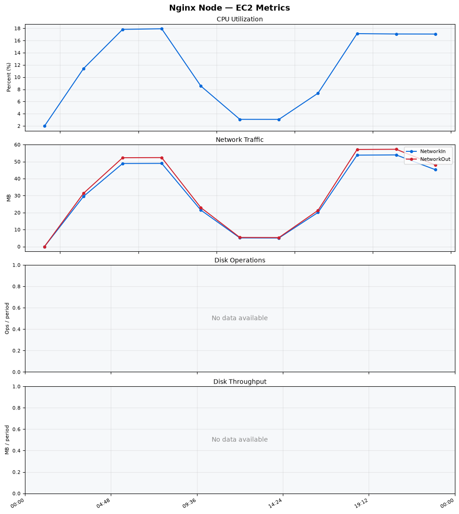
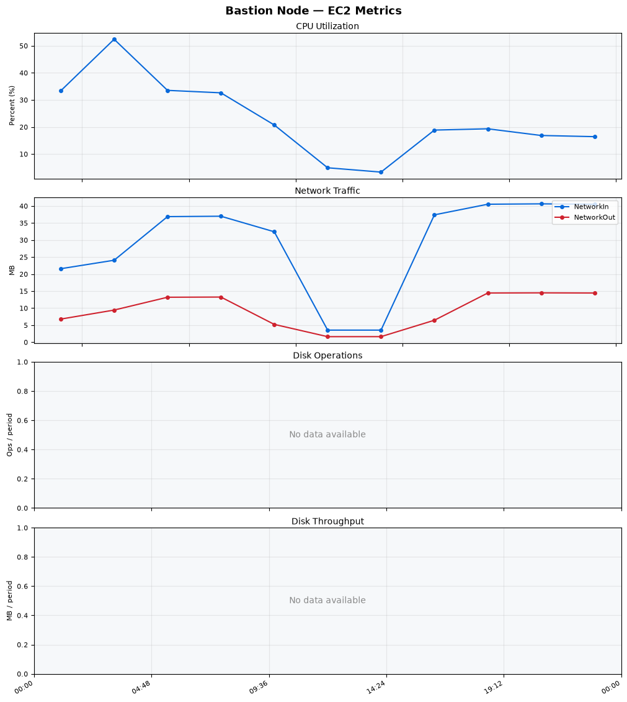
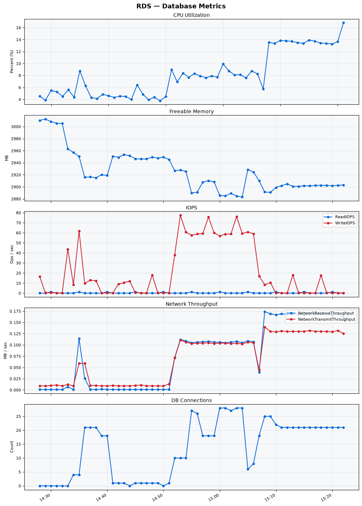

Build Number: 345

Build Date and Time: 2026-08-06--15-29-55

Thunder Pack URL: https://github.com/thunder-id/thunderid/releases/download/v1.0.0-alpha2/thunderid-1.0.0-alpha2-linux-x64.zip

Deployment Pattern: single-node

Thunder Instance Type: t2.nano

Nginx Instance Type: t2.nano

Bastion Instance Type: t3a.large

Database Instance Type: db.t3.medium

Database Type: postgres

Concurrency: 50

Thunder Instance ID: i-0e66d655321c83ee0

Nginx Instance ID: i-08622cc864b324318

Bastion Instance ID: i-0d7a9940c9f32c57e

RDS Instance ID: wso2thunderdbinstance27472

Performance Repo: https://github.com/asgardeo/thunder-performance

Pipeline Definition Branch: main

Checkout Ref (code under test): main

## Summary

| Scenario Name | Heap Size | Concurrent Users | Label | # Samples | Error % | Throughput (Requests/sec) | Average Response Time (ms) | 95th Percentile of Response Time (ms) |
| --- | --- | --- | --- | --- | --- | --- | --- | --- |
| Client Credentials Grant Type | N/A | 50 | 1 Get access token | 305359 | 0.00 | 508.60 | 97.00 | 120.00 |
| Authorization Code Grant Type | N/A | 50 | 1 Send request to authorize endpoint | 4989 | 0.00 | 8.32 | 7.41 | 13.00 |
| Authorization Code Grant Type | N/A | 50 | 2 Start Authentication Flow | 4989 | 0.00 | 8.32 | 5.17 | 9.00 |
| Authorization Code Grant Type | N/A | 50 | 3 Perform authentication | 4989 | 0.00 | 8.32 | 12.70 | 17.00 |
| Authorization Code Grant Type | N/A | 50 | 4 Obtain authorization code | 4989 | 0.00 | 8.32 | 6.63 | 10.00 |
| Authorization Code Grant Type | N/A | 50 | 5 Obtain access token | 4989 | 0.00 | 8.32 | 10.96 | 16.00 |
| User Authentication with Credentials | N/A | 50 | 1 Perform user authentication | 289406 | 0.00 | 482.39 | 103.30 | 191.00 |

## CloudWatch Metrics

### Thunder (EC2)

### Nginx (EC2)

### Bastion (EC2)

### RDS

