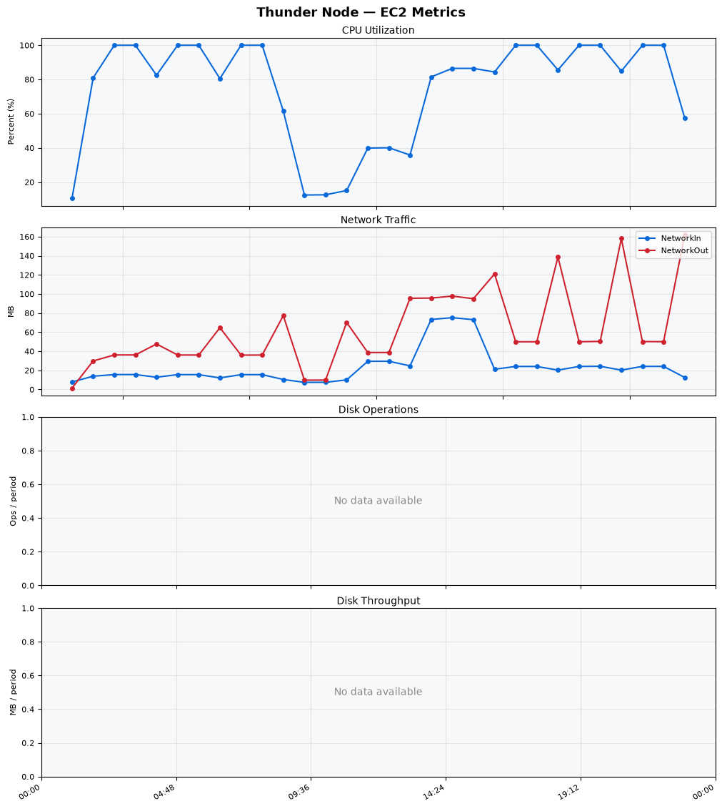
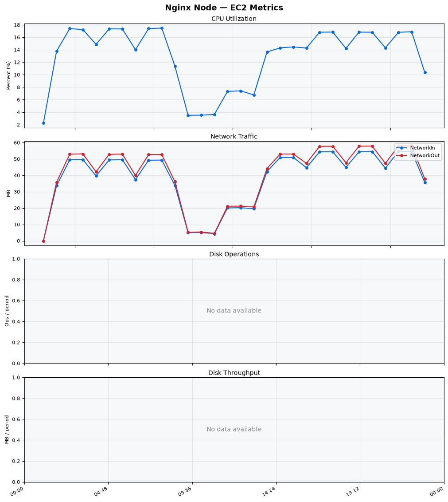
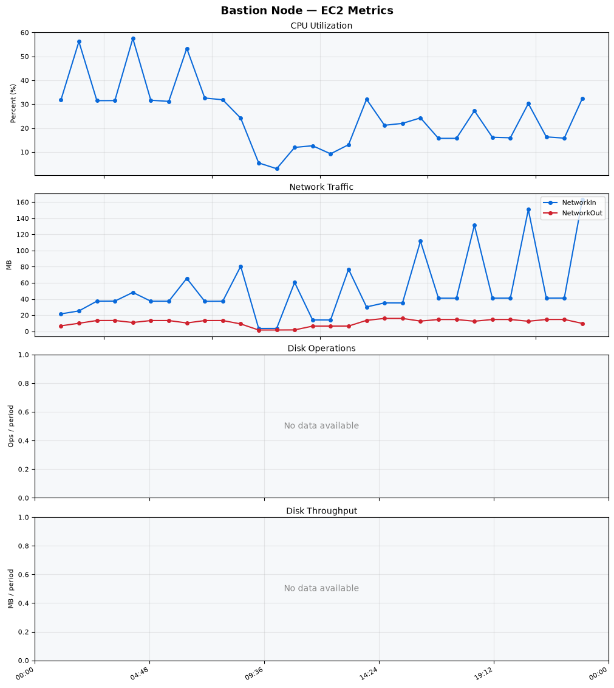
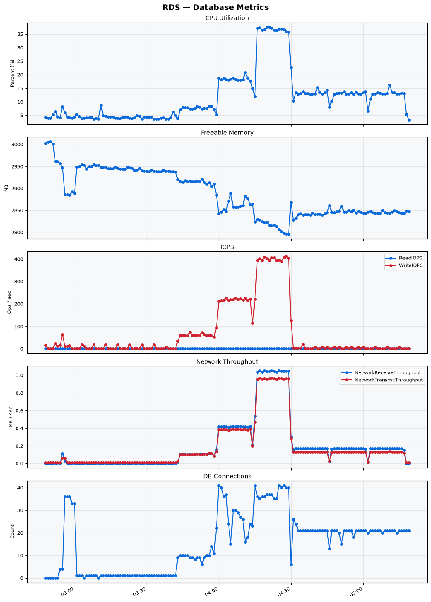

Build Number: 346

Build Date and Time: 2026-08-07--05-27-28

Thunder Pack URL: https://github.com/thunder-id/thunderid/releases/download/v1.0.0-alpha2/thunderid-1.0.0-alpha2-linux-x64.zip

Deployment Pattern: single-node

Thunder Instance Type: t2.nano

Nginx Instance Type: t2.nano

Bastion Instance Type: t3a.large

Database Instance Type: db.t3.medium

Database Type: postgres

Concurrency: 50,200,500

Thunder Instance ID: i-0c6593bfe13d7fffe

Nginx Instance ID: i-04fc7456311afc7c7

Bastion Instance ID: i-0fb02007ea3c5de52

RDS Instance ID: wso2thunderdbinstance24542

Performance Repo: https://github.com/asgardeo/thunder-performance

Pipeline Definition Branch: main

Checkout Ref (code under test): main

## Summary

| Scenario Name | Heap Size | Concurrent Users | Label | # Samples | Error % | Throughput (Requests/sec) | Average Response Time (ms) | 95th Percentile of Response Time (ms) |
| --- | --- | --- | --- | --- | --- | --- | --- | --- |
| Client Credentials Grant Type | N/A | 50 | 1 Get access token | 309361 | 0.00 | 515.16 | 95.74 | 119.00 |
| Client Credentials Grant Type | N/A | 200 | 1 Get access token | 308962 | 0.00 | 513.35 | 388.50 | 423.00 |
| Client Credentials Grant Type | N/A | 500 | 1 Get access token | 308722 | 0.00 | 511.16 | 974.28 | 1023.00 |
| Authorization Code Grant Type | N/A | 50 | 1 Send request to authorize endpoint | 4974 | 0.00 | 8.30 | 7.48 | 12.00 |
| Authorization Code Grant Type | N/A | 50 | 2 Start Authentication Flow | 4974 | 0.00 | 8.30 | 4.72 | 8.00 |
| Authorization Code Grant Type | N/A | 50 | 3 Perform authentication | 4973 | 0.00 | 8.30 | 10.58 | 15.00 |
| Authorization Code Grant Type | N/A | 50 | 4 Obtain authorization code | 4974 | 0.00 | 8.30 | 5.86 | 9.00 |
| Authorization Code Grant Type | N/A | 50 | 5 Obtain access token | 4974 | 0.00 | 8.30 | 10.18 | 14.00 |
| Authorization Code Grant Type | N/A | 200 | 1 Send request to authorize endpoint | 19782 | 0.00 | 32.99 | 9.09 | 17.00 |
| Authorization Code Grant Type | N/A | 200 | 2 Start Authentication Flow | 19784 | 0.00 | 32.99 | 6.14 | 12.00 |
| Authorization Code Grant Type | N/A | 200 | 3 Perform authentication | 19781 | 0.00 | 32.99 | 12.44 | 22.00 |
| Authorization Code Grant Type | N/A | 200 | 4 Obtain authorization code | 19783 | 0.00 | 32.99 | 7.53 | 14.00 |
| Authorization Code Grant Type | N/A | 200 | 5 Obtain access token | 19783 | 0.00 | 32.99 | 12.20 | 20.00 |
| Authorization Code Grant Type | N/A | 500 | 1 Send request to authorize endpoint | 48797 | 0.00 | 81.36 | 26.47 | 65.00 |
| Authorization Code Grant Type | N/A | 500 | 2 Start Authentication Flow | 48793 | 0.00 | 81.36 | 20.89 | 53.00 |
| Authorization Code Grant Type | N/A | 500 | 3 Perform authentication | 48795 | 0.00 | 81.36 | 39.34 | 97.00 |
| Authorization Code Grant Type | N/A | 500 | 4 Obtain authorization code | 48796 | 0.00 | 81.36 | 25.11 | 62.00 |
| Authorization Code Grant Type | N/A | 500 | 5 Obtain access token | 48797 | 0.00 | 81.36 | 31.01 | 73.00 |
| User Authentication with Credentials | N/A | 50 | 1 Perform user authentication | 292392 | 0.00 | 487.36 | 102.27 | 189.00 |
| User Authentication with Credentials | N/A | 200 | 1 Perform user authentication | 292953 | 0.00 | 488.05 | 409.36 | 1111.00 |
| User Authentication with Credentials | N/A | 500 | 1 Perform user authentication | 293676 | 0.00 | 488.78 | 1020.45 | 2943.00 |

## CloudWatch Metrics

### Thunder (EC2)

### Nginx (EC2)

### Bastion (EC2)

### RDS

