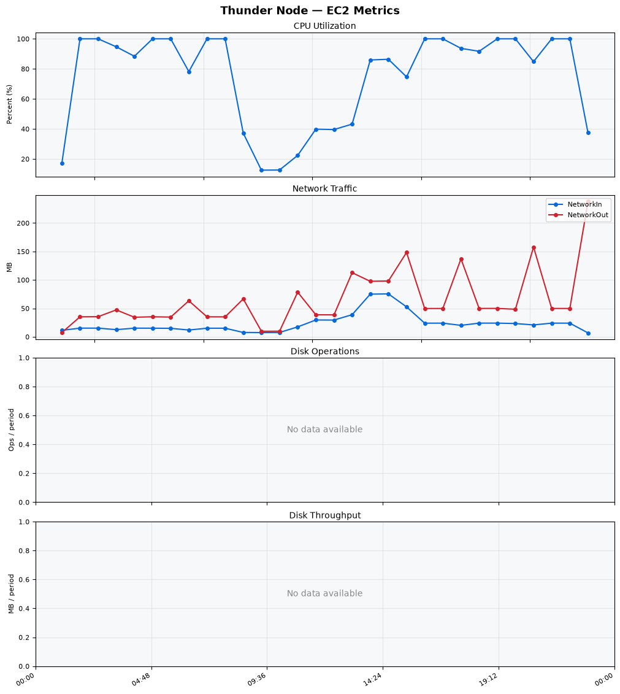
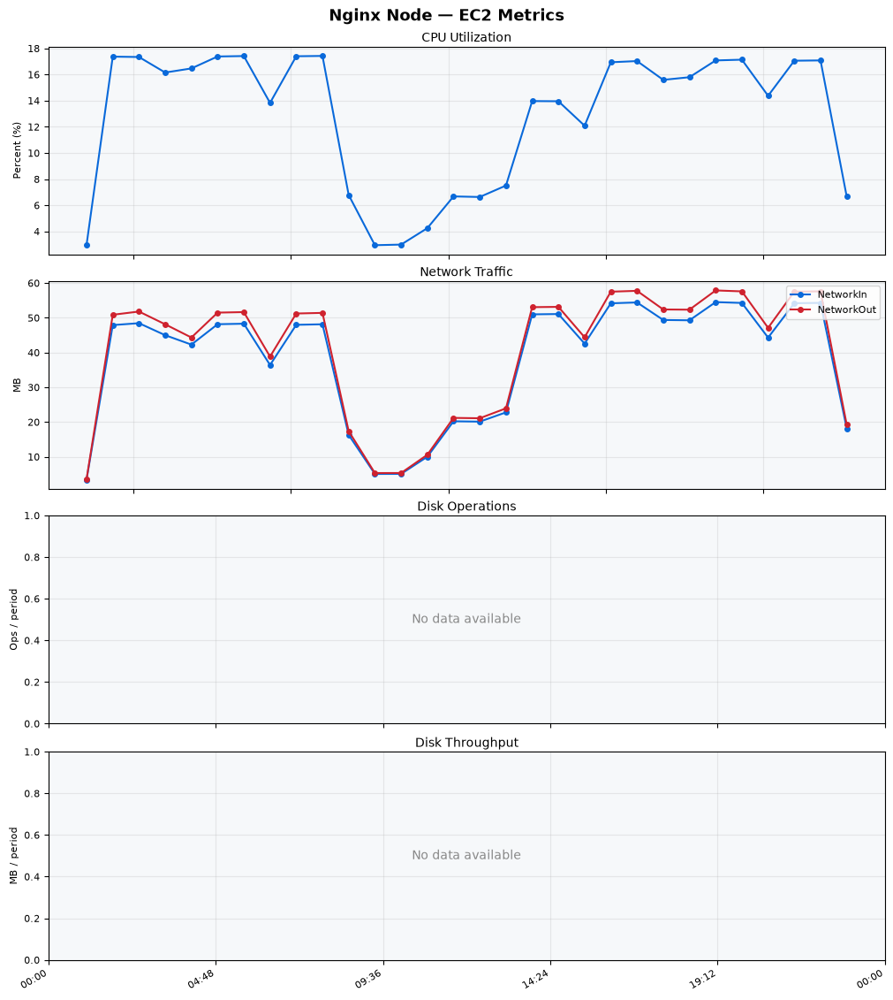
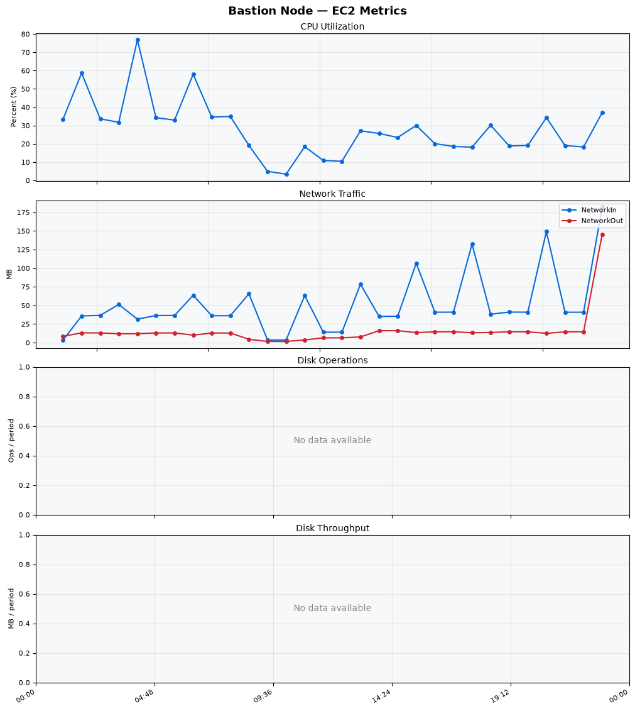
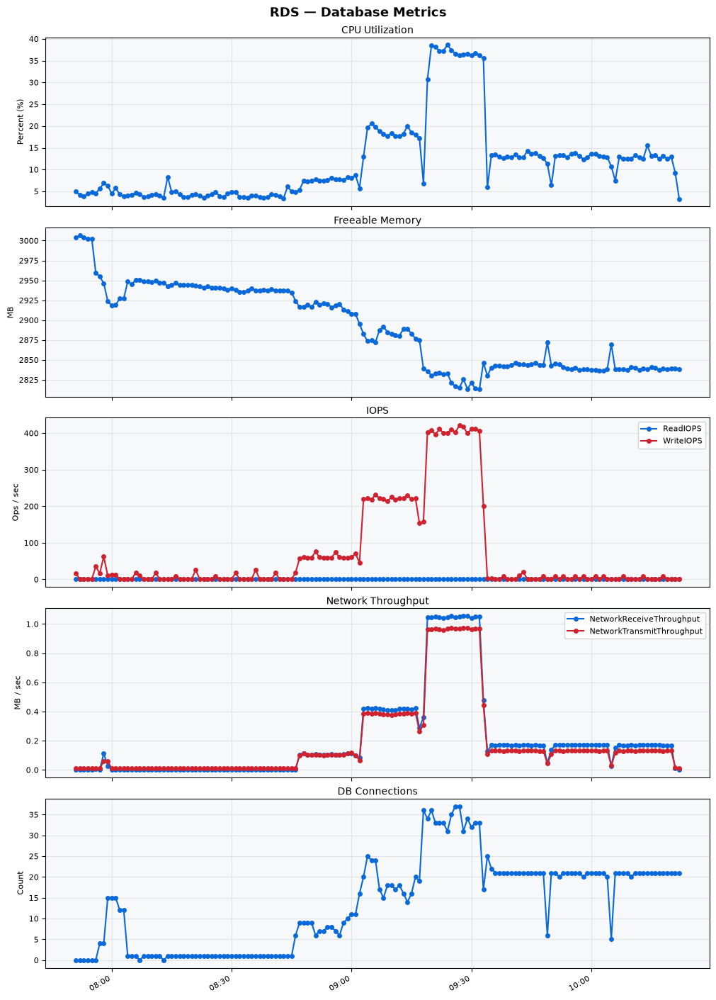

Build Number: 344

Build Date and Time: 2026-08-06--10-30-38

Thunder Pack URL: https://github.com/thunder-id/thunderid/releases/download/v1.0.0-beta/thunderid-1.0.0-beta-linux-x64.zip

Deployment Pattern: single-node

Thunder Instance Type: t2.nano

Nginx Instance Type: t2.nano

Bastion Instance Type: t3a.large

Database Instance Type: db.t3.medium

Database Type: postgres

Concurrency: 50,200,500

Thunder Instance ID: i-0b420a29281219c3a

Nginx Instance ID: i-079653e6111896d54

Bastion Instance ID: i-04b1921103403482c

RDS Instance ID: wso2thunderdbinstance1557

Performance Repo: https://github.com/asgardeo/thunder-performance

Pipeline Definition Branch: main

Checkout Ref (code under test): main

## Summary

| Scenario Name | Heap Size | Concurrent Users | Label | # Samples | Error % | Throughput (Requests/sec) | Average Response Time (ms) | 95th Percentile of Response Time (ms) |
| --- | --- | --- | --- | --- | --- | --- | --- | --- |
| Client Credentials Grant Type | N/A | 50 | 1 Get access token | 302889 | 0.00 | 504.43 | 97.67 | 120.00 |
| Client Credentials Grant Type | N/A | 200 | 1 Get access token | 302025 | 0.00 | 501.66 | 397.38 | 431.00 |
| Client Credentials Grant Type | N/A | 500 | 1 Get access token | 301080 | 0.00 | 498.25 | 999.35 | 1047.00 |
| Authorization Code Grant Type | N/A | 50 | 1 Send request to authorize endpoint | 4958 | 0.00 | 8.27 | 7.07 | 12.00 |
| Authorization Code Grant Type | N/A | 50 | 2 Start Authentication Flow | 4958 | 0.00 | 8.27 | 4.55 | 7.00 |
| Authorization Code Grant Type | N/A | 50 | 3 Perform authentication | 4959 | 0.00 | 8.27 | 10.05 | 14.00 |
| Authorization Code Grant Type | N/A | 50 | 4 Obtain authorization code | 4959 | 0.00 | 8.27 | 5.62 | 8.00 |
| Authorization Code Grant Type | N/A | 50 | 5 Obtain access token | 4959 | 0.00 | 8.27 | 9.82 | 13.00 |
| Authorization Code Grant Type | N/A | 200 | 1 Send request to authorize endpoint | 19729 | 0.00 | 32.90 | 8.25 | 15.00 |
| Authorization Code Grant Type | N/A | 200 | 2 Start Authentication Flow | 19729 | 0.00 | 32.90 | 5.66 | 11.00 |
| Authorization Code Grant Type | N/A | 200 | 3 Perform authentication | 19728 | 0.00 | 32.90 | 11.15 | 19.00 |
| Authorization Code Grant Type | N/A | 200 | 4 Obtain authorization code | 19728 | 0.00 | 32.90 | 6.92 | 13.00 |
| Authorization Code Grant Type | N/A | 200 | 5 Obtain access token | 19729 | 0.00 | 32.90 | 11.28 | 18.00 |
| Authorization Code Grant Type | N/A | 500 | 1 Send request to authorize endpoint | 48996 | 0.00 | 81.70 | 21.70 | 51.00 |
| Authorization Code Grant Type | N/A | 500 | 2 Start Authentication Flow | 48993 | 0.00 | 81.71 | 16.84 | 40.00 |
| Authorization Code Grant Type | N/A | 500 | 3 Perform authentication | 48997 | 0.00 | 81.70 | 32.05 | 75.00 |
| Authorization Code Grant Type | N/A | 500 | 4 Obtain authorization code | 48996 | 0.00 | 81.71 | 19.14 | 44.00 |
| Authorization Code Grant Type | N/A | 500 | 5 Obtain access token | 48996 | 0.00 | 81.71 | 26.77 | 60.00 |
| User Authentication with Credentials | N/A | 50 | 1 Perform user authentication | 291513 | 0.00 | 485.91 | 102.52 | 189.00 |
| User Authentication with Credentials | N/A | 200 | 1 Perform user authentication | 292168 | 0.00 | 486.77 | 410.40 | 1119.00 |
| User Authentication with Credentials | N/A | 500 | 1 Perform user authentication | 291376 | 0.01 | 485.01 | 1028.37 | 2959.00 |

## CloudWatch Metrics

### Thunder (EC2)

### Nginx (EC2)

### Bastion (EC2)

### RDS

