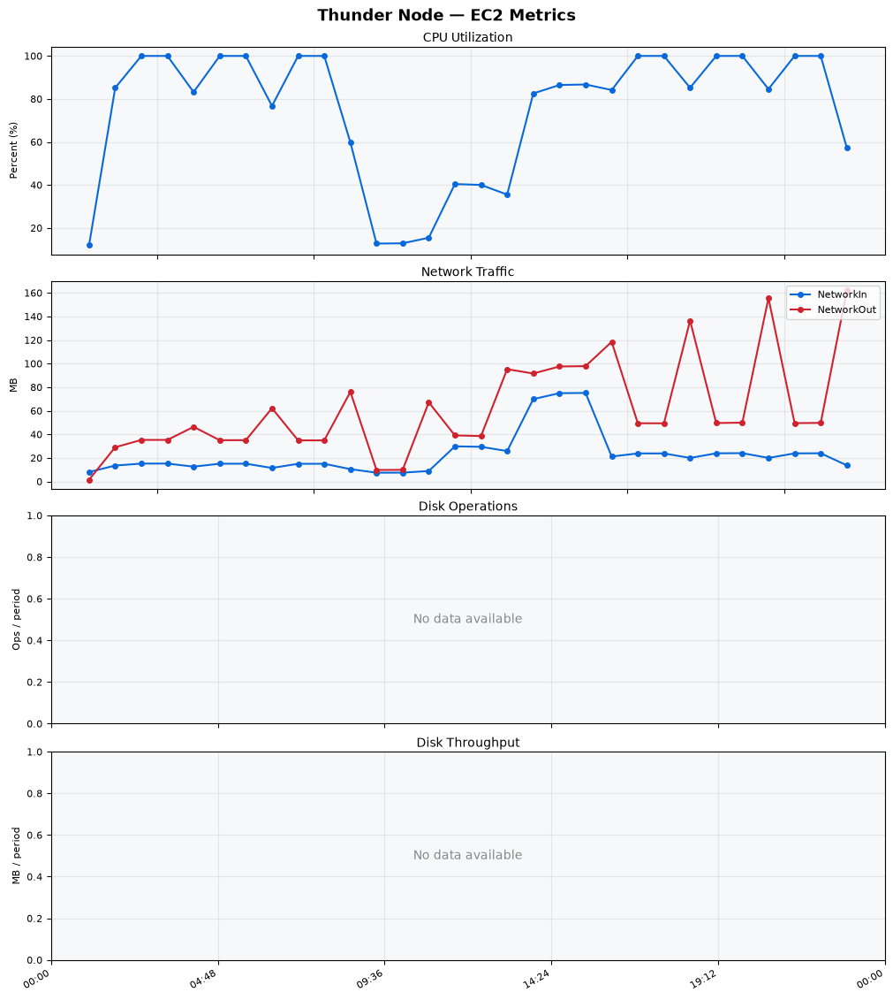
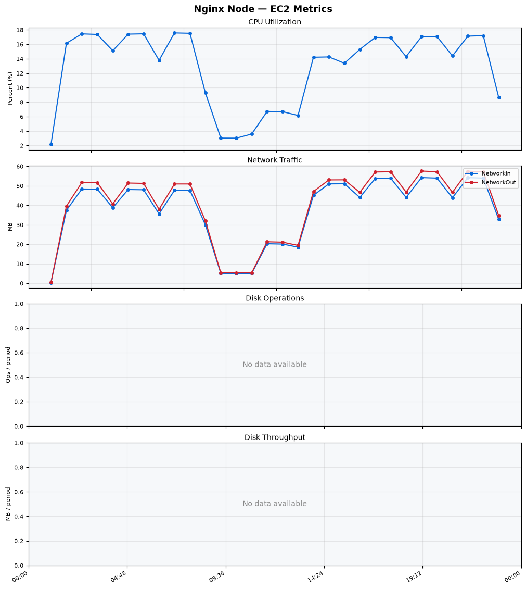
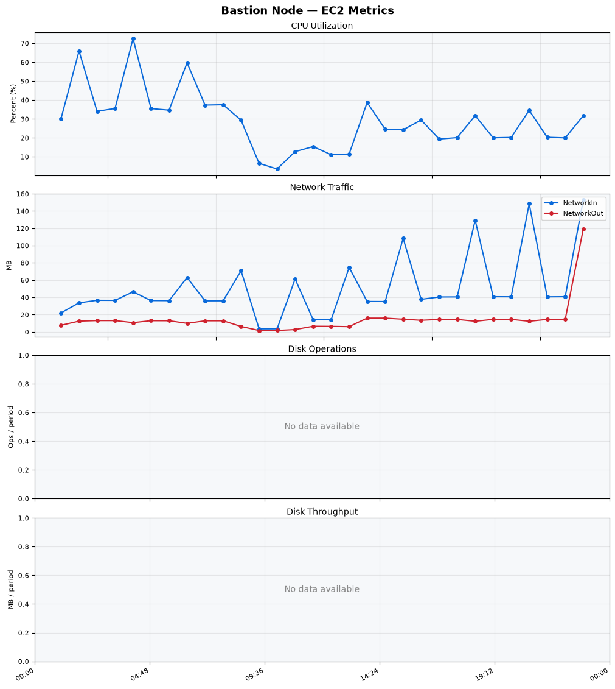
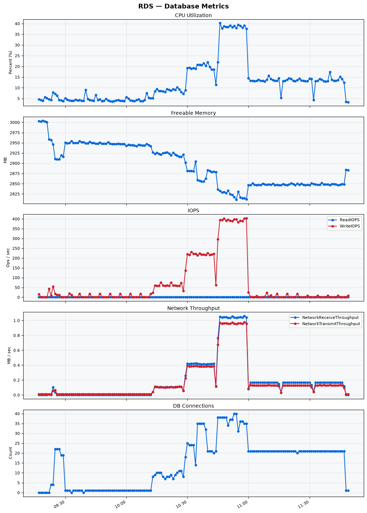

Build Number: 349

Build Date and Time: 2026-08-10--11-57-30

Thunder Pack URL: https://github.com/thunder-id/thunderid/releases/download/v1.0.0-beta/thunderid-1.0.0-beta-linux-x64.zip

Deployment Pattern: single-node

Thunder Instance Type: t2.nano

Nginx Instance Type: t2.nano

Bastion Instance Type: t3a.large

Database Instance Type: db.t3.medium

Database Type: postgres

Concurrency: 50,200,500

Thunder Instance ID: i-0a702bc6b647737c1

Nginx Instance ID: i-0f90fa2fda89717d7

Bastion Instance ID: i-07f9c86f2597db173

RDS Instance ID: wso2thunderdbinstance14548

Performance Repo: https://github.com/asgardeo/thunder-performance

Pipeline Definition Branch: main

Checkout Ref (code under test): main

## Summary

| Scenario Name | Heap Size | Concurrent Users | Label | # Samples | Error % | Throughput (Requests/sec) | Average Response Time (ms) | 95th Percentile of Response Time (ms) |
| --- | --- | --- | --- | --- | --- | --- | --- | --- |
| Client Credentials Grant Type | N/A | 50 | 1 Get access token | 301870 | 0.00 | 502.69 | 98.04 | 120.00 |
| Client Credentials Grant Type | N/A | 200 | 1 Get access token | 300143 | 0.00 | 498.45 | 399.87 | 435.00 |
| Client Credentials Grant Type | N/A | 500 | 1 Get access token | 304649 | 0.00 | 494.14 | 987.47 | 1055.00 |
| Authorization Code Grant Type | N/A | 50 | 1 Send request to authorize endpoint | 4958 | 0.00 | 8.27 | 8.41 | 15.00 |
| Authorization Code Grant Type | N/A | 50 | 2 Start Authentication Flow | 4958 | 0.00 | 8.27 | 5.48 | 9.00 |
| Authorization Code Grant Type | N/A | 50 | 3 Perform authentication | 4960 | 0.00 | 8.28 | 11.28 | 17.00 |
| Authorization Code Grant Type | N/A | 50 | 4 Obtain authorization code | 4958 | 0.00 | 8.27 | 6.57 | 11.00 |
| Authorization Code Grant Type | N/A | 50 | 5 Obtain access token | 4958 | 0.00 | 8.27 | 11.22 | 17.00 |
| Authorization Code Grant Type | N/A | 200 | 1 Send request to authorize endpoint | 19738 | 0.00 | 32.91 | 9.75 | 18.00 |
| Authorization Code Grant Type | N/A | 200 | 2 Start Authentication Flow | 19738 | 0.00 | 32.91 | 6.66 | 13.00 |
| Authorization Code Grant Type | N/A | 200 | 3 Perform authentication | 19738 | 0.00 | 32.91 | 13.16 | 24.00 |
| Authorization Code Grant Type | N/A | 200 | 4 Obtain authorization code | 19739 | 0.00 | 32.91 | 8.11 | 16.00 |
| Authorization Code Grant Type | N/A | 200 | 5 Obtain access token | 19740 | 0.00 | 32.91 | 13.00 | 22.00 |
| Authorization Code Grant Type | N/A | 500 | 1 Send request to authorize endpoint | 48732 | 0.00 | 81.27 | 27.92 | 70.00 |
| Authorization Code Grant Type | N/A | 500 | 2 Start Authentication Flow | 48732 | 0.00 | 81.27 | 22.21 | 57.00 |
| Authorization Code Grant Type | N/A | 500 | 3 Perform authentication | 48728 | 0.00 | 81.26 | 40.14 | 100.00 |
| Authorization Code Grant Type | N/A | 500 | 4 Obtain authorization code | 48730 | 0.00 | 81.27 | 26.20 | 68.00 |
| Authorization Code Grant Type | N/A | 500 | 5 Obtain access token | 48730 | 0.00 | 81.27 | 32.55 | 76.00 |
| User Authentication with Credentials | N/A | 50 | 1 Perform user authentication | 289062 | 0.00 | 481.82 | 103.34 | 190.00 |
| User Authentication with Credentials | N/A | 200 | 1 Perform user authentication | 290610 | 0.00 | 484.14 | 412.56 | 1119.00 |
| User Authentication with Credentials | N/A | 500 | 1 Perform user authentication | 290499 | 0.00 | 483.56 | 1031.35 | 2991.00 |

## CloudWatch Metrics

### Thunder (EC2)

### Nginx (EC2)

### Bastion (EC2)

### RDS

