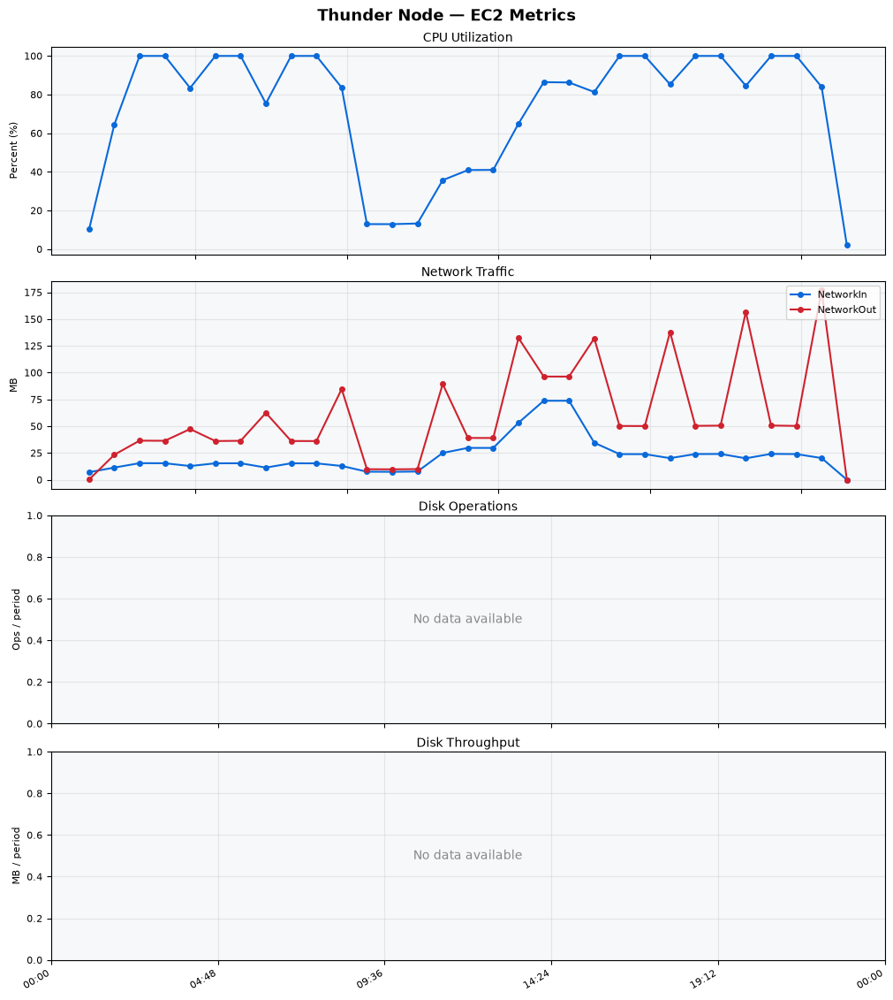
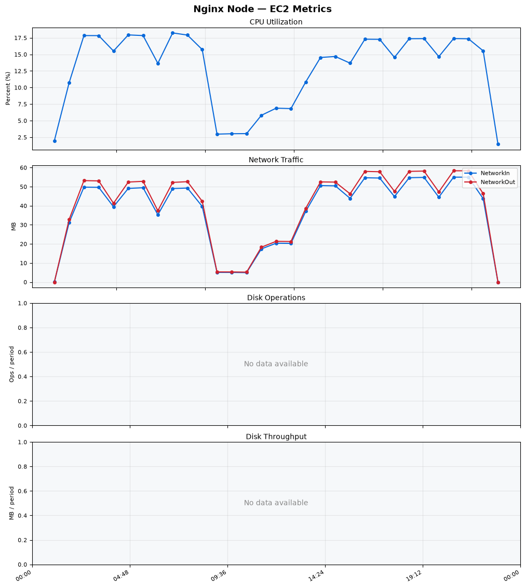
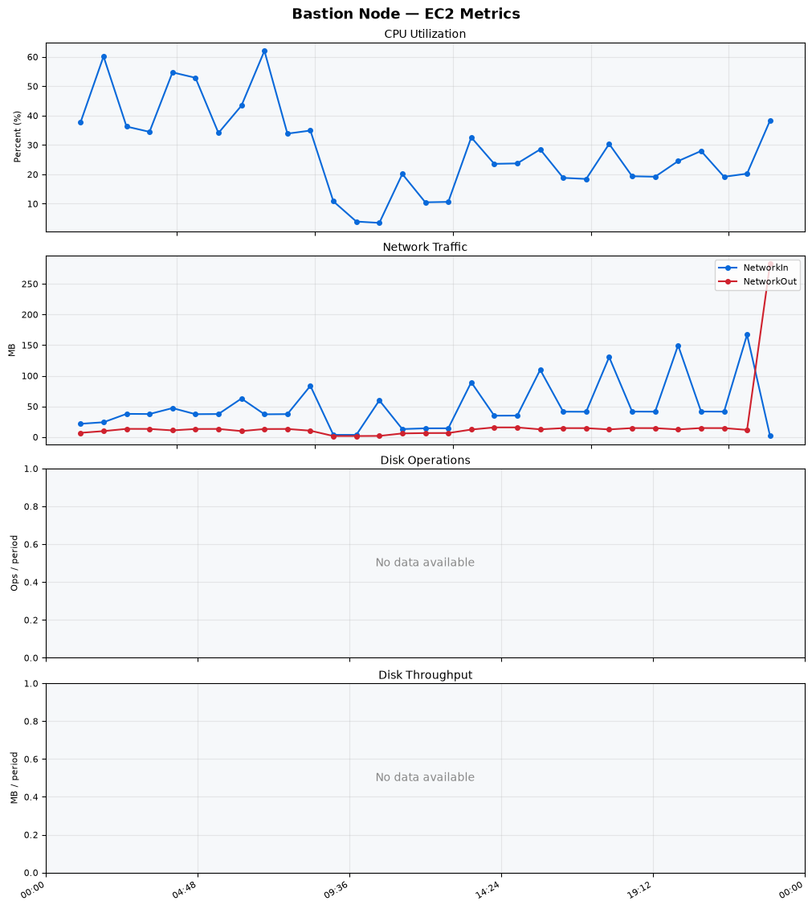
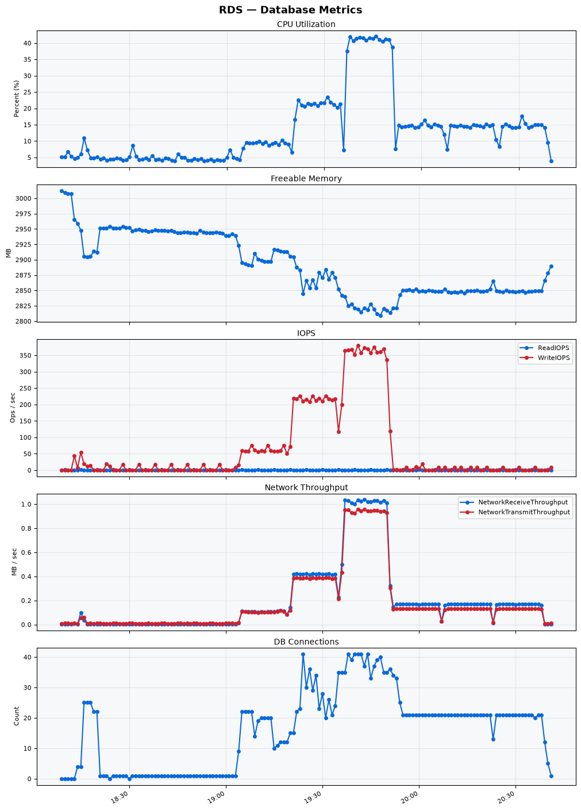

Build Number: 350

Build Date and Time: 2026-08-10--20-47-20

Thunder Pack URL: https://github.com/thunder-id/thunderid/releases/download/v1.0.0-beta2/thunderid-1.0.0-beta2-linux-x64.zip

Deployment Pattern: single-node

Thunder Instance Type: t2.nano

Nginx Instance Type: t2.nano

Bastion Instance Type: t3a.large

Database Instance Type: db.t3.medium

Database Type: postgres

Concurrency: 50,200,500

Thunder Instance ID: i-0b5dbfae1a736b688

Nginx Instance ID: i-05104fcf333343426

Bastion Instance ID: i-027e8cf780e1826b1

RDS Instance ID: wso2thunderdbinstance1667

Performance Repo: https://github.com/asgardeo/thunder-performance

Pipeline Definition Branch: main

Checkout Ref (code under test): main

## Summary

| Scenario Name | Heap Size | Concurrent Users | Label | # Samples | Error % | Throughput (Requests/sec) | Average Response Time (ms) | 95th Percentile of Response Time (ms) |
| --- | --- | --- | --- | --- | --- | --- | --- | --- |
| Client Credentials Grant Type | N/A | 50 | 1 Get access token | 305713 | 0.00 | 509.08 | 96.89 | 119.00 |
| Client Credentials Grant Type | N/A | 200 | 1 Get access token | 304654 | 0.00 | 505.84 | 394.07 | 427.00 |
| Client Credentials Grant Type | N/A | 500 | 1 Get access token | 318456 | 0.00 | 503.26 | 945.48 | 1039.00 |
| Authorization Code Grant Type | N/A | 50 | 1 Send request to authorize endpoint | 4933 | 0.00 | 8.23 | 8.57 | 15.00 |
| Authorization Code Grant Type | N/A | 50 | 2 Start Authentication Flow | 4933 | 0.00 | 8.23 | 5.51 | 10.00 |
| Authorization Code Grant Type | N/A | 50 | 3 Perform authentication | 4931 | 0.00 | 8.22 | 12.80 | 19.00 |
| Authorization Code Grant Type | N/A | 50 | 4 Obtain authorization code | 4932 | 0.00 | 8.22 | 7.02 | 11.00 |
| Authorization Code Grant Type | N/A | 50 | 5 Obtain access token | 4933 | 0.00 | 8.23 | 11.57 | 18.00 |
| Authorization Code Grant Type | N/A | 200 | 1 Send request to authorize endpoint | 19775 | 0.00 | 32.98 | 11.53 | 21.00 |
| Authorization Code Grant Type | N/A | 200 | 2 Start Authentication Flow | 19775 | 0.00 | 32.98 | 8.08 | 15.00 |
| Authorization Code Grant Type | N/A | 200 | 3 Perform authentication | 19774 | 0.00 | 32.98 | 16.12 | 27.00 |
| Authorization Code Grant Type | N/A | 200 | 4 Obtain authorization code | 19774 | 0.00 | 32.98 | 10.48 | 18.00 |
| Authorization Code Grant Type | N/A | 200 | 5 Obtain access token | 19775 | 0.00 | 32.98 | 14.91 | 25.00 |
| Authorization Code Grant Type | N/A | 500 | 1 Send request to authorize endpoint | 47752 | 0.00 | 79.63 | 50.17 | 194.00 |
| Authorization Code Grant Type | N/A | 500 | 2 Start Authentication Flow | 47753 | 0.00 | 79.63 | 41.88 | 167.00 |
| Authorization Code Grant Type | N/A | 500 | 3 Perform authentication | 47752 | 0.00 | 79.63 | 69.80 | 252.00 |
| Authorization Code Grant Type | N/A | 500 | 4 Obtain authorization code | 47752 | 0.00 | 79.63 | 59.43 | 287.00 |
| Authorization Code Grant Type | N/A | 500 | 5 Obtain access token | 47752 | 0.00 | 79.62 | 47.60 | 133.00 |
| User Authentication with Credentials | N/A | 50 | 1 Perform user authentication | 289695 | 0.00 | 482.87 | 103.18 | 191.00 |
| User Authentication with Credentials | N/A | 200 | 1 Perform user authentication | 291140 | 0.00 | 485.05 | 411.86 | 1119.00 |
| User Authentication with Credentials | N/A | 500 | 1 Perform user authentication | 291028 | 0.00 | 484.38 | 1029.78 | 2975.00 |

## CloudWatch Metrics

### Thunder (EC2)

### Nginx (EC2)

### Bastion (EC2)

### RDS

