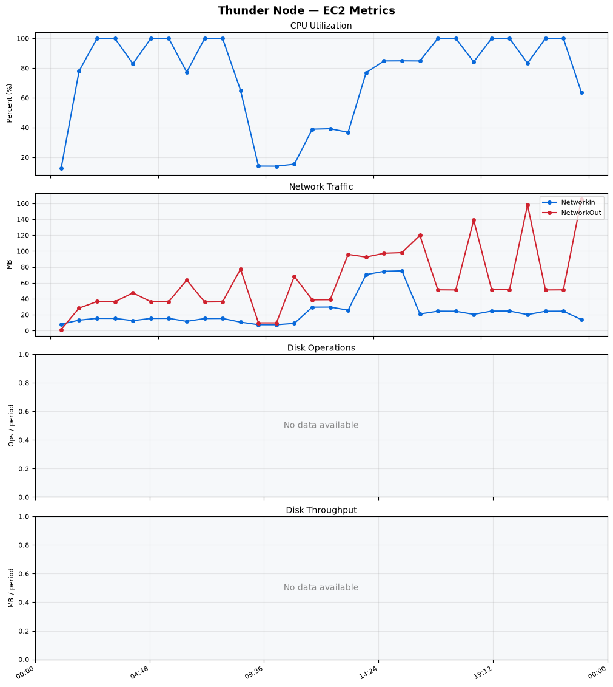
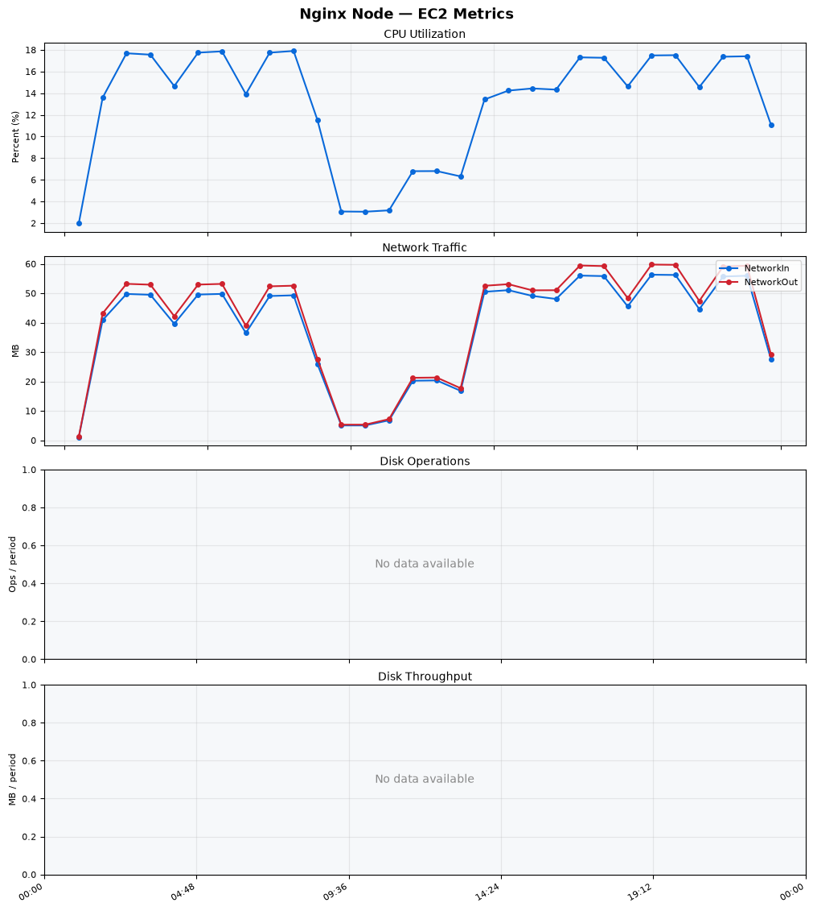
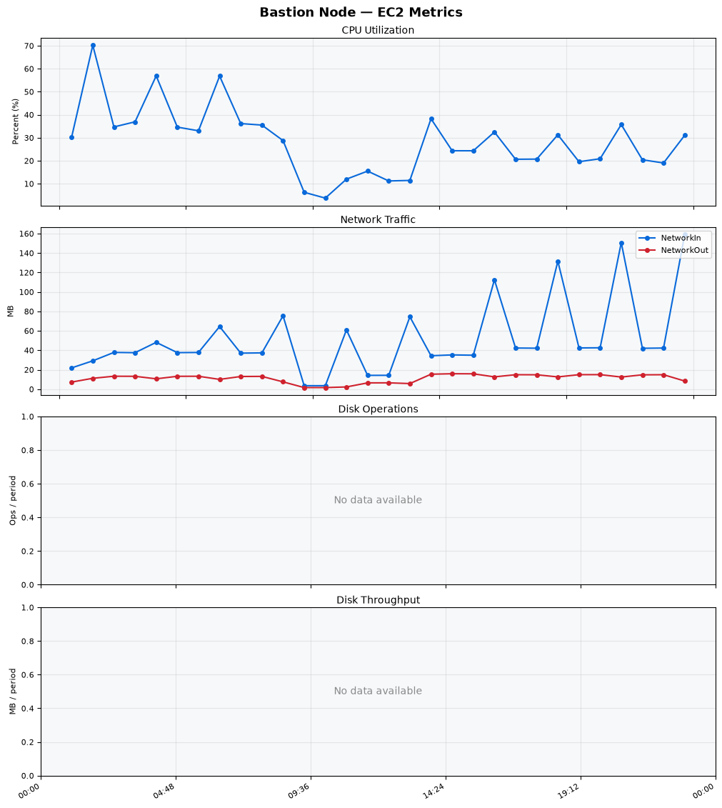
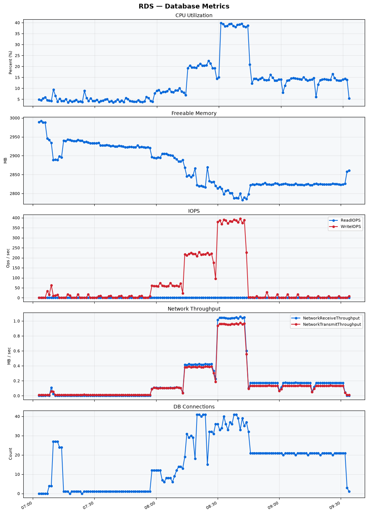

Build Number: 352

Build Date and Time: 2026-08-11--09-42-17

Thunder Pack URL: https://github.com/thunder-id/thunderid/releases/download/v1.0.0-beta2/thunderid-1.0.0-beta2-linux-x64.zip

Deployment Pattern: single-node

Thunder Instance Type: t2.nano

Nginx Instance Type: t2.nano

Bastion Instance Type: t3a.large

Database Instance Type: db.t3.medium

Database Type: postgres

Concurrency: 50,200,500

Thunder Instance ID: i-00bc0c56726be19ed

Nginx Instance ID: i-09c8236b7c19f453c

Bastion Instance ID: i-0f8375b7da50ac2ff

RDS Instance ID: wso2thunderdbinstance3316

Performance Repo: https://github.com/asgardeo/thunder-performance

Pipeline Definition Branch: main

Checkout Ref (code under test): main

## Summary

| Scenario Name | Heap Size | Concurrent Users | Label | # Samples | Error % | Throughput (Requests/sec) | Average Response Time (ms) | 95th Percentile of Response Time (ms) |
| --- | --- | --- | --- | --- | --- | --- | --- | --- |
| Client Credentials Grant Type | N/A | 50 | 1 Get access token | 305969 | 0.00 | 509.51 | 96.38 | 118.00 |
| Client Credentials Grant Type | N/A | 200 | 1 Get access token | 306510 | 0.00 | 509.17 | 391.58 | 425.00 |
| Client Credentials Grant Type | N/A | 500 | 1 Get access token | 304834 | 0.00 | 504.71 | 986.35 | 1039.00 |
| Authorization Code Grant Type | N/A | 50 | 1 Send request to authorize endpoint | 4932 | 0.00 | 8.23 | 8.10 | 14.00 |
| Authorization Code Grant Type | N/A | 50 | 2 Start Authentication Flow | 4932 | 0.00 | 8.23 | 5.29 | 9.00 |
| Authorization Code Grant Type | N/A | 50 | 3 Perform authentication | 4932 | 0.00 | 8.23 | 11.48 | 18.00 |
| Authorization Code Grant Type | N/A | 50 | 4 Obtain authorization code | 4932 | 0.00 | 8.23 | 6.61 | 11.00 |
| Authorization Code Grant Type | N/A | 50 | 5 Obtain access token | 4932 | 0.00 | 8.23 | 11.06 | 17.00 |
| Authorization Code Grant Type | N/A | 200 | 1 Send request to authorize endpoint | 19868 | 0.00 | 33.13 | 10.66 | 20.00 |
| Authorization Code Grant Type | N/A | 200 | 2 Start Authentication Flow | 19868 | 0.00 | 33.13 | 7.42 | 15.00 |
| Authorization Code Grant Type | N/A | 200 | 3 Perform authentication | 19864 | 0.00 | 33.13 | 16.49 | 25.00 |
| Authorization Code Grant Type | N/A | 200 | 4 Obtain authorization code | 19864 | 0.00 | 33.13 | 9.67 | 17.00 |
| Authorization Code Grant Type | N/A | 200 | 5 Obtain access token | 19865 | 0.00 | 33.13 | 14.16 | 24.00 |
| Authorization Code Grant Type | N/A | 500 | 1 Send request to authorize endpoint | 48623 | 0.00 | 81.08 | 32.29 | 90.00 |
| Authorization Code Grant Type | N/A | 500 | 2 Start Authentication Flow | 48626 | 0.00 | 81.09 | 26.45 | 76.00 |
| Authorization Code Grant Type | N/A | 500 | 3 Perform authentication | 48621 | 0.00 | 81.08 | 46.29 | 126.00 |
| Authorization Code Grant Type | N/A | 500 | 4 Obtain authorization code | 48621 | 0.00 | 81.08 | 35.63 | 108.00 |
| Authorization Code Grant Type | N/A | 500 | 5 Obtain access token | 48624 | 0.00 | 81.08 | 34.41 | 85.00 |
| User Authentication with Credentials | N/A | 50 | 1 Perform user authentication | 296280 | 0.00 | 493.87 | 100.78 | 186.00 |
| User Authentication with Credentials | N/A | 200 | 1 Perform user authentication | 298247 | 0.00 | 496.91 | 401.99 | 1087.00 |
| User Authentication with Credentials | N/A | 500 | 1 Perform user authentication | 296644 | 0.00 | 493.79 | 1010.04 | 2911.00 |

## CloudWatch Metrics

### Thunder (EC2)

### Nginx (EC2)

### Bastion (EC2)

### RDS

