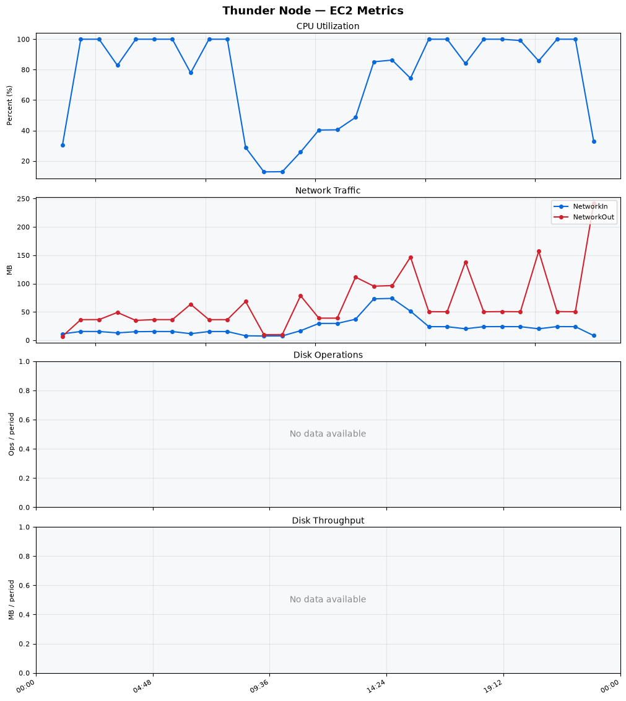
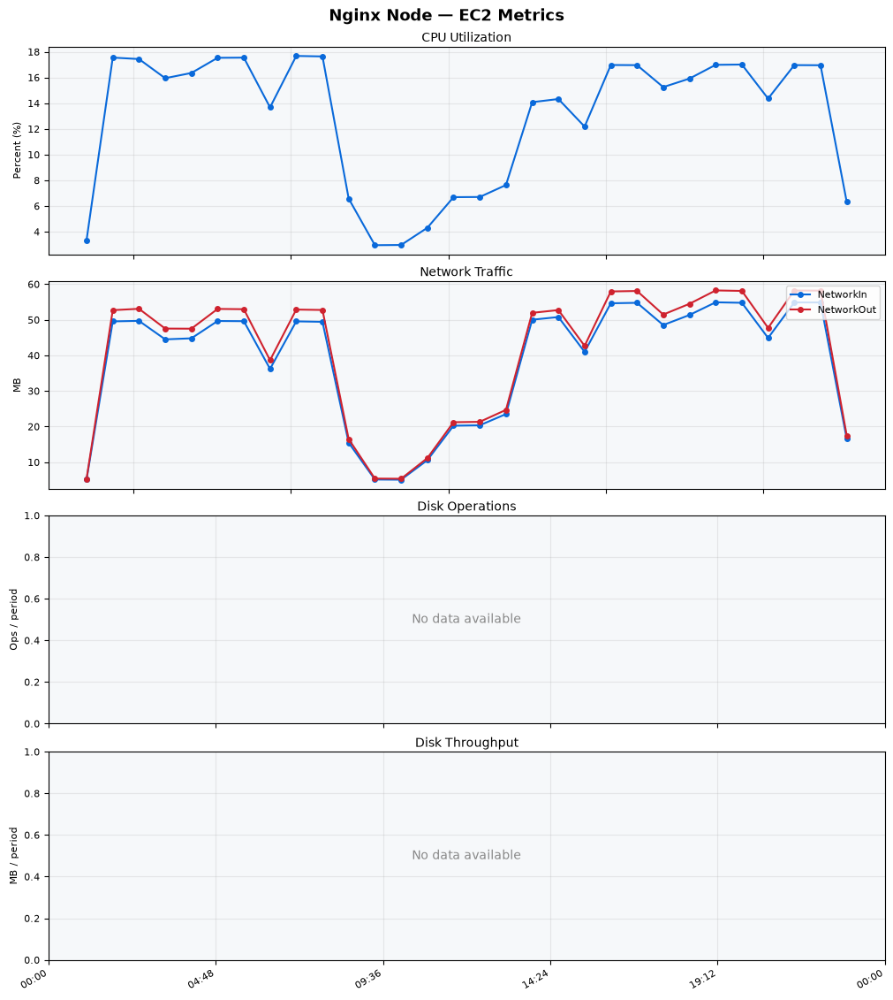
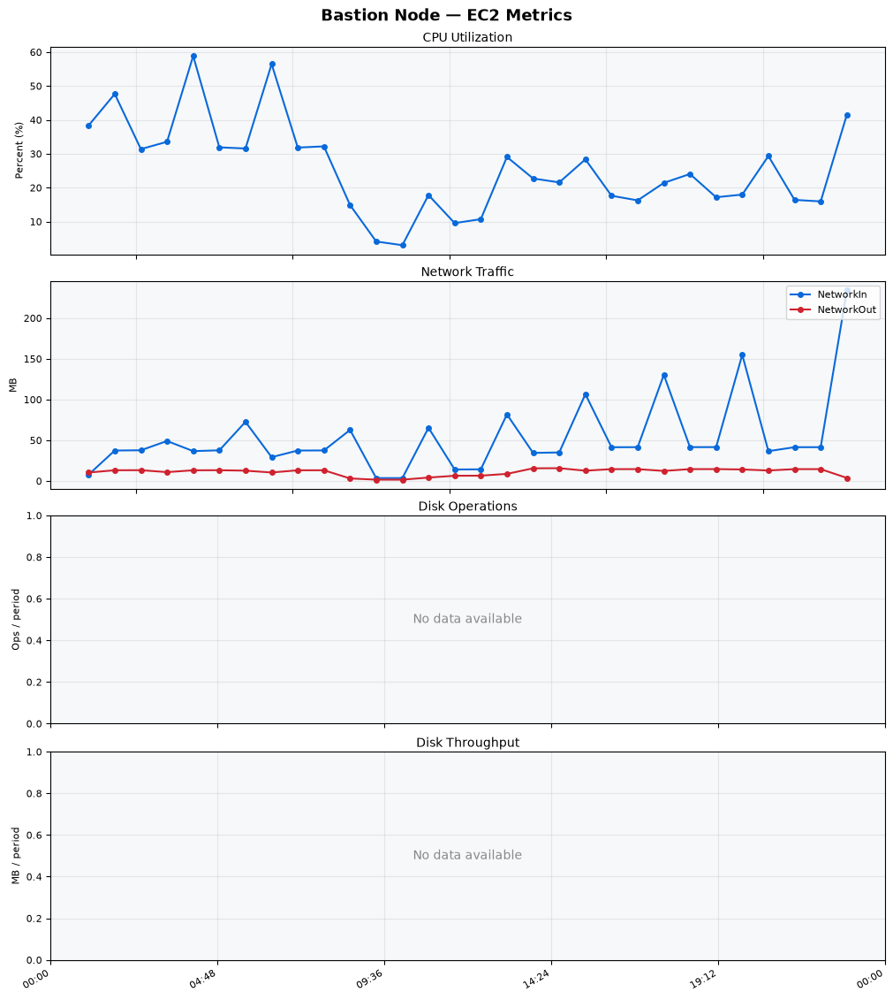
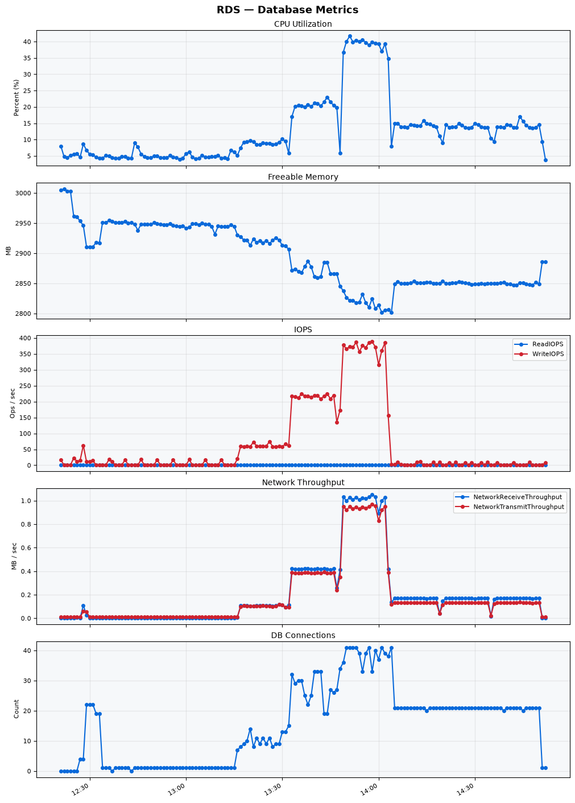

Build Number: 354

Build Date and Time: 2026-08-11--14-58-32

Thunder Pack URL: https://github.com/thunder-id/thunderid/releases/download/v1.0.0-beta2/thunderid-1.0.0-beta2-linux-x64.zip

Deployment Pattern: single-node

Thunder Instance Type: t2.nano

Nginx Instance Type: t2.nano

Bastion Instance Type: t3a.large

Database Instance Type: db.t3.medium

Database Type: postgres

Concurrency: 50,200,500

Thunder Instance ID: i-0e33f79ab8a62b4e4

Nginx Instance ID: i-0a948e30ba025395b

Bastion Instance ID: i-05907e62bac562b09

RDS Instance ID: wso2thunderdbinstance31992

Performance Repo: https://github.com/asgardeo/thunder-performance

Pipeline Definition Branch: main

Checkout Ref (code under test): main

## Summary

| Scenario Name | Heap Size | Concurrent Users | Label | # Samples | Error % | Throughput (Requests/sec) | Average Response Time (ms) | 95th Percentile of Response Time (ms) |
| --- | --- | --- | --- | --- | --- | --- | --- | --- |
| Client Credentials Grant Type | N/A | 50 | 1 Get access token | 306317 | 0.00 | 510.20 | 96.78 | 119.00 |
| Client Credentials Grant Type | N/A | 200 | 1 Get access token | 305991 | 0.00 | 508.19 | 392.34 | 427.00 |
| Client Credentials Grant Type | N/A | 500 | 1 Get access token | 306435 | 0.00 | 505.75 | 981.85 | 1031.00 |
| Authorization Code Grant Type | N/A | 50 | 1 Send request to authorize endpoint | 4972 | 0.00 | 8.29 | 8.45 | 16.00 |
| Authorization Code Grant Type | N/A | 50 | 2 Start Authentication Flow | 4972 | 0.00 | 8.29 | 5.19 | 10.00 |
| Authorization Code Grant Type | N/A | 50 | 3 Perform authentication | 4971 | 0.00 | 8.29 | 11.66 | 20.00 |
| Authorization Code Grant Type | N/A | 50 | 4 Obtain authorization code | 4972 | 0.00 | 8.29 | 6.39 | 12.00 |
| Authorization Code Grant Type | N/A | 50 | 5 Obtain access token | 4972 | 0.00 | 8.29 | 10.85 | 18.00 |
| Authorization Code Grant Type | N/A | 200 | 1 Send request to authorize endpoint | 19789 | 0.00 | 33.00 | 12.30 | 23.00 |
| Authorization Code Grant Type | N/A | 200 | 2 Start Authentication Flow | 19790 | 0.00 | 33.00 | 8.48 | 17.00 |
| Authorization Code Grant Type | N/A | 200 | 3 Perform authentication | 19790 | 0.00 | 33.00 | 16.72 | 31.00 |
| Authorization Code Grant Type | N/A | 200 | 4 Obtain authorization code | 19790 | 0.00 | 33.00 | 11.30 | 21.00 |
| Authorization Code Grant Type | N/A | 200 | 5 Obtain access token | 19789 | 0.00 | 33.00 | 15.22 | 28.00 |
| Authorization Code Grant Type | N/A | 500 | 1 Send request to authorize endpoint | 47194 | 0.00 | 78.70 | 60.30 | 211.00 |
| Authorization Code Grant Type | N/A | 500 | 2 Start Authentication Flow | 47195 | 0.00 | 78.70 | 48.92 | 183.00 |
| Authorization Code Grant Type | N/A | 500 | 3 Perform authentication | 47194 | 0.00 | 78.70 | 90.27 | 287.00 |
| Authorization Code Grant Type | N/A | 500 | 4 Obtain authorization code | 47193 | 0.00 | 78.69 | 86.16 | 317.00 |
| Authorization Code Grant Type | N/A | 500 | 5 Obtain access token | 47193 | 0.00 | 78.70 | 52.69 | 142.00 |
| User Authentication with Credentials | N/A | 50 | 1 Perform user authentication | 290705 | 0.00 | 484.46 | 102.85 | 190.00 |
| User Authentication with Credentials | N/A | 200 | 1 Perform user authentication | 291418 | 0.00 | 485.53 | 411.50 | 1119.00 |
| User Authentication with Credentials | N/A | 500 | 1 Perform user authentication | 291285 | 0.00 | 484.81 | 1028.91 | 2975.00 |

## CloudWatch Metrics

### Thunder (EC2)

### Nginx (EC2)

### Bastion (EC2)

### RDS

