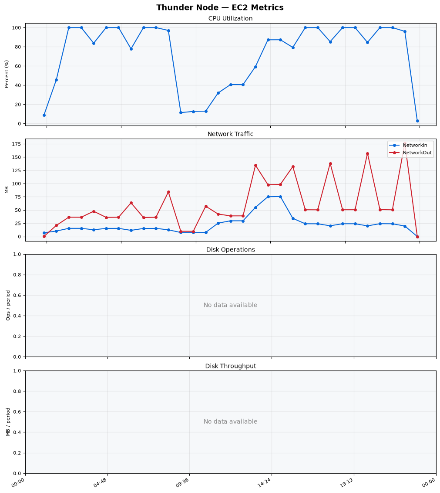
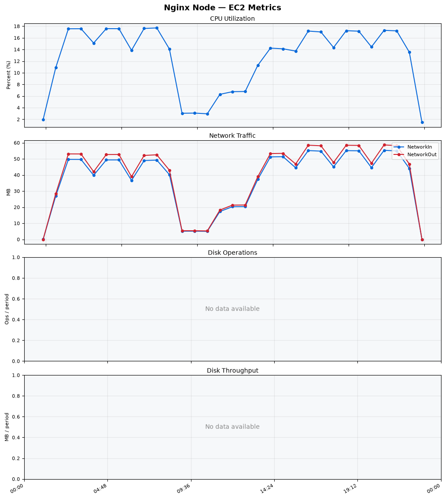
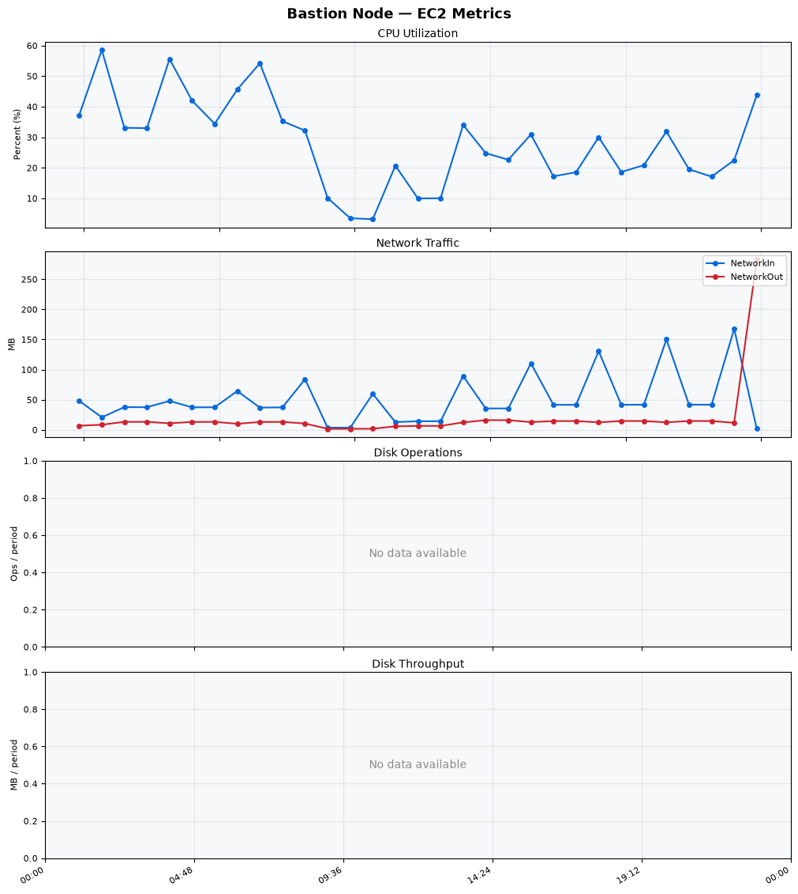
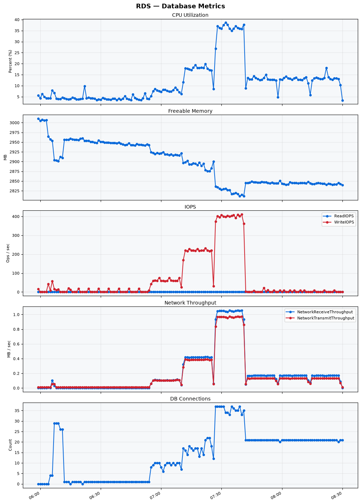

Build Number: 356

Build Date and Time: 2026-08-12--08-39-19

Thunder Pack URL: https://github.com/thunder-id/thunderid/releases/download/v1.0.0-beta2/thunderid-1.0.0-beta2-linux-x64.zip

Deployment Pattern: single-node

Thunder Instance Type: t2.nano

Nginx Instance Type: t2.nano

Bastion Instance Type: t3a.large

Database Instance Type: db.t3.medium

Database Type: postgres

Concurrency: 50,200,500

Thunder Instance ID: i-05434a3e2b6c93caf

Nginx Instance ID: i-04667522a01acab28

Bastion Instance ID: i-0f3d80224236b2bd9

RDS Instance ID: wso2thunderdbinstance29383

Performance Repo: https://github.com/asgardeo/thunder-performance

Pipeline Definition Branch: main

Checkout Ref (code under test): main

## Summary

| Scenario Name | Heap Size | Concurrent Users | Label | # Samples | Error % | Throughput (Requests/sec) | Average Response Time (ms) | 95th Percentile of Response Time (ms) |
| --- | --- | --- | --- | --- | --- | --- | --- | --- |
| Client Credentials Grant Type | N/A | 50 | 1 Get access token | 305579 | 0.00 | 508.94 | 96.60 | 119.00 |
| Client Credentials Grant Type | N/A | 200 | 1 Get access token | 304648 | 0.00 | 505.99 | 393.94 | 427.00 |
| Client Credentials Grant Type | N/A | 500 | 1 Get access token | 306231 | 0.00 | 502.92 | 982.13 | 1039.00 |
| Authorization Code Grant Type | N/A | 50 | 1 Send request to authorize endpoint | 4978 | 0.00 | 8.30 | 6.58 | 11.00 |
| Authorization Code Grant Type | N/A | 50 | 2 Start Authentication Flow | 4978 | 0.00 | 8.30 | 4.22 | 7.00 |
| Authorization Code Grant Type | N/A | 50 | 3 Perform authentication | 4979 | 0.00 | 8.30 | 9.56 | 14.00 |
| Authorization Code Grant Type | N/A | 50 | 4 Obtain authorization code | 4978 | 0.00 | 8.30 | 5.29 | 8.00 |
| Authorization Code Grant Type | N/A | 50 | 5 Obtain access token | 4978 | 0.00 | 8.30 | 9.59 | 13.00 |
| Authorization Code Grant Type | N/A | 200 | 1 Send request to authorize endpoint | 19830 | 0.00 | 33.07 | 7.97 | 15.00 |
| Authorization Code Grant Type | N/A | 200 | 2 Start Authentication Flow | 19830 | 0.00 | 33.07 | 5.36 | 11.00 |
| Authorization Code Grant Type | N/A | 200 | 3 Perform authentication | 19827 | 0.00 | 33.06 | 10.83 | 19.00 |
| Authorization Code Grant Type | N/A | 200 | 4 Obtain authorization code | 19828 | 0.00 | 33.06 | 6.72 | 13.00 |
| Authorization Code Grant Type | N/A | 200 | 5 Obtain access token | 19830 | 0.00 | 33.06 | 11.05 | 18.00 |
| Authorization Code Grant Type | N/A | 500 | 1 Send request to authorize endpoint | 48902 | 0.00 | 81.55 | 23.65 | 59.00 |
| Authorization Code Grant Type | N/A | 500 | 2 Start Authentication Flow | 48898 | 0.00 | 81.54 | 18.43 | 47.00 |
| Authorization Code Grant Type | N/A | 500 | 3 Perform authentication | 48919 | 0.00 | 81.58 | 34.87 | 86.00 |
| Authorization Code Grant Type | N/A | 500 | 4 Obtain authorization code | 48913 | 0.00 | 81.57 | 21.24 | 52.00 |
| Authorization Code Grant Type | N/A | 500 | 5 Obtain access token | 48909 | 0.00 | 81.56 | 28.90 | 68.00 |
| User Authentication with Credentials | N/A | 50 | 1 Perform user authentication | 291306 | 0.00 | 485.56 | 102.59 | 189.00 |
| User Authentication with Credentials | N/A | 200 | 1 Perform user authentication | 292146 | 0.00 | 486.74 | 410.37 | 1111.00 |
| User Authentication with Credentials | N/A | 500 | 1 Perform user authentication | 292126 | 0.00 | 486.23 | 1025.76 | 2959.00 |

## CloudWatch Metrics

### Thunder (EC2)

### Nginx (EC2)

### Bastion (EC2)

### RDS

