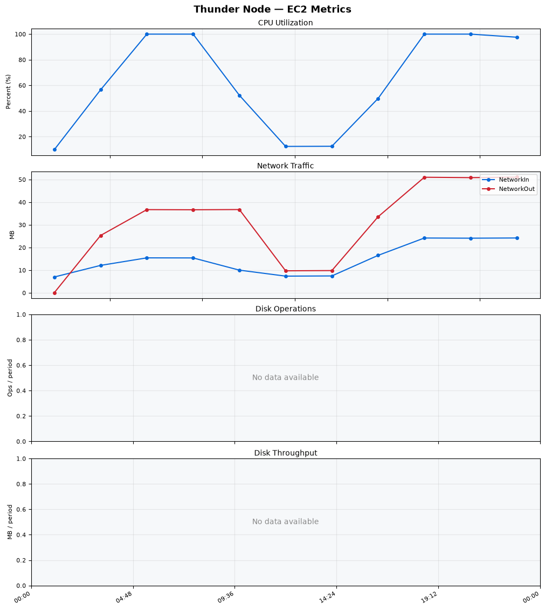
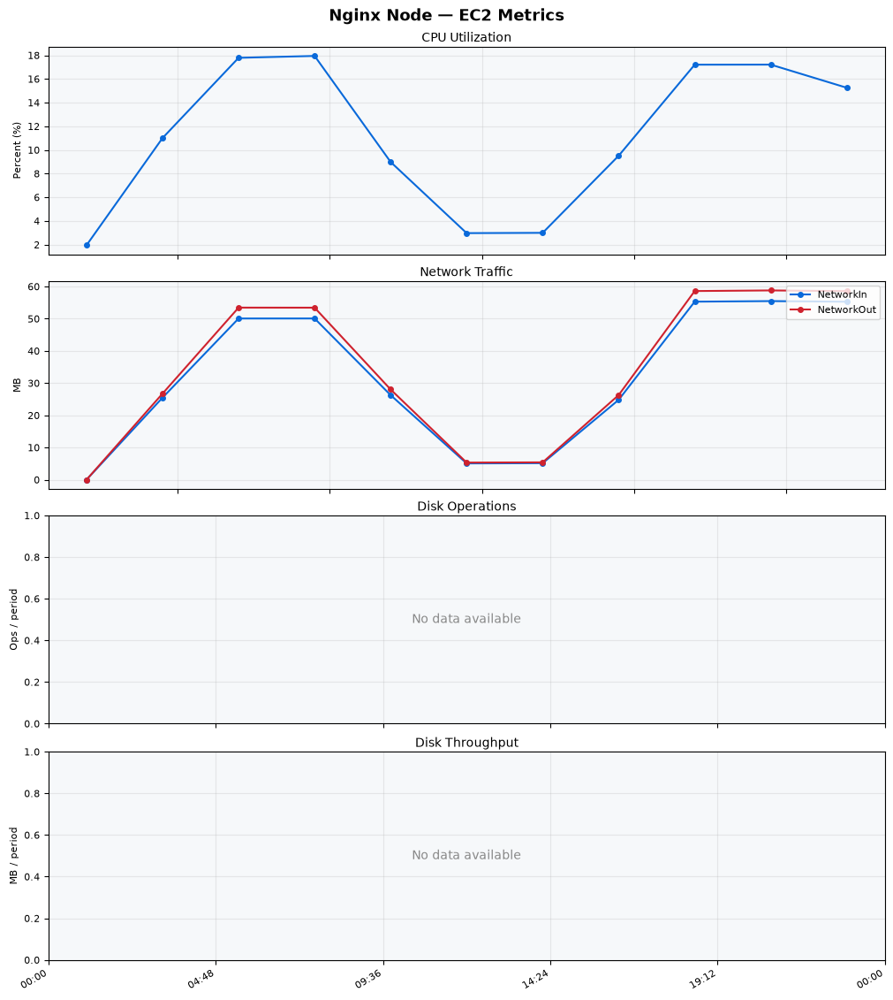
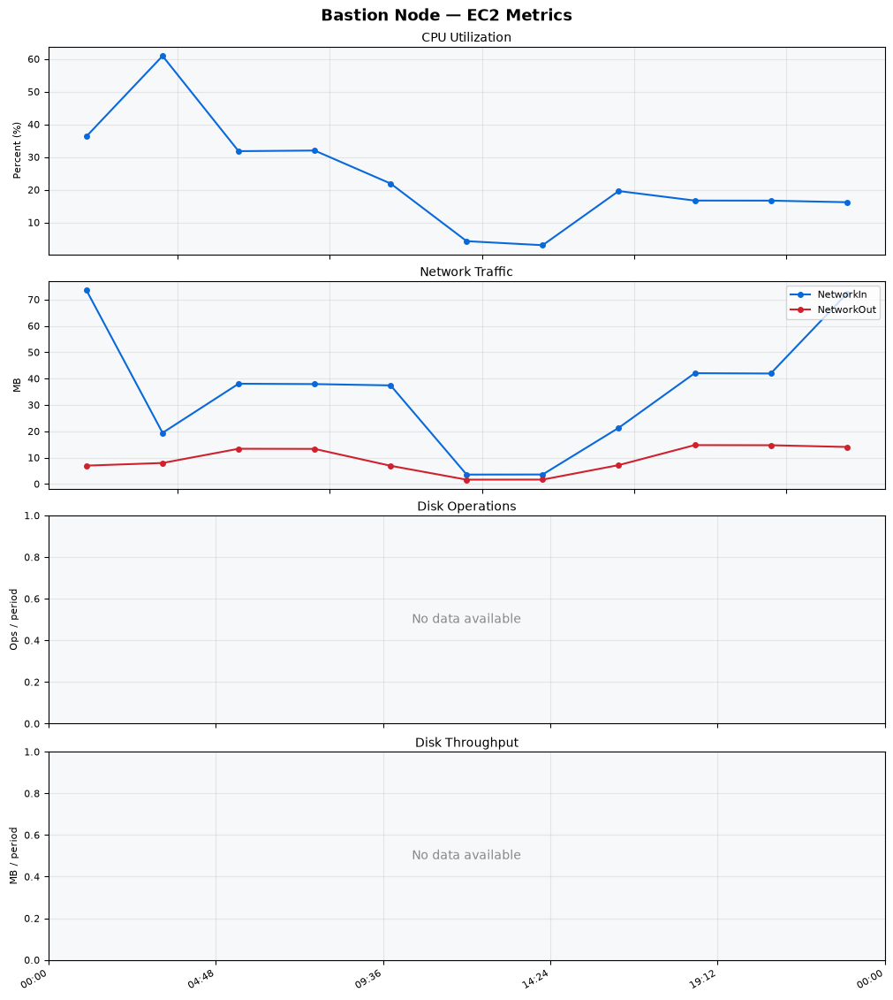
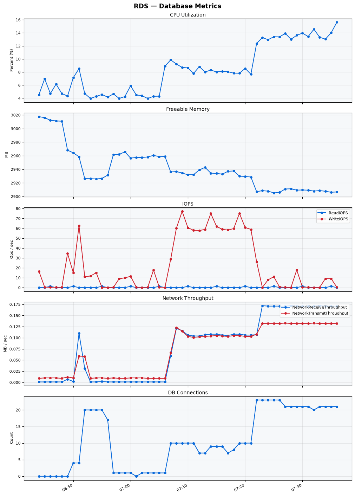

Build Number: 357

Build Date and Time: 2026-08-13--07-43-28

Thunder Pack URL: https://github.com/thunder-id/thunderid/releases/download/v1.0.0-beta2/thunderid-1.0.0-beta2-linux-x64.zip

Deployment Pattern: single-node

Thunder Instance Type: t2.nano

Nginx Instance Type: t2.nano

Bastion Instance Type: t3a.large

Database Instance Type: db.t3.medium

Database Type: postgres

Concurrency: 50

Thunder Instance ID: i-04558774f3cbc8289

Nginx Instance ID: i-07de7b401d9ecda2e

Bastion Instance ID: i-04295a01086b13f01

RDS Instance ID: wso2thunderdbinstance31618

Performance Repo: https://github.com/asgardeo/thunder-performance

Pipeline Definition Branch: restart-issue

Checkout Ref (code under test): restart-issue

## Summary

| Scenario Name | Heap Size | Concurrent Users | Label | # Samples | Error % | Throughput (Requests/sec) | Average Response Time (ms) | 95th Percentile of Response Time (ms) |
| --- | --- | --- | --- | --- | --- | --- | --- | --- |
| Client Credentials Grant Type | N/A | 50 | 1 Get access token | 308361 | 0.00 | 513.58 | 96.35 | 116.00 |
| Authorization Code Grant Type | N/A | 50 | 1 Send request to authorize endpoint | 4976 | 0.00 | 8.30 | 6.28 | 11.00 |
| Authorization Code Grant Type | N/A | 50 | 2 Start Authentication Flow | 4976 | 0.00 | 8.30 | 4.30 | 7.00 |
| Authorization Code Grant Type | N/A | 50 | 3 Perform authentication | 4977 | 0.00 | 8.30 | 9.58 | 13.00 |
| Authorization Code Grant Type | N/A | 50 | 4 Obtain authorization code | 4977 | 0.00 | 8.30 | 5.35 | 8.00 |
| Authorization Code Grant Type | N/A | 50 | 5 Obtain access token | 4977 | 0.00 | 8.30 | 9.57 | 13.00 |
| User Authentication with Credentials | N/A | 50 | 1 Perform user authentication | 294527 | 0.00 | 490.91 | 101.52 | 188.00 |

## CloudWatch Metrics

### Thunder (EC2)

### Nginx (EC2)

### Bastion (EC2)

### RDS

