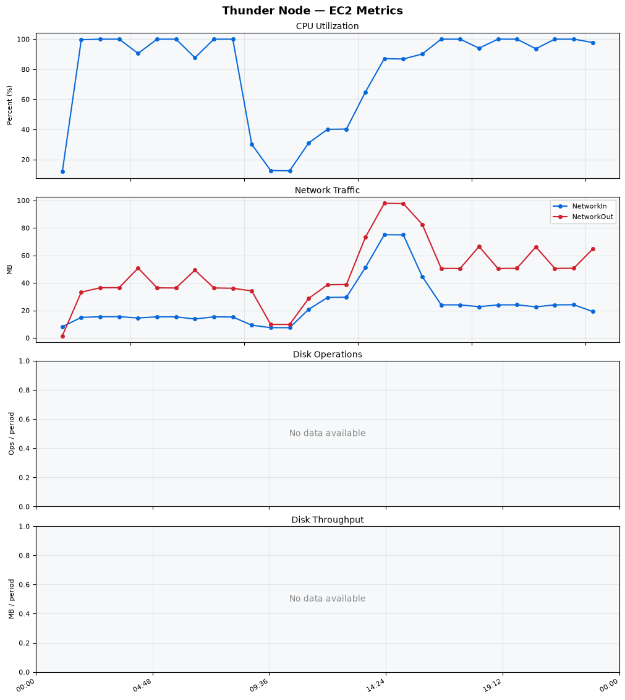
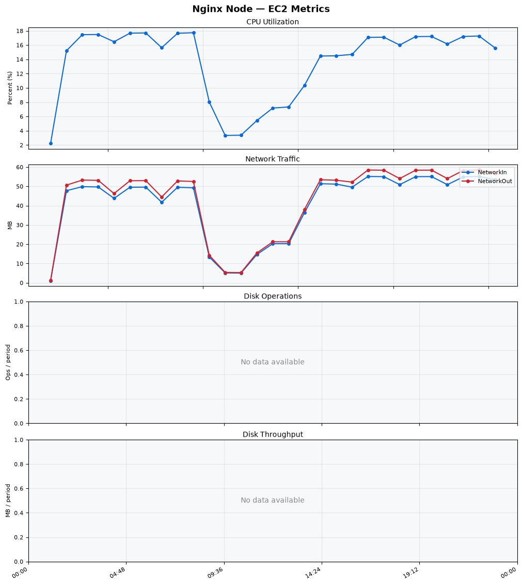
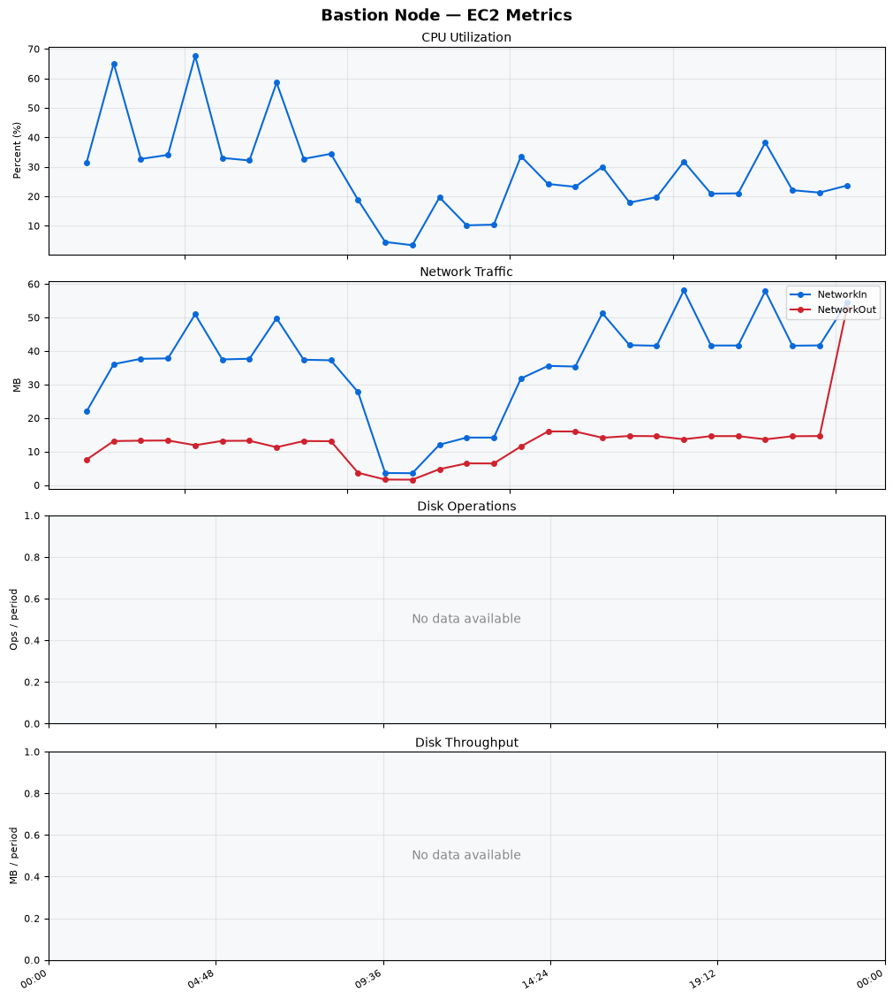
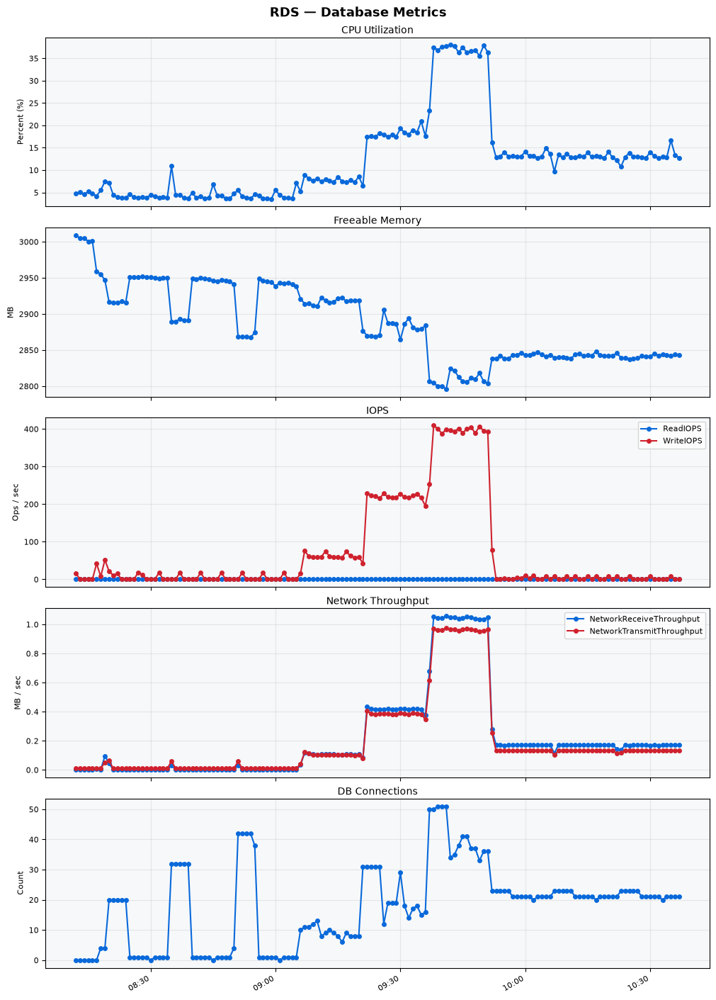

Build Number: 358

Build Date and Time: 2026-08-13--10-45-47

Thunder Pack URL: https://github.com/thunder-id/thunderid/releases/download/v1.0.0-beta2/thunderid-1.0.0-beta2-linux-x64.zip

Deployment Pattern: single-node

Thunder Instance Type: t2.nano

Nginx Instance Type: t2.nano

Bastion Instance Type: t3a.large

Database Instance Type: db.t3.medium

Database Type: postgres

Concurrency: 50,200,500

Thunder Instance ID: i-0dea279b29c90835f

Nginx Instance ID: i-0f259fcfa73947295

Bastion Instance ID: i-0673c231f6771ab3f

RDS Instance ID: wso2thunderdbinstance5407

Performance Repo: https://github.com/asgardeo/thunder-performance

Pipeline Definition Branch: restart-issue

Checkout Ref (code under test): restart-issue

## Summary

| Scenario Name | Heap Size | Concurrent Users | Label | # Samples | Error % | Throughput (Requests/sec) | Average Response Time (ms) | 95th Percentile of Response Time (ms) |
| --- | --- | --- | --- | --- | --- | --- | --- | --- |
| Client Credentials Grant Type | N/A | 50 | 1 Get access token | 306770 | 0.00 | 510.93 | 96.20 | 117.00 |
| Client Credentials Grant Type | N/A | 200 | 1 Get access token | 306008 | 0.00 | 508.24 | 392.28 | 423.00 |
| Client Credentials Grant Type | N/A | 500 | 1 Get access token | 304461 | 0.00 | 504.02 | 987.88 | 1031.00 |
| Authorization Code Grant Type | N/A | 50 | 1 Send request to authorize endpoint | 4976 | 0.00 | 8.30 | 6.85 | 11.00 |
| Authorization Code Grant Type | N/A | 50 | 2 Start Authentication Flow | 4976 | 0.00 | 8.30 | 4.70 | 8.00 |
| Authorization Code Grant Type | N/A | 50 | 3 Perform authentication | 4976 | 0.00 | 8.30 | 10.46 | 15.00 |
| Authorization Code Grant Type | N/A | 50 | 4 Obtain authorization code | 4976 | 0.00 | 8.30 | 5.73 | 9.00 |
| Authorization Code Grant Type | N/A | 50 | 5 Obtain access token | 4976 | 0.00 | 8.30 | 10.16 | 14.00 |
| Authorization Code Grant Type | N/A | 200 | 1 Send request to authorize endpoint | 19738 | 0.00 | 32.91 | 9.04 | 17.00 |
| Authorization Code Grant Type | N/A | 200 | 2 Start Authentication Flow | 19738 | 0.00 | 32.91 | 6.22 | 12.00 |
| Authorization Code Grant Type | N/A | 200 | 3 Perform authentication | 19739 | 0.00 | 32.91 | 12.26 | 21.00 |
| Authorization Code Grant Type | N/A | 200 | 4 Obtain authorization code | 19740 | 0.00 | 32.91 | 7.59 | 15.00 |
| Authorization Code Grant Type | N/A | 200 | 5 Obtain access token | 19739 | 0.00 | 32.91 | 12.35 | 21.00 |
| Authorization Code Grant Type | N/A | 500 | 1 Send request to authorize endpoint | 48770 | 0.00 | 81.33 | 26.48 | 67.00 |
| Authorization Code Grant Type | N/A | 500 | 2 Start Authentication Flow | 48769 | 0.00 | 81.33 | 20.85 | 54.00 |
| Authorization Code Grant Type | N/A | 500 | 3 Perform authentication | 48767 | 0.00 | 81.33 | 38.28 | 98.00 |
| Authorization Code Grant Type | N/A | 500 | 4 Obtain authorization code | 48769 | 0.00 | 81.33 | 24.84 | 64.00 |
| Authorization Code Grant Type | N/A | 500 | 5 Obtain access token | 48771 | 0.00 | 81.33 | 31.24 | 74.00 |
| User Authentication with Credentials | N/A | 50 | 1 Perform user authentication | 292588 | 0.00 | 487.70 | 102.10 | 188.00 |
| User Authentication with Credentials | N/A | 200 | 1 Perform user authentication | 292560 | 0.00 | 487.43 | 409.75 | 1111.00 |
| User Authentication with Credentials | N/A | 500 | 1 Perform user authentication | 292230 | 0.00 | 486.48 | 1025.20 | 2959.00 |

## CloudWatch Metrics

### Thunder (EC2)

### Nginx (EC2)

### Bastion (EC2)

### RDS

