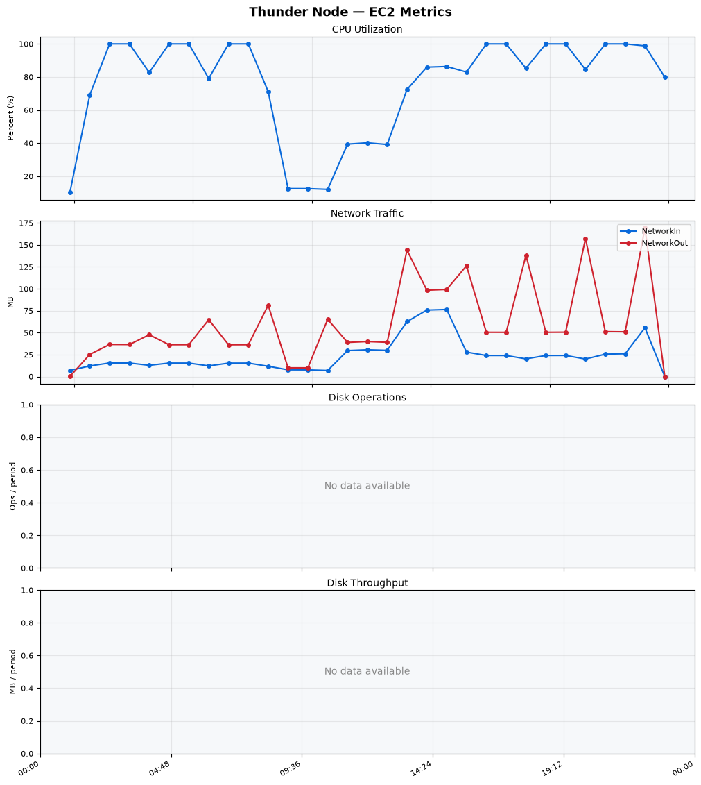
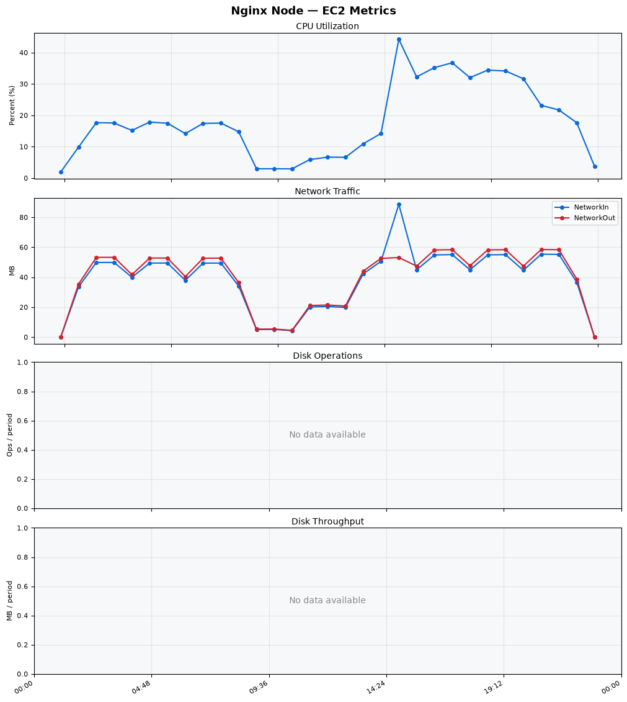
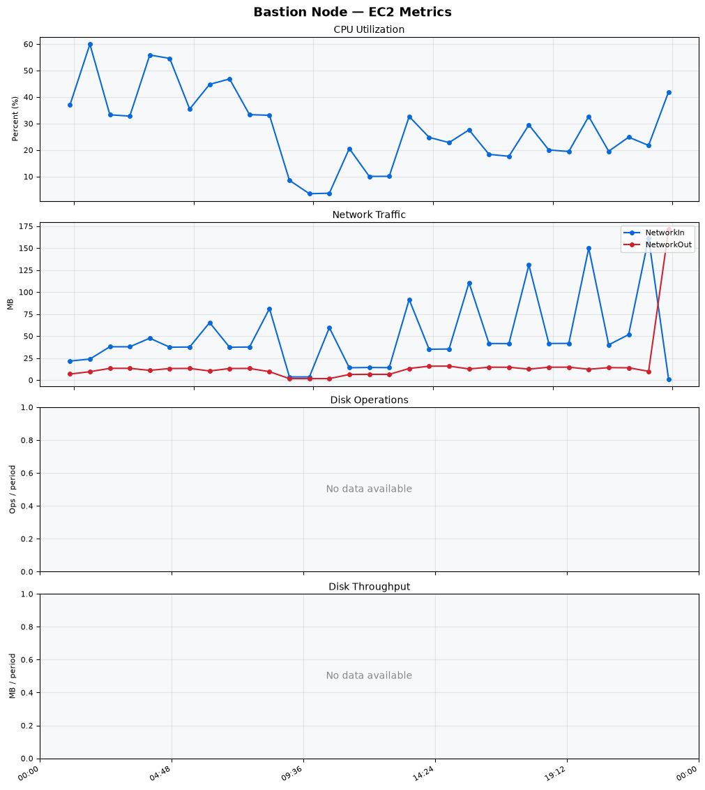
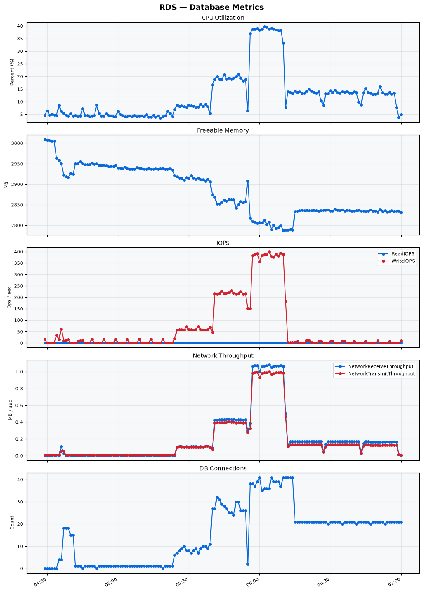

Build Number: 360

Build Date and Time: 2026-08-14--07-08-31

Thunder Pack URL: https://github.com/thunder-id/thunderid/releases/download/v1.0.0-rc/thunderid-1.0.0-rc-linux-x64.zip

Deployment Pattern: single-node

Thunder Instance Type: t2.nano

Nginx Instance Type: t2.nano

Bastion Instance Type: t3a.large

Database Instance Type: db.t3.medium

Database Type: postgres

Concurrency: 50,200,500

Thunder Instance ID: i-0fb2a229a67a34d0a

Nginx Instance ID: i-0a61bbb42d98a54a5

Bastion Instance ID: i-0bcfd5f4c72fc393c

RDS Instance ID: wso2thunderdbinstance8533

Performance Repo: https://github.com/asgardeo/thunder-performance

Pipeline Definition Branch: main

Checkout Ref (code under test): main

## Summary

| Scenario Name | Heap Size | Concurrent Users | Label | # Samples | Error % | Throughput (Requests/sec) | Average Response Time (ms) | 95th Percentile of Response Time (ms) |
| --- | --- | --- | --- | --- | --- | --- | --- | --- |
| Client Credentials Grant Type | N/A | 50 | 1 Get access token | 306837 | 0.00 | 510.96 | 96.59 | 118.00 |
| Client Credentials Grant Type | N/A | 200 | 1 Get access token | 305359 | 0.00 | 507.12 | 393.03 | 427.00 |
| Client Credentials Grant Type | N/A | 500 | 1 Get access token | 304834 | 0.00 | 504.87 | 986.20 | 1031.00 |
| Authorization Code Grant Type | N/A | 50 | 1 Send request to authorize endpoint | 4917 | 0.00 | 8.20 | 7.47 | 13.00 |
| Authorization Code Grant Type | N/A | 50 | 2 Start Authentication Flow | 4917 | 0.00 | 8.20 | 4.77 | 8.00 |
| Authorization Code Grant Type | N/A | 50 | 3 Perform authentication | 4917 | 0.00 | 8.20 | 10.68 | 15.00 |
| Authorization Code Grant Type | N/A | 50 | 4 Obtain authorization code | 4917 | 0.00 | 8.20 | 5.85 | 9.00 |
| Authorization Code Grant Type | N/A | 50 | 5 Obtain access token | 4917 | 0.00 | 8.20 | 10.29 | 15.00 |
| Authorization Code Grant Type | N/A | 200 | 1 Send request to authorize endpoint | 19792 | 0.00 | 33.00 | 9.61 | 19.00 |
| Authorization Code Grant Type | N/A | 200 | 2 Start Authentication Flow | 19792 | 0.00 | 33.00 | 6.56 | 14.00 |
| Authorization Code Grant Type | N/A | 200 | 3 Perform authentication | 19790 | 0.00 | 33.00 | 13.58 | 24.00 |
| Authorization Code Grant Type | N/A | 200 | 4 Obtain authorization code | 19791 | 0.00 | 33.00 | 8.26 | 16.00 |
| Authorization Code Grant Type | N/A | 200 | 5 Obtain access token | 19791 | 0.00 | 33.00 | 12.77 | 23.00 |
| Authorization Code Grant Type | N/A | 500 | 1 Send request to authorize endpoint | 48443 | 0.00 | 80.77 | 35.61 | 105.00 |
| Authorization Code Grant Type | N/A | 500 | 2 Start Authentication Flow | 48444 | 0.00 | 80.77 | 29.22 | 89.00 |
| Authorization Code Grant Type | N/A | 500 | 3 Perform authentication | 48445 | 0.00 | 80.78 | 50.69 | 146.00 |
| Authorization Code Grant Type | N/A | 500 | 4 Obtain authorization code | 48443 | 0.00 | 80.77 | 38.25 | 129.00 |
| Authorization Code Grant Type | N/A | 500 | 5 Obtain access token | 48442 | 0.00 | 80.77 | 37.65 | 96.00 |
| User Authentication with Credentials | N/A | 50 | 1 Perform user authentication | 291089 | 0.00 | 485.19 | 102.69 | 189.00 |
| User Authentication with Credentials | N/A | 200 | 1 Perform user authentication | 291773 | 0.00 | 486.12 | 410.94 | 1119.00 |
| User Authentication with Credentials | N/A | 500 | 1 Perform user authentication | 277053 | 0.00 | 460.37 | 1082.48 | 2975.00 |

## CloudWatch Metrics

### Thunder (EC2)

### Nginx (EC2)

### Bastion (EC2)

### RDS

