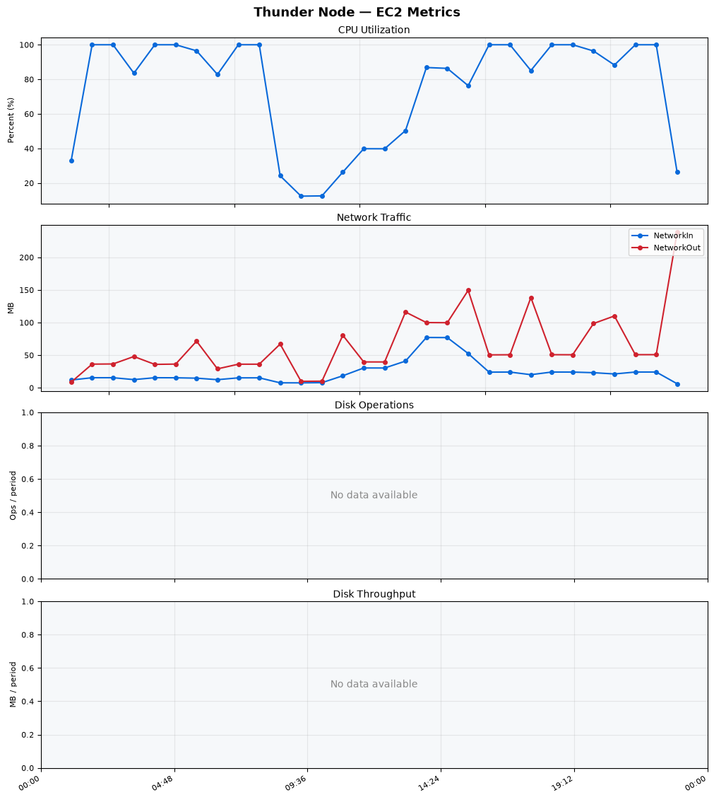
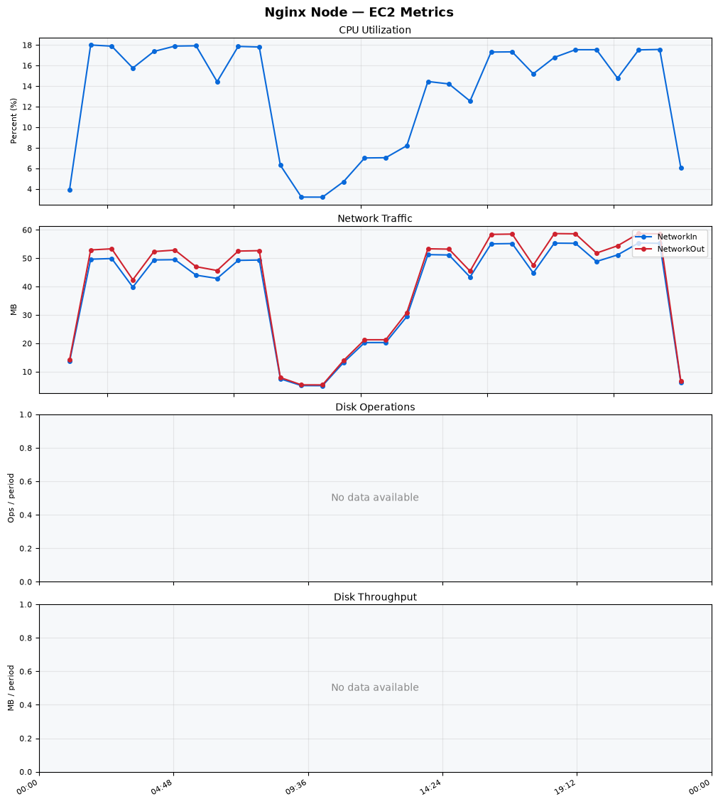
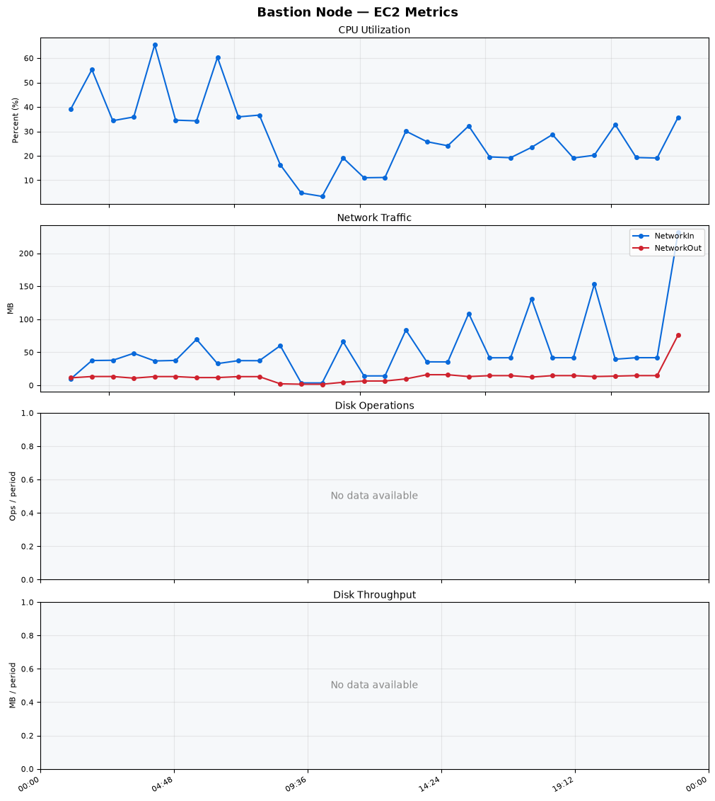
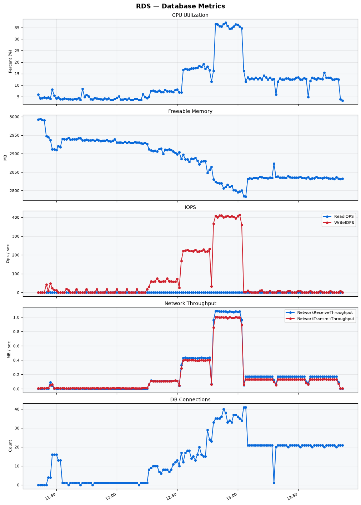

Build Number: 364

Build Date and Time: 2026-08-14--14-00-49

Thunder Pack URL: https://github.com/thunder-id/thunderid/releases/download/v1.0.0-rc/thunderid-1.0.0-rc-linux-x64.zip

Deployment Pattern: single-node

Thunder Instance Type: t2.nano

Nginx Instance Type: t2.nano

Bastion Instance Type: t3a.large

Database Instance Type: db.t3.medium

Database Type: postgres

Concurrency: 50,200,500

Thunder Instance ID: i-031133201a3cbf1c7

Nginx Instance ID: i-0b3e85499498e2448

Bastion Instance ID: i-0655c35a6743e5f57

RDS Instance ID: wso2thunderdbinstance20726

Performance Repo: https://github.com/asgardeo/thunder-performance

Pipeline Definition Branch: main

Checkout Ref (code under test): main

## Summary

| Scenario Name | Heap Size | Concurrent Users | Label | # Samples | Error % | Throughput (Requests/sec) | Average Response Time (ms) | 95th Percentile of Response Time (ms) |
| --- | --- | --- | --- | --- | --- | --- | --- | --- |
| Client Credentials Grant Type | N/A | 50 | 1 Get access token | 306807 | 0.00 | 510.94 | 96.48 | 118.00 |
| Client Credentials Grant Type | N/A | 200 | 1 Get access token | 305710 | 0.00 | 507.76 | 392.62 | 425.00 |
| Client Credentials Grant Type | N/A | 500 | 1 Get access token | 304599 | 0.00 | 503.66 | 987.24 | 1039.00 |
| Authorization Code Grant Type | N/A | 50 | 1 Send request to authorize endpoint | 4974 | 0.00 | 8.29 | 6.37 | 11.00 |
| Authorization Code Grant Type | N/A | 50 | 2 Start Authentication Flow | 4974 | 0.00 | 8.29 | 4.18 | 7.00 |
| Authorization Code Grant Type | N/A | 50 | 3 Perform authentication | 4975 | 0.00 | 8.30 | 9.21 | 13.00 |
| Authorization Code Grant Type | N/A | 50 | 4 Obtain authorization code | 4974 | 0.00 | 8.29 | 5.22 | 8.00 |
| Authorization Code Grant Type | N/A | 50 | 5 Obtain access token | 4974 | 0.00 | 8.29 | 9.25 | 13.00 |
| Authorization Code Grant Type | N/A | 200 | 1 Send request to authorize endpoint | 19832 | 0.00 | 33.07 | 7.97 | 15.00 |
| Authorization Code Grant Type | N/A | 200 | 2 Start Authentication Flow | 19832 | 0.00 | 33.07 | 5.48 | 11.00 |
| Authorization Code Grant Type | N/A | 200 | 3 Perform authentication | 19835 | 0.00 | 33.07 | 11.09 | 19.00 |
| Authorization Code Grant Type | N/A | 200 | 4 Obtain authorization code | 19834 | 0.00 | 33.07 | 6.84 | 13.00 |
| Authorization Code Grant Type | N/A | 200 | 5 Obtain access token | 19833 | 0.00 | 33.07 | 11.03 | 18.00 |
| Authorization Code Grant Type | N/A | 500 | 1 Send request to authorize endpoint | 48884 | 0.00 | 81.52 | 21.79 | 51.00 |
| Authorization Code Grant Type | N/A | 500 | 2 Start Authentication Flow | 48885 | 0.00 | 81.52 | 16.90 | 41.00 |
| Authorization Code Grant Type | N/A | 500 | 3 Perform authentication | 48884 | 0.00 | 81.51 | 32.13 | 78.00 |
| Authorization Code Grant Type | N/A | 500 | 4 Obtain authorization code | 48882 | 0.00 | 81.52 | 19.45 | 45.00 |
| Authorization Code Grant Type | N/A | 500 | 5 Obtain access token | 48883 | 0.00 | 81.51 | 26.71 | 61.00 |
| User Authentication with Credentials | N/A | 50 | 1 Perform user authentication | 292020 | 0.00 | 486.77 | 102.33 | 188.00 |
| User Authentication with Credentials | N/A | 200 | 1 Perform user authentication | 293407 | 0.00 | 488.85 | 408.65 | 1111.00 |
| User Authentication with Credentials | N/A | 500 | 1 Perform user authentication | 293265 | 0.00 | 488.13 | 1021.78 | 2943.00 |

## CloudWatch Metrics

### Thunder (EC2)

### Nginx (EC2)

### Bastion (EC2)

### RDS

