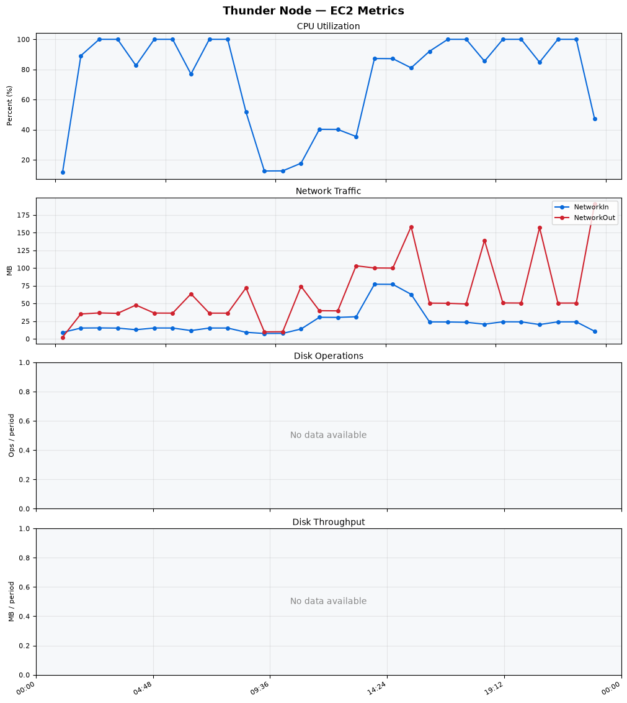
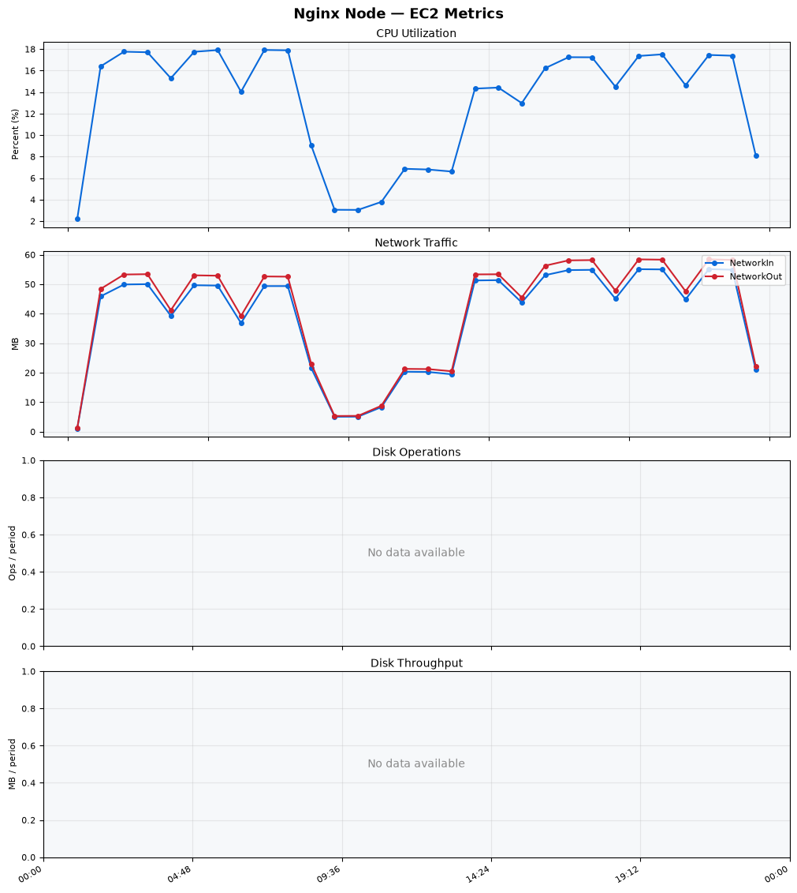
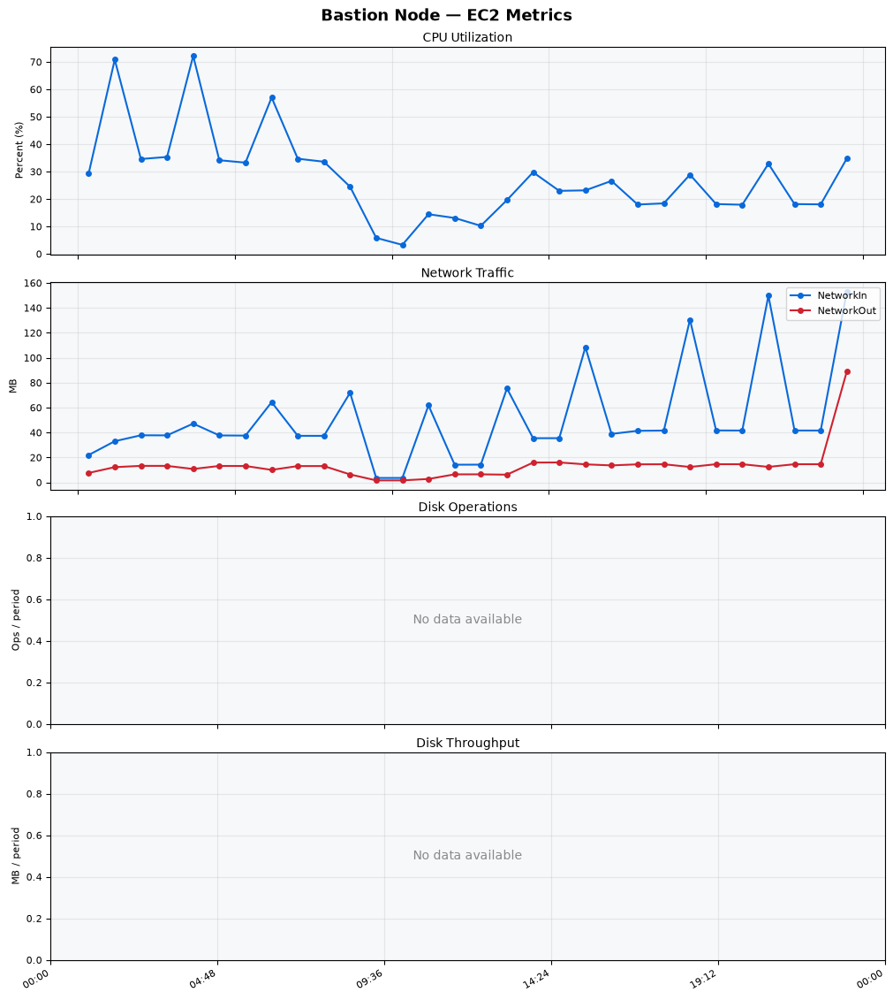
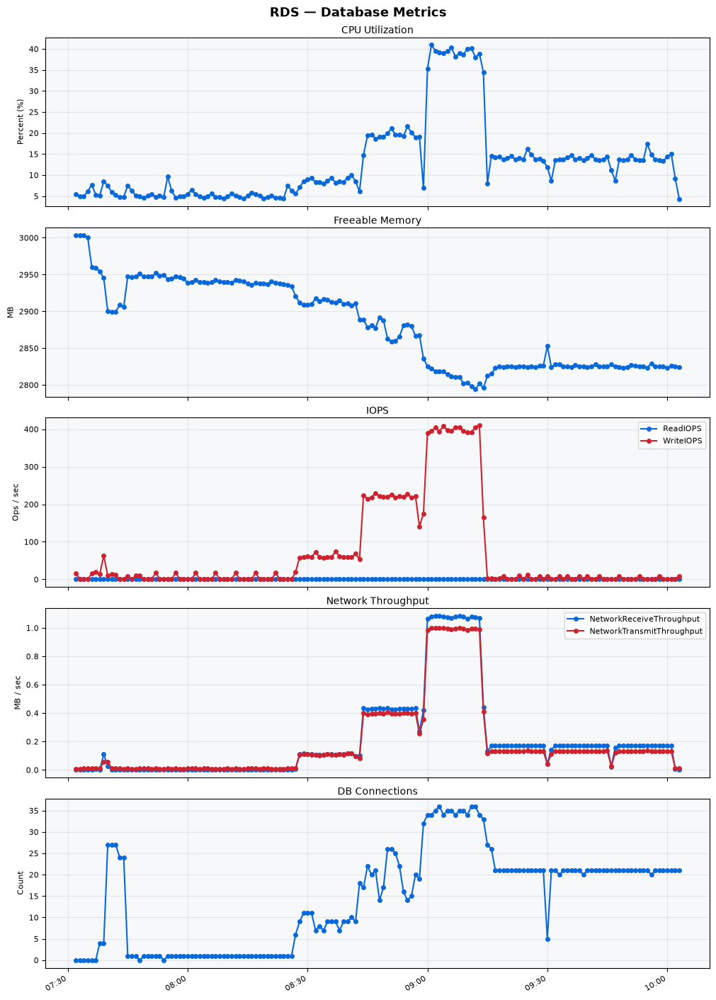

Build Number: 370

Build Date and Time: 2026-08-17--10-09-59

Thunder Pack URL: https://github.com/thunder-id/thunderid/releases/download/v1.0.0/thunderid-1.0.0-linux-x64.zip

Deployment Pattern: single-node

Thunder Instance Type: t2.nano

Nginx Instance Type: t2.nano

Bastion Instance Type: t3a.large

Database Instance Type: db.t3.medium

Database Type: postgres

Concurrency: 50,200,500

Thunder Instance ID: i-0afc9eee48812a177

Nginx Instance ID: i-032895029f6b58175

Bastion Instance ID: i-02acacd920863d1e3

RDS Instance ID: wso2thunderdbinstance368

Performance Repo: https://github.com/asgardeo/thunder-performance

Pipeline Definition Branch: main

Checkout Ref (code under test): main

## Summary

| Scenario Name | Heap Size | Concurrent Users | Label | # Samples | Error % | Throughput (Requests/sec) | Average Response Time (ms) | 95th Percentile of Response Time (ms) |
| --- | --- | --- | --- | --- | --- | --- | --- | --- |
| Client Credentials Grant Type | N/A | 50 | 1 Get access token | 307000 | 0.00 | 511.39 | 96.16 | 118.00 |
| Client Credentials Grant Type | N/A | 200 | 1 Get access token | 305995 | 0.00 | 508.32 | 392.19 | 425.00 |
| Client Credentials Grant Type | N/A | 500 | 1 Get access token | 305148 | 0.00 | 504.46 | 985.37 | 1039.00 |
| Authorization Code Grant Type | N/A | 50 | 1 Send request to authorize endpoint | 4955 | 0.00 | 8.26 | 7.10 | 12.00 |
| Authorization Code Grant Type | N/A | 50 | 2 Start Authentication Flow | 4955 | 0.00 | 8.26 | 4.59 | 8.00 |
| Authorization Code Grant Type | N/A | 50 | 3 Perform authentication | 4955 | 0.00 | 8.26 | 10.09 | 14.00 |
| Authorization Code Grant Type | N/A | 50 | 4 Obtain authorization code | 4955 | 0.00 | 8.26 | 5.72 | 9.00 |
| Authorization Code Grant Type | N/A | 50 | 5 Obtain access token | 4955 | 0.00 | 8.26 | 10.02 | 14.00 |
| Authorization Code Grant Type | N/A | 200 | 1 Send request to authorize endpoint | 19798 | 0.00 | 33.01 | 8.78 | 16.00 |
| Authorization Code Grant Type | N/A | 200 | 2 Start Authentication Flow | 19798 | 0.00 | 33.01 | 5.97 | 12.00 |
| Authorization Code Grant Type | N/A | 200 | 3 Perform authentication | 19799 | 0.00 | 33.02 | 12.00 | 21.00 |
| Authorization Code Grant Type | N/A | 200 | 4 Obtain authorization code | 19798 | 0.00 | 33.01 | 7.41 | 14.00 |
| Authorization Code Grant Type | N/A | 200 | 5 Obtain access token | 19797 | 0.00 | 33.01 | 12.02 | 20.00 |
| Authorization Code Grant Type | N/A | 500 | 1 Send request to authorize endpoint | 48805 | 0.00 | 81.38 | 26.25 | 66.00 |
| Authorization Code Grant Type | N/A | 500 | 2 Start Authentication Flow | 48804 | 0.00 | 81.38 | 20.70 | 53.00 |
| Authorization Code Grant Type | N/A | 500 | 3 Perform authentication | 48802 | 0.00 | 81.37 | 38.53 | 97.00 |
| Authorization Code Grant Type | N/A | 500 | 4 Obtain authorization code | 48803 | 0.00 | 81.38 | 24.37 | 62.00 |
| Authorization Code Grant Type | N/A | 500 | 5 Obtain access token | 48802 | 0.00 | 81.38 | 31.06 | 73.00 |
| User Authentication with Credentials | N/A | 50 | 1 Perform user authentication | 291160 | 0.00 | 485.32 | 102.65 | 189.00 |
| User Authentication with Credentials | N/A | 200 | 1 Perform user authentication | 292487 | 0.00 | 487.32 | 409.95 | 1111.00 |
| User Authentication with Credentials | N/A | 500 | 1 Perform user authentication | 291977 | 0.00 | 485.99 | 1026.43 | 2975.00 |

## CloudWatch Metrics

### Thunder (EC2)

### Nginx (EC2)

### Bastion (EC2)

### RDS

