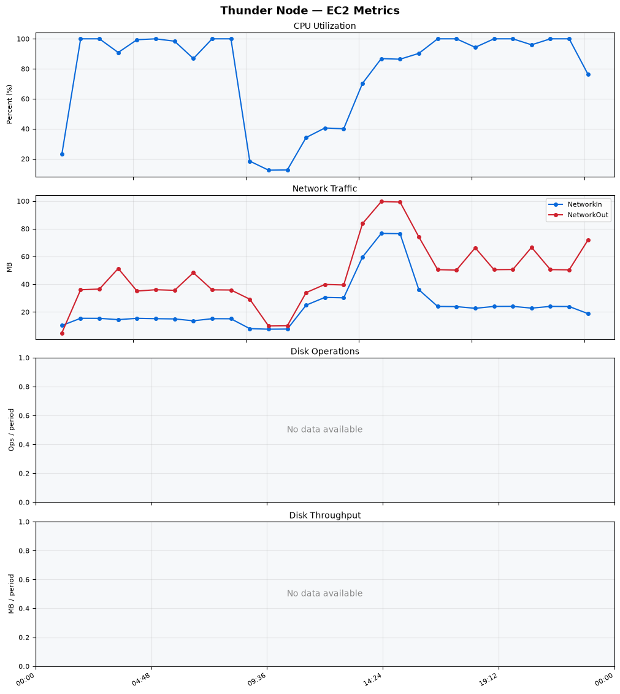
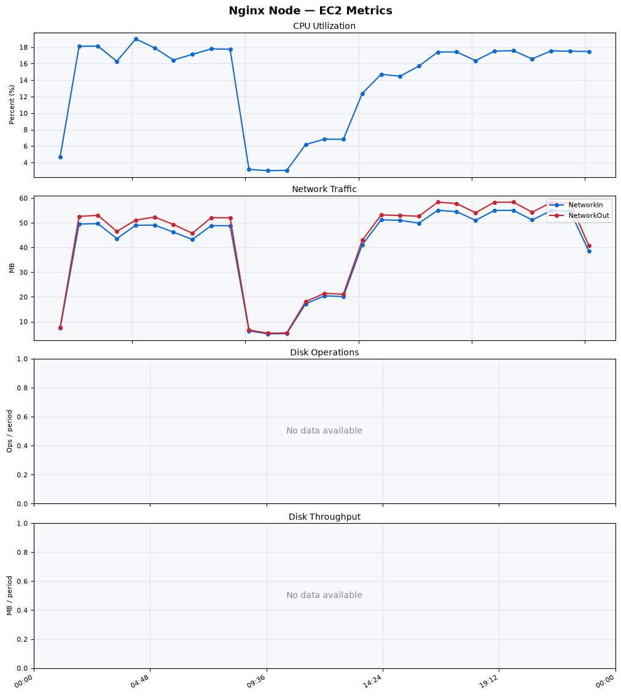
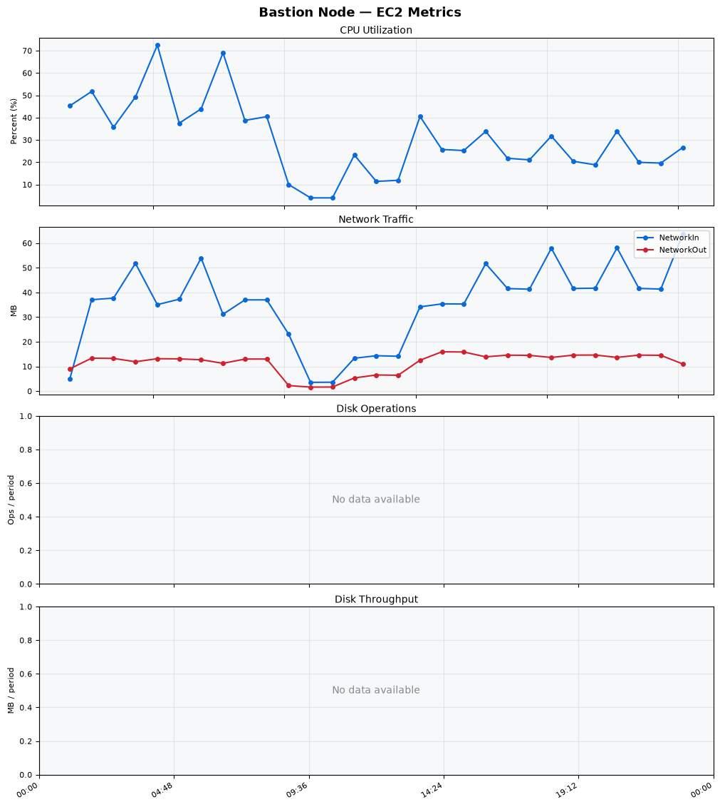
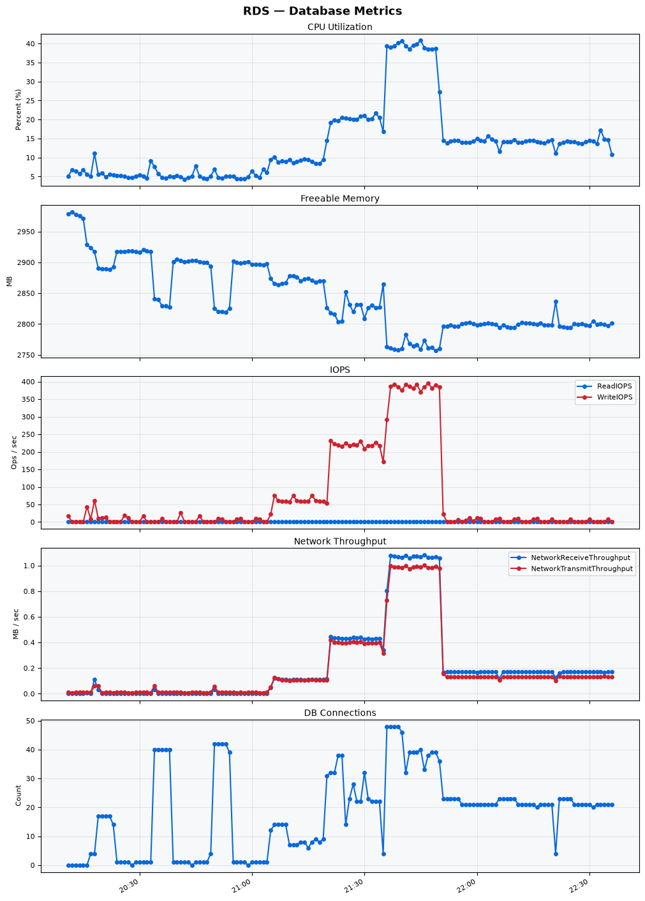

Build Number: 371

Build Date and Time: 2026-08-17--22-42-28

Thunder Pack URL: https://github.com/thunder-id/thunderid/releases/download/v1.0.0/thunderid-1.0.0-linux-x64.zip

Deployment Pattern: single-node

Thunder Instance Type: t2.nano

Nginx Instance Type: t2.nano

Bastion Instance Type: t3a.large

Database Instance Type: db.t3.medium

Database Type: postgres

Concurrency: 50,200,500

Thunder Instance ID: i-066d866c785a38b62

Nginx Instance ID: i-08ef3efc2b1530ad7

Bastion Instance ID: i-0e8ea5315a6f5bc64

RDS Instance ID: wso2thunderdbinstance12

Performance Repo: https://github.com/asgardeo/thunder-performance

Pipeline Definition Branch: main

Checkout Ref (code under test): main

## Summary

| Scenario Name | Heap Size | Concurrent Users | Label | # Samples | Error % | Throughput (Requests/sec) | Average Response Time (ms) | 95th Percentile of Response Time (ms) |
| --- | --- | --- | --- | --- | --- | --- | --- | --- |
| Client Credentials Grant Type | N/A | 50 | 1 Get access token | 305796 | 0.00 | 509.35 | 96.41 | 117.00 |
| Client Credentials Grant Type | N/A | 200 | 1 Get access token | 303790 | 0.00 | 504.52 | 394.90 | 425.00 |
| Client Credentials Grant Type | N/A | 500 | 1 Get access token | 302015 | 0.00 | 499.01 | 995.52 | 1047.00 |
| Authorization Code Grant Type | N/A | 50 | 1 Send request to authorize endpoint | 4955 | 0.00 | 8.26 | 6.79 | 12.00 |
| Authorization Code Grant Type | N/A | 50 | 2 Start Authentication Flow | 4955 | 0.00 | 8.26 | 4.84 | 8.00 |
| Authorization Code Grant Type | N/A | 50 | 3 Perform authentication | 4954 | 0.00 | 8.26 | 10.51 | 16.00 |
| Authorization Code Grant Type | N/A | 50 | 4 Obtain authorization code | 4956 | 0.00 | 8.26 | 5.86 | 9.00 |
| Authorization Code Grant Type | N/A | 50 | 5 Obtain access token | 4956 | 0.00 | 8.26 | 10.03 | 14.00 |
| Authorization Code Grant Type | N/A | 200 | 1 Send request to authorize endpoint | 19832 | 0.00 | 33.07 | 9.57 | 18.00 |
| Authorization Code Grant Type | N/A | 200 | 2 Start Authentication Flow | 19830 | 0.00 | 33.07 | 6.52 | 13.00 |
| Authorization Code Grant Type | N/A | 200 | 3 Perform authentication | 19831 | 0.00 | 33.07 | 13.74 | 24.00 |
| Authorization Code Grant Type | N/A | 200 | 4 Obtain authorization code | 19831 | 0.00 | 33.07 | 8.52 | 16.00 |
| Authorization Code Grant Type | N/A | 200 | 5 Obtain access token | 19831 | 0.00 | 33.07 | 12.78 | 22.00 |
| Authorization Code Grant Type | N/A | 500 | 1 Send request to authorize endpoint | 48397 | 0.00 | 80.71 | 34.37 | 96.00 |
| Authorization Code Grant Type | N/A | 500 | 2 Start Authentication Flow | 48400 | 0.00 | 80.71 | 28.05 | 80.00 |
| Authorization Code Grant Type | N/A | 500 | 3 Perform authentication | 48417 | 0.00 | 80.73 | 49.10 | 134.00 |
| Authorization Code Grant Type | N/A | 500 | 4 Obtain authorization code | 48406 | 0.00 | 80.72 | 36.98 | 109.00 |
| Authorization Code Grant Type | N/A | 500 | 5 Obtain access token | 48405 | 0.00 | 80.71 | 36.62 | 91.00 |
| User Authentication with Credentials | N/A | 50 | 1 Perform user authentication | 291011 | 0.00 | 485.07 | 102.61 | 189.00 |
| User Authentication with Credentials | N/A | 200 | 1 Perform user authentication | 292591 | 0.00 | 487.48 | 409.77 | 1111.00 |
| User Authentication with Credentials | N/A | 500 | 1 Perform user authentication | 291474 | 0.00 | 485.16 | 1027.99 | 2959.00 |

## CloudWatch Metrics

### Thunder (EC2)

### Nginx (EC2)

### Bastion (EC2)

### RDS

