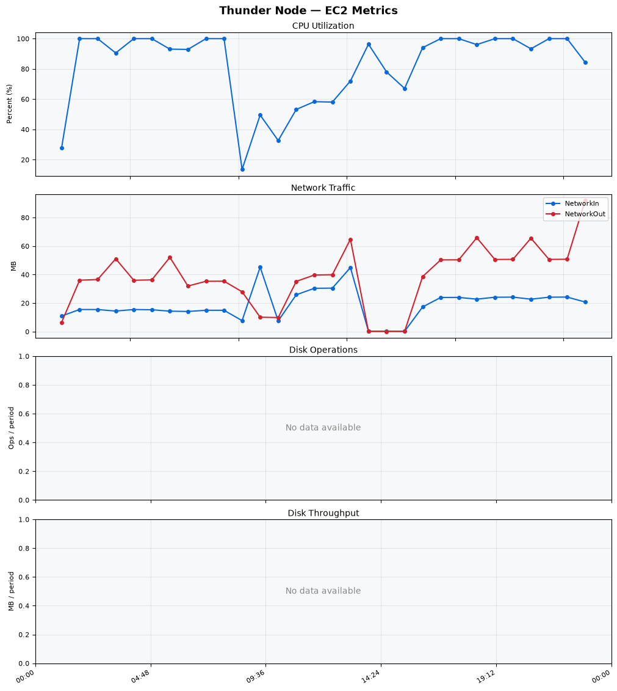
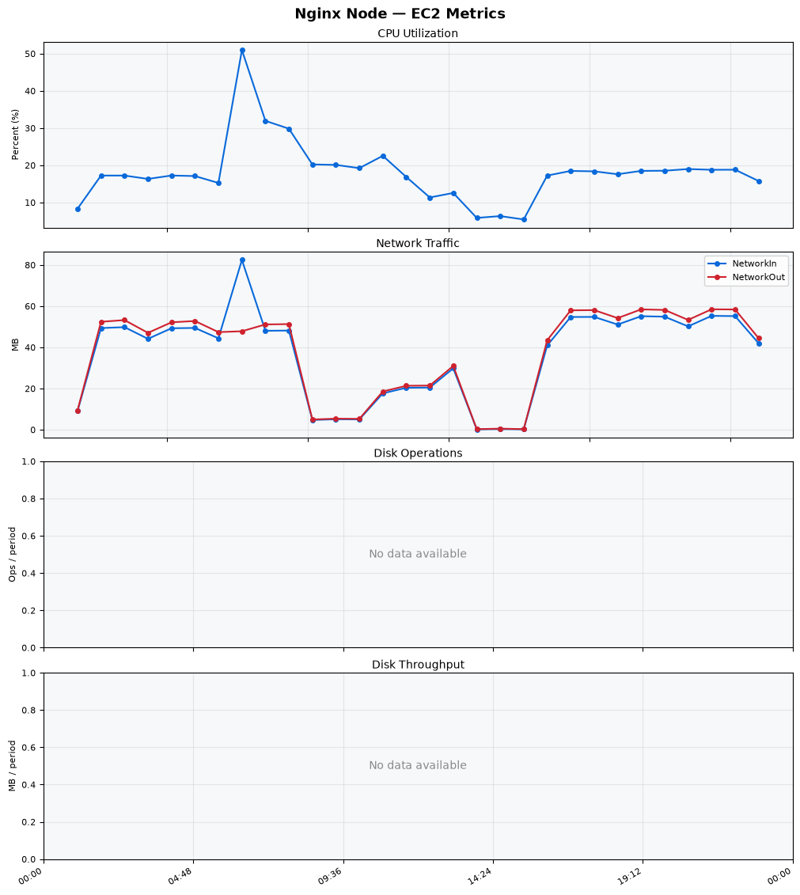
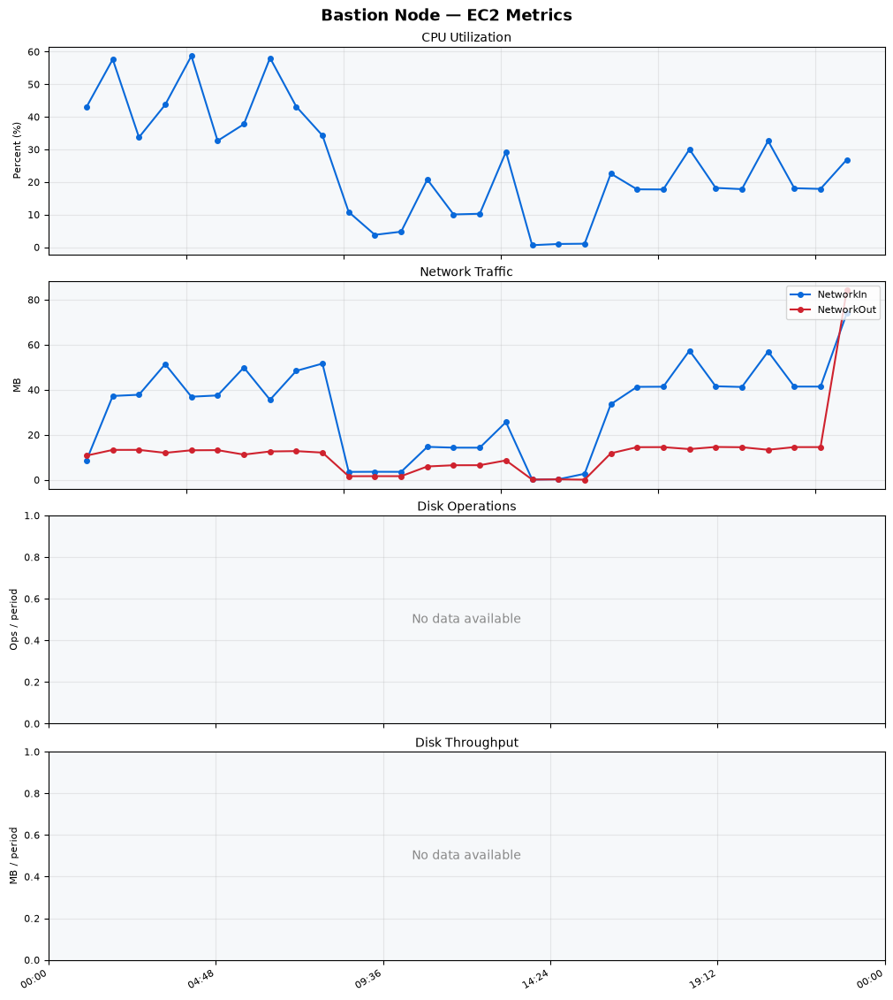
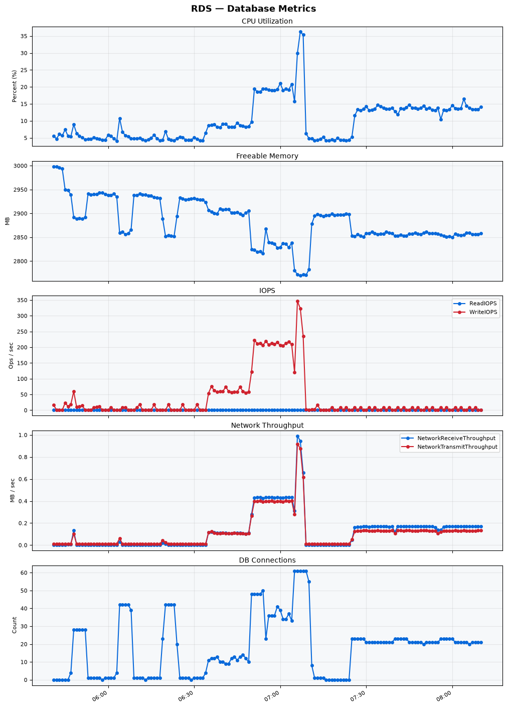

Build Number: 372

Build Date and Time: 2026-08-18--08-15-25

Thunder Pack URL: https://github.com/thunder-id/thunderid/releases/download/v1.0.0/thunderid-1.0.0-linux-x64.zip

Deployment Pattern: single-node

Thunder Instance Type: t2.nano

Nginx Instance Type: t2.nano

Bastion Instance Type: t3a.large

Database Instance Type: db.t3.medium

Database Type: postgres

Concurrency: 50,200,500

Thunder Instance ID: i-046b9845a415b330d

Nginx Instance ID: i-0dafeaf1218a0f7fa

Bastion Instance ID: i-06a0961ba2c1b6f5d

RDS Instance ID: wso2thunderdbinstance20662

Performance Repo: https://github.com/asgardeo/thunder-performance

Pipeline Definition Branch: main

Checkout Ref (code under test): main

## Summary

| Scenario Name | Heap Size | Concurrent Users | Label | # Samples | Error % | Throughput (Requests/sec) | Average Response Time (ms) | 95th Percentile of Response Time (ms) |
| --- | --- | --- | --- | --- | --- | --- | --- | --- |
| Client Credentials Grant Type | N/A | 50 | 1 Get access token | 306684 | 0.00 | 510.79 | 96.28 | 116.00 |
| Client Credentials Grant Type | N/A | 200 | 1 Get access token | 305173 | 0.00 | 506.97 | 393.27 | 423.00 |
| Client Credentials Grant Type | N/A | 500 | 1 Get access token | 296749 | 0.00 | 490.16 | 1013.21 | 1063.00 |
| Authorization Code Grant Type | N/A | 50 | 1 Send request to authorize endpoint | 4933 | 0.00 | 8.23 | 9.94 | 32.00 |
| Authorization Code Grant Type | N/A | 50 | 2 Start Authentication Flow | 4933 | 0.00 | 8.23 | 6.41 | 16.00 |
| Authorization Code Grant Type | N/A | 50 | 3 Perform authentication | 4933 | 0.00 | 8.23 | 18.40 | 63.00 |
| Authorization Code Grant Type | N/A | 50 | 4 Obtain authorization code | 4933 | 0.00 | 8.23 | 7.39 | 18.00 |
| Authorization Code Grant Type | N/A | 50 | 5 Obtain access token | 4933 | 0.00 | 8.23 | 13.00 | 26.00 |
| Authorization Code Grant Type | N/A | 200 | 1 Send request to authorize endpoint | 19795 | 0.00 | 33.01 | 15.32 | 46.00 |
| Authorization Code Grant Type | N/A | 200 | 2 Start Authentication Flow | 19795 | 0.00 | 33.01 | 10.29 | 31.00 |
| Authorization Code Grant Type | N/A | 200 | 3 Perform authentication | 19798 | 0.00 | 33.01 | 28.60 | 85.00 |
| Authorization Code Grant Type | N/A | 200 | 4 Obtain authorization code | 19796 | 0.00 | 33.01 | 13.55 | 41.00 |
| Authorization Code Grant Type | N/A | 200 | 5 Obtain access token | 19796 | 0.00 | 33.01 | 19.25 | 51.00 |
| Authorization Code Grant Type | N/A | 500 | 1 Send request to authorize endpoint | 626 | 100.00 | 1.04 | 60032.82 | 60159.00 |
| Authorization Code Grant Type | N/A | 500 | 2 Start Authentication Flow | 602 | 100.00 | 0.93 | 60034.55 | 60159.00 |
| Authorization Code Grant Type | N/A | 500 | 3 Perform authentication | 626 | 100.00 | 1.00 | 60036.09 | 60159.00 |
| Authorization Code Grant Type | N/A | 500 | 4 Obtain authorization code | 859 | 100.00 | 1.45 | 60033.79 | 60159.00 |
| Authorization Code Grant Type | N/A | 500 | 5 Obtain access token | 866 | 100.00 | 1.32 | 60034.07 | 60159.00 |
| User Authentication with Credentials | N/A | 50 | 1 Perform user authentication | 290321 | 0.00 | 483.92 | 102.95 | 190.00 |
| User Authentication with Credentials | N/A | 200 | 1 Perform user authentication | 289546 | 0.00 | 482.40 | 414.12 | 1135.00 |
| User Authentication with Credentials | N/A | 500 | 1 Perform user authentication | 291299 | 0.00 | 484.88 | 1028.69 | 2959.00 |

## CloudWatch Metrics

### Thunder (EC2)

### Nginx (EC2)

### Bastion (EC2)

### RDS

