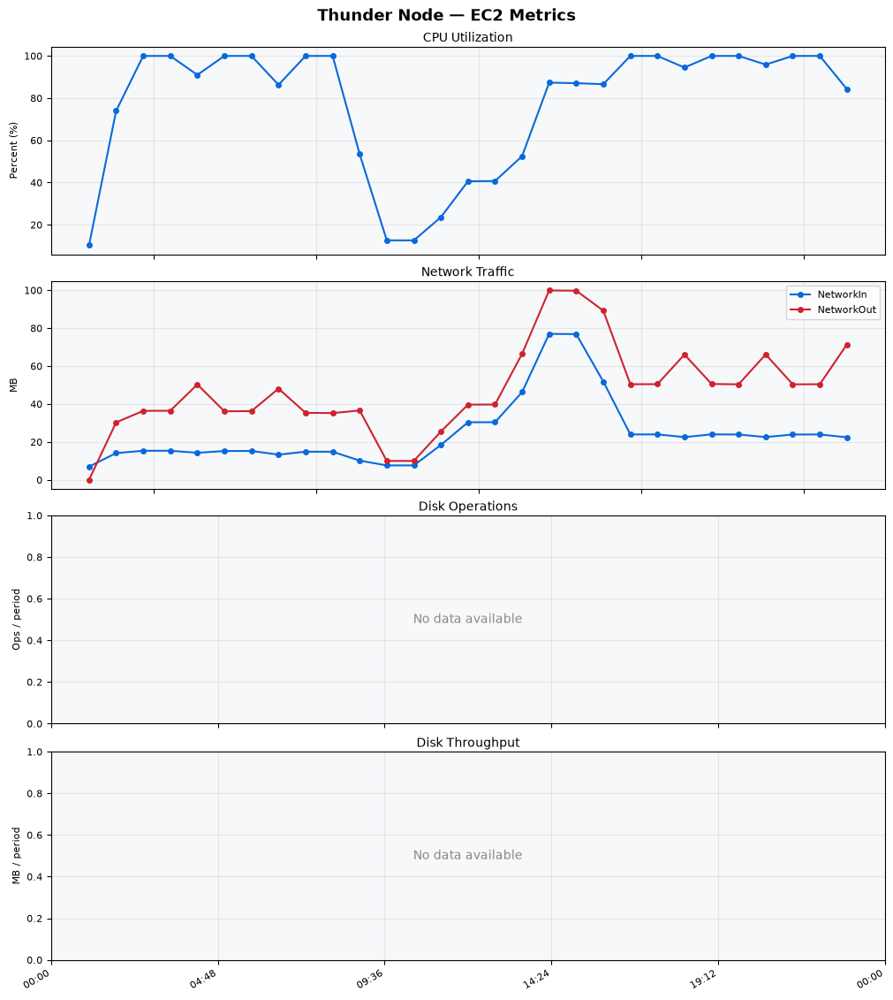
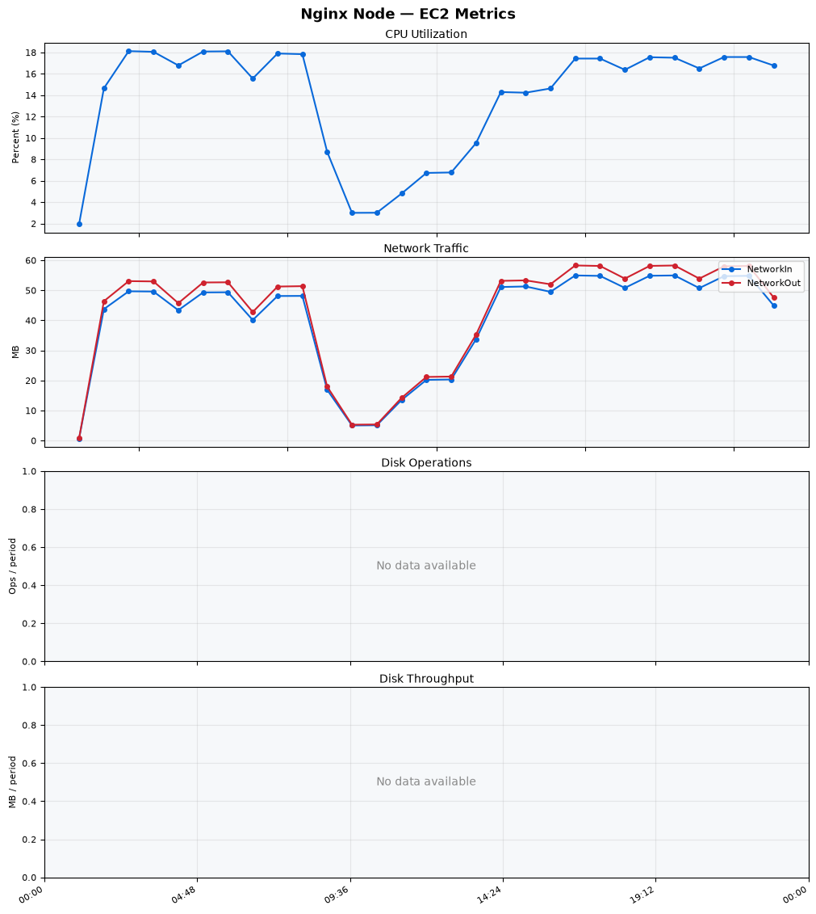
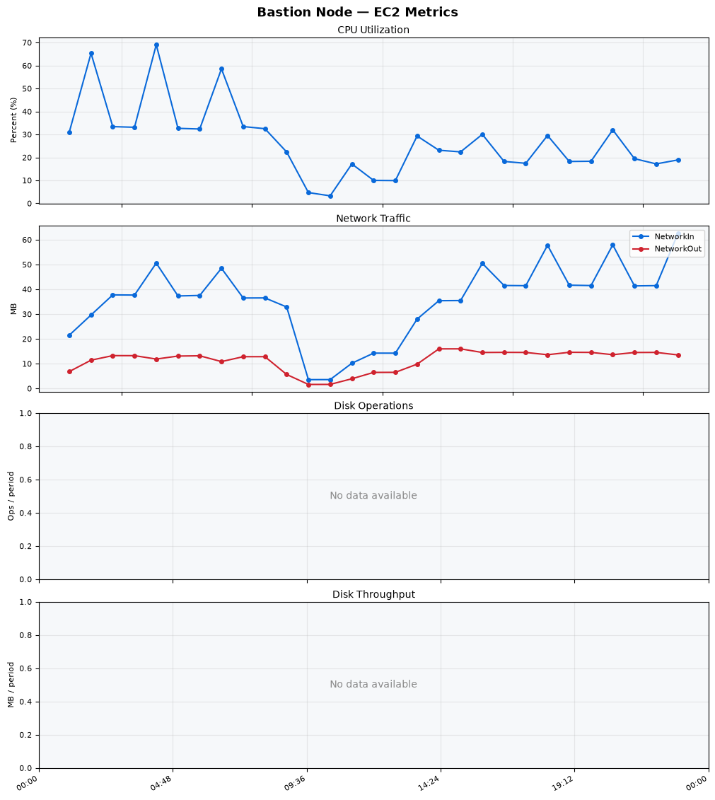
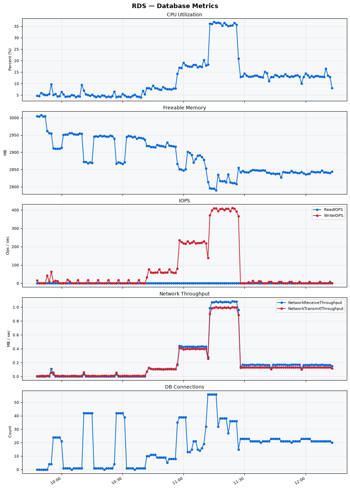

Build Number: 373

Build Date and Time: 2026-08-18--12-18-16

Thunder Pack URL: https://github.com/thunder-id/thunderid/releases/download/v1.0.0/thunderid-1.0.0-linux-x64.zip

Deployment Pattern: single-node

Thunder Instance Type: t2.nano

Nginx Instance Type: t2.nano

Bastion Instance Type: t3a.large

Database Instance Type: db.t3.medium

Database Type: postgres

Concurrency: 50,200,500

Thunder Instance ID: i-0f614665da416d8f5

Nginx Instance ID: i-0b10a6cd0b40de46d

Bastion Instance ID: i-003a15c714a062e65

RDS Instance ID: wso2thunderdbinstance21587

Performance Repo: https://github.com/asgardeo/thunder-performance

Pipeline Definition Branch: main

Checkout Ref (code under test): main

## Summary

| Scenario Name | Heap Size | Concurrent Users | Label | # Samples | Error % | Throughput (Requests/sec) | Average Response Time (ms) | 95th Percentile of Response Time (ms) |
| --- | --- | --- | --- | --- | --- | --- | --- | --- |
| Client Credentials Grant Type | N/A | 50 | 1 Get access token | 306249 | 0.00 | 509.96 | 96.75 | 117.00 |
| Client Credentials Grant Type | N/A | 200 | 1 Get access token | 304834 | 0.00 | 506.28 | 393.83 | 425.00 |
| Client Credentials Grant Type | N/A | 500 | 1 Get access token | 297286 | 0.00 | 492.06 | 1011.64 | 1063.00 |
| Authorization Code Grant Type | N/A | 50 | 1 Send request to authorize endpoint | 4945 | 0.00 | 8.25 | 5.96 | 10.00 |
| Authorization Code Grant Type | N/A | 50 | 2 Start Authentication Flow | 4946 | 0.00 | 8.25 | 4.09 | 7.00 |
| Authorization Code Grant Type | N/A | 50 | 3 Perform authentication | 4945 | 0.00 | 8.25 | 9.31 | 13.00 |
| Authorization Code Grant Type | N/A | 50 | 4 Obtain authorization code | 4945 | 0.00 | 8.25 | 5.11 | 8.00 |
| Authorization Code Grant Type | N/A | 50 | 5 Obtain access token | 4945 | 0.00 | 8.25 | 9.17 | 13.00 |
| Authorization Code Grant Type | N/A | 200 | 1 Send request to authorize endpoint | 19834 | 0.00 | 33.07 | 8.00 | 15.00 |
| Authorization Code Grant Type | N/A | 200 | 2 Start Authentication Flow | 19834 | 0.00 | 33.07 | 5.42 | 11.00 |
| Authorization Code Grant Type | N/A | 200 | 3 Perform authentication | 19832 | 0.00 | 33.07 | 11.25 | 20.00 |
| Authorization Code Grant Type | N/A | 200 | 4 Obtain authorization code | 19833 | 0.00 | 33.07 | 6.82 | 13.00 |
| Authorization Code Grant Type | N/A | 200 | 5 Obtain access token | 19834 | 0.00 | 33.07 | 11.09 | 18.00 |
| Authorization Code Grant Type | N/A | 500 | 1 Send request to authorize endpoint | 48878 | 0.00 | 81.51 | 23.34 | 58.00 |
| Authorization Code Grant Type | N/A | 500 | 2 Start Authentication Flow | 48878 | 0.00 | 81.50 | 18.22 | 47.00 |
| Authorization Code Grant Type | N/A | 500 | 3 Perform authentication | 48884 | 0.00 | 81.51 | 34.47 | 87.00 |
| Authorization Code Grant Type | N/A | 500 | 4 Obtain authorization code | 48883 | 0.00 | 81.51 | 20.78 | 52.00 |
| Authorization Code Grant Type | N/A | 500 | 5 Obtain access token | 48881 | 0.00 | 81.51 | 28.64 | 68.00 |
| User Authentication with Credentials | N/A | 50 | 1 Perform user authentication | 291318 | 0.00 | 485.58 | 102.61 | 189.00 |
| User Authentication with Credentials | N/A | 200 | 1 Perform user authentication | 291667 | 0.00 | 485.97 | 411.10 | 1111.00 |
| User Authentication with Credentials | N/A | 500 | 1 Perform user authentication | 290851 | 0.00 | 484.13 | 1030.35 | 2975.00 |

## CloudWatch Metrics

### Thunder (EC2)

### Nginx (EC2)

### Bastion (EC2)

### RDS

