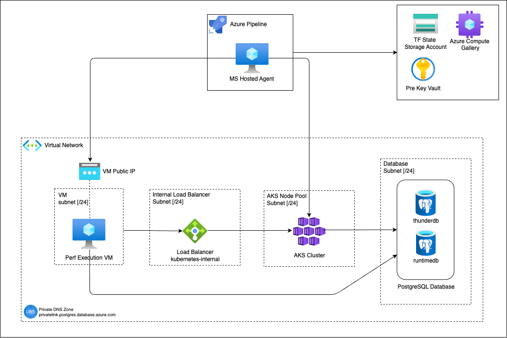

# Thunder Performance Testing on Azure

This guide outlines the setup process for deploying Thunder performance testing infrastructure on Azure. The deployment uses Terraform, Packer, and Azure DevOps pipelines to create and manage the required resources.

## Overview

The Thunder Performance testing environment on Azure consists of:
- Performance test runner VM (created from a custom image)
- AKS cluster for deploying Thunder
- Associated infrastructure components (networking, storage, etc.)

## Architecture Diagram
The architecture diagram below illustrates the components and their interactions.



## Prerequisites

### Azure Resources

1. **Azure AD Application Registration**
    - Register an application in Azure AD
    - Grant Contributor access to the resource group that will be used by Packer

2. **Resource Group**
    - Create a resource group for prerequisite resources (e.g., `rg-thunder-pre-perf-eastus2-001`)

3. **Key Vault**
    - Create a Key Vault in the resource group

4. **Storage Account**
    - Create a Storage Account to store the Terraform state
    - Create a container named `terraform` in the Storage Account

5. **Azure Compute Gallery**
    - Create an Azure Compute Gallery
    - Create a VM Image Definition in the gallery:
        - OS type: Linux
        - VM architecture: x64

6. **Clone Repository**
    - Clone this repository to your local machine

### Azure DevOps Setup

1. **Project Creation**
    - Create a project in Azure DevOps

2. **Service Connection**
    - Create a service connection to connect to your Azure subscription:
        - Identity type: App registration (automatic)
        - Credential type: Workload identity federation
        - Subscription: Select the subscription to deploy the resources
        - Resource group: Set as empty (To ensure subscription-wide access to create new resource groups)
        - Service connection name: Set a descriptive name (e.g., `azure-devops-connection`)

3. **Service Connection Permissions**
    - Ensure the service connection has the following permissions:
        - Storage Blob Data Contributor role in the Storage Account created for Terraform state
        - `Secret Get` permission in the Key Vault Access Policies of the created Key Vault
        - Owner role on the subscription with permissions to only assign `Network Contributor` role

## Deployment Steps

### Step 1: Create VM Image Template for Performance Runner VM

1. Navigate to the Packer directory:
   ```bash
   cd kubernetes/azure/terraform/vm-image-template/packer
   ```

2. Create configuration file:
    - Create a file named `conf.auto.pkrvars.hcl`
    - Copy content from `conf.auto.pkrvars.hcl.sample` and update with your values
    - Use the client ID and client secret from the registered Azure AD application


3. Build the VM image:
   ```bash
   packer init .
   packer build .
   ```

### Step 2: Generate SSH Keys

1. Generate SSH keys for the performance test VM:
   ```bash
   ssh-keygen -t rsa -b 4096 -f vm_ssh_key
   ```

2. Generate SSH keys for the AKS cluster nodes:
   ```bash
   ssh-keygen -t rsa -b 4096 -f aks_ssh_key
   ```

### Step 3: Configure Key Vault Secrets

Add the following secrets to the previously created Key Vault:

| Secret Name | Description                                               |
|-------------|-----------------------------------------------------------|
| `AKS-ADMIN-USERNAME` | Admin username for the AKS cluster nodes                  |
| `AKS-SSH-KEY` | SSH private key for AKS cluster nodes (created in Step 2) |
| `POSTGRES-ADMIN-USERNAME` | Admin username for the PostgreSQL server                  |
| `POSTGRES-ADMIN-PASSWORD` | Admin password for the PostgreSQL server                  |
| `SUBSCRIPTION-ID` | Azure Subscription ID for resource deployment             |
| `TENANT-ID` | Azure Tenant ID of the subscription                       |
| `VM-IMAGE-ID` | ID of the VM image (created in Step 1)                    |
| `VM-SSH-KEY` | SSH private key for the VM (created in Step 2)            |

### Step 4: Configure Azure DevOps Pipeline Variables

1. **Create Secret Variable Group**
    - Name: `vg-thunder-perf-secrets`
    - Link to the Key Vault created in prerequisites
    - Link the following secrets:
        - `POSTGRES-ADMIN-USERNAME`
        - `POSTGRES-ADMIN-PASSWORD`

2. **Create Configuration Variable Group**
    - Name: `vg-thunder-perf`
    - Add the following variables:
        - `AZURE_SERVICE_CONNECTION_NAME`: Name of the service connection
        - `PRE_KEYVAULT_NAME`: Name of the Key Vault
        - `TF_STATE_STORAGE_ACCOUNT_NAME`: Name of the storage account
        - `TF_STATE_CONTAINER_NAME`: Name of the container (e.g., `terraform`)
        - `TF_STATE_NAME`: Name of the Terraform state file (e.g., `thunder-perf.terraform.tfstate`)

3. **Add Secure Files to Library**
    - `azureVMSSHKey`: SSH private key for the VM (created in Step 2)
    - `azureVMSSHPublicKey.pub`: SSH public key for the VM
    - `azureAKSSSHPublicKey.pub`: SSH public key for the AKS cluster nodes

### Step 5: Create Azure DevOps Pipelines

Create the following pipelines in Azure DevOps:

| Pipeline Name | Source File | Purpose |
|---------------|-------------|---------|
| Terraform Execution | `kubernetes/azure/devops-pipelines/execute-terraform.yaml` | Provisions the infrastructure |
| Deploy Thunder | `kubernetes/azure/devops-pipelines/deploy-thunder.yaml` | Deploys Thunder to the AKS cluster |
| Performance Test Execution | `kubernetes/azure/devops-pipelines/perf-test-execution.yaml` | Runs performance tests |

## Usage

This section details the three primary pipelines used for Thunder performance testing on Azure. Each pipeline serves a specific purpose in the overall workflow.

### Terraform Execution Pipeline

This pipeline manages the infrastructure provisioning and teardown, offering two primary functions:

#### 1. Infrastructure Provisioning
Execute the pipeline with the `create` action to provision all required Azure resources. This should be the first pipeline run in your workflow.

#### 2. Infrastructure Teardown
Execute the pipeline with the `destroy` action to remove all previously provisioned resources and clean up the environment.

**Pipeline Parameters:**

| Parameter Name | Description                              | Accepted Values     | Default Value |
|----------------|------------------------------------------|---------------------|---------------|
| Terraform Action | The infrastructure operation to perform  | `create`, `destroy` | `create` |
| Terraform Performance Repository | Repository containing the Terraform code | String              | asgardeo/thunder-performance |
| Terraform Performance Repository Branch | Branch of the repository to use          | String              | main |

### Deploy Thunder Pipeline

This pipeline deploys Thunder to the provisioned AKS cluster through a series of modular jobs. Each job can be executed independently by toggling the corresponding parameter.

**Deployment Jobs:**

1. **Install Internal Nginx Ingress Controller** - Deploys an Nginx Ingress Controller in the AKS cluster configured as an internal load balancer
2. **Create TLS Secret** - Generates and configures a self-signed TLS certificate as a Kubernetes Secret to be used by the Thunder ingress
3. **Setup Database Schema** - Setup the databases with the required table schema for Thunder
4. **Install Thunder** - Deploys the Thunder application using Helm
5. **Add Hosts Entry to VM** - Adds an entry to the `/etc/hosts` file of the Perf Test Execution VM to resolve the Thunder Ingress URL

**Pipeline Parameters:**

| Parameter Name | Description                             | Accepted Values | Default Value |
|----------------|-----------------------------------------|-----------------|---------------|
| Install Internal NGINX Ingress Controller | Enable/disable Nginx installation       | `true`, `false` | `true` |
| Create TLS Secret | Enable/disable TLS secret creation      | `true`, `false` | `true` |
| Setup Database Schema | Enable/disable database schema creation | `true`, `false` | `true` |
| Install Thunder | Enable/disable Thunder deployment       | `true`, `false` | `true` |
| Add Hosts Entry to VM | Enable/disable hosts file configuration | `true`, `false` | `true` |
| Terraform Repository | Repository containing Thunder           | String          | asgardeo/thunder-performance |
| Terraform Repository Branch | Branch of the repository to use         | String          | main |

### Performance Test Execution Pipeline

This pipeline executes the performance tests against the deployed Thunder instance, managing environment scaling for optimal resource utilization.

**Pipeline Jobs:**

1. **Scale Up Perf Environment** - Increases capacity of the AKS cluster, PostgreSQL server, and Performance VM
2. **Execute Performance Test** - Runs the configured performance tests against the Thunder deployment
3. **Scale Down Perf Environment** - Reduces resource allocation after test completion to minimize costs

**Pipeline Parameters:**

| Parameter Name | Description                                                                                                                                  | Accepted Values | Default Value                    |
|----------------|----------------------------------------------------------------------------------------------------------------------------------------------|-----------------|----------------------------------|
| Scale Up Perf Environment | Enable/disable environment scaling up                                                                                                        | `true`, `false` | `true`                           |
| Execute Performance Test | Enable/disable test execution                                                                                                                | `true`, `false` | `true`                           |
| Scale Down Perf Environment | Enable/disable environment scaling down                                                                                                      | `true`, `false` | `true`                           |
| Performance repo name | Repository containing performance tests                                                                                                      | String          | asgardeo/thunder-performance     |
| Performance repo branch | Branch of the performance repository                                                                                                         | String          | thunder                          |
| Concurrency | User load configuration                                                                                                                      | Number          | `200`                            |
| Perf-Test purpose | Test run description for reporting                                                                                                           | String          | Regular Thunder performance test |
| Run Mode | Test execution scope                                                                                                                         | `QUICK`, `FULL` | `QUICK`                          |
| Populate test data | Enable/disable test data population. This should be executed as true when the test is executed for the first time after environment creation | `true`, `false` | `false`                          |


## Additional Resources

- [Azure Documentation](https://docs.microsoft.com/en-us/azure/)
- [WSO2 Public Terraform Modules](https://github.com/wso2/azure-terraform-modules)
- [Azure Terraform Provider Documentation](https://registry.terraform.io/providers/hashicorp/azurerm/latest/docs)
- [Terraform Documentation](https://www.terraform.io/docs/)
- [Packer Documentation](https://www.packer.io/docs/)
