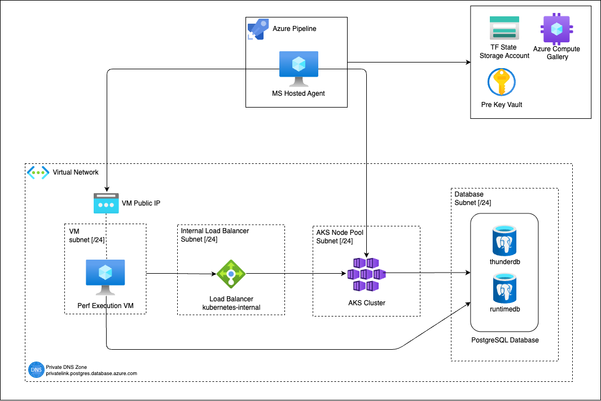

# Thunder Performance Testing on Azure

This guide outlines the setup process for deploying Thunder performance testing infrastructure on Azure. The deployment uses Terraform, Packer, and Azure DevOps pipelines to create and manage the required resources.

## Overview

The Thunder Performance testing environment on Azure consists of:
- Performance test runner VM (created from a custom image)
- AKS cluster for deploying Thunder
- Associated infrastructure components (networking, storage, etc.)

## Architecture Diagram
The architecture diagram below illustrates the components and their interactions.



## Prerequisites

### Azure Resources

1. **Azure AD Application Registration**
    - Register an application in Azure AD
    - Grant Contributor access to the resource group that will be used by Packer

2. **Resource Group**
    - Create a resource group for prerequisite resources (e.g., `rg-thunder-pre-perf-eastus2-001`)

3. **Key Vault**
    - Create a Key Vault in the resource group

4. **Storage Account**
    - Create a Storage Account to store the Terraform state
    - Create a container named `terraform` in the Storage Account

5. **Azure Compute Gallery**
    - Create an Azure Compute Gallery
    - Create a VM Image Definition in the gallery:
        - OS type: Linux
        - VM architecture: x64

6. **Clone Repository**
    - Clone this repository to your local machine

### Azure DevOps Setup

1. **Project Creation**
    - Create a project in Azure DevOps

2. **Service Connection**
    - Create a service connection to connect to your Azure subscription:
        - Identity type: App registration (automatic)
        - Credential type: Workload identity federation
        - Subscription: Select the subscription to deploy the resources
        - Resource group: Set as empty (To ensure subscription-wide access to create new resource groups)
        - Service connection name: Set a descriptive name (e.g., `azure-devops-connection`)

3. **Service Connection Permissions**
    - Ensure the service connection has the following permissions:
        - Storage Blob Data Contributor role in the Storage Account created for Terraform state
        - `Secret Get` permission in the Key Vault Access Policies of the created Key Vault
        - Owner role on the subscription with permissions to only assign `Network Contributor` role

## Deployment Steps

### Step 1: Create VM Image Template for Performance Runner VM

1. Navigate to the Packer directory:
   ```bash
   cd kubernetes/azure/terraform/vm-image-template/packer
   ```

2. Create configuration file:
    - Create a file named `conf.auto.pkrvars.hcl`
    - Copy content from `conf.auto.pkrvars.hcl.sample` and update with your values
    - Use the client ID and client secret from the registered Azure AD application


3. Build the VM image:
   ```bash
   packer init .
   packer build .
   ```

### Step 2: Generate SSH Keys

1. Generate SSH keys for the performance test VM:
   ```bash
   ssh-keygen -t rsa -b 4096 -f vm_ssh_key
   ```

2. Generate SSH keys for the AKS cluster nodes:
   ```bash
   ssh-keygen -t rsa -b 4096 -f aks_ssh_key
   ```

### Step 3: Configure Key Vault Secrets

Add the following secrets to the previously created Key Vault:

| Secret Name | Description                                               |
|-------------|-----------------------------------------------------------|
| `AKS-ADMIN-USERNAME` | Admin username for the AKS cluster nodes                  |
| `AKS-SSH-KEY` | SSH private key for AKS cluster nodes (created in Step 2) |
| `POSTGRES-ADMIN-USERNAME` | Admin username for the PostgreSQL server                  |
| `POSTGRES-ADMIN-PASSWORD` | Admin password for the PostgreSQL server                  |
| `REDIS-PASSWORD` | Password for the in-cluster Redis. Required only when Cache Mode or Runtime Database Type is set to `redis` |
| `SUBSCRIPTION-ID` | Azure Subscription ID for resource deployment             |
| `TENANT-ID` | Azure Tenant ID of the subscription                       |
| `VM-IMAGE-ID` | ID of the VM image (created in Step 1)                    |
| `VM-SSH-KEY` | SSH private key for the VM (created in Step 2)            |

### Step 4: Configure Azure DevOps Pipeline Variables

1. **Create Secret Variable Group**
    - Name: `vg-thunder-perf-secrets`
    - Link to the Key Vault created in prerequisites
    - Link the following secrets:
        - `POSTGRES-ADMIN-USERNAME`
        - `POSTGRES-ADMIN-PASSWORD`
        - `REDIS-PASSWORD` (only needed for Redis-backed runs)

2. **Create Configuration Variable Group**
    - Name: `vg-thunder-perf`
    - Add the following variables:
        - `AZURE_SERVICE_CONNECTION_NAME`: Name of the service connection
        - `PRE_KEYVAULT_NAME`: Name of the Key Vault
        - `TF_STATE_STORAGE_ACCOUNT_NAME`: Name of the storage account
        - `TF_STATE_CONTAINER_NAME`: Name of the container (e.g., `terraform`)
        - `TF_STATE_NAME`: Name of the Terraform state file (e.g., `thunder-perf.terraform.tfstate`)

3. **Add Secure Files to Library**
    - `azureVMSSHKey`: SSH private key for the VM (created in Step 2)
    - `azureVMSSHPublicKey.pub`: SSH public key for the VM
    - `azureAKSSSHPublicKey.pub`: SSH public key for the AKS cluster nodes

### Step 5: Create Azure DevOps Pipelines

Create the following pipelines in Azure DevOps:

| Pipeline Name                 | Source File | Purpose |
|-------------------------------|-------------|---------|
| Execute Terraform             | `kubernetes/azure/devops-pipelines/execute-terraform.yaml` | Provisions the infrastructure |
| Deploy Thunder                | `kubernetes/azure/devops-pipelines/deploy-thunder.yaml` | Deploys Thunder to the AKS cluster |
| Run Performance Test | `kubernetes/azure/devops-pipelines/perf-test-execution.yaml` | Runs performance tests |

## Usage

This section details the three primary pipelines used for Thunder performance testing on Azure. Each pipeline serves a specific purpose in the overall workflow.

### Execute Terraform  Pipeline

This pipeline manages the infrastructure provisioning and teardown, offering two primary functions:

#### 1. Infrastructure Provisioning
Execute the pipeline with the `create` action to provision all required Azure resources. This should be the first pipeline run in your workflow.

#### 2. Infrastructure Teardown
Execute the pipeline with the `destroy` action to remove all previously provisioned resources and clean up the environment.

**Pipeline Parameters:**

| Parameter Name | Description                              | Accepted Values     | Default Value |
|----------------|------------------------------------------|---------------------|---------------|
| Terraform Action | The infrastructure operation to perform  | `create`, `destroy` | `create` |
| Terraform Performance Repository | Repository containing the Terraform code | String              | asgardeo/thunder-performance |
| Terraform Performance Repository Branch | Branch of the repository to use          | String              | main |
| Config PostgreSQL Server SKU | SKU of the config database server | `GP_Standard_D2s_v3`, `GP_Standard_D4s_v3`, `GP_Standard_D8s_v3`, `GP_Standard_D16s_v3` | `GP_Standard_D2s_v3` |
| Runtime PostgreSQL Server SKU | SKU of the runtime database server | Same as above | `GP_Standard_D2s_v3` |
| User PostgreSQL Server SKU | SKU of the user database server | Same as above | `GP_Standard_D2s_v3` |
| AKS Node Pool VM Size | VM size of the AKS default node pool | `Standard_F8s_v2`, `Standard_F16s_v2`, `Standard_F32s_v2`, `Standard_F64s_v2` | `Standard_F8s_v2` |
| AKS Node Pool Node Count | Number of nodes in the node pool | Number | `2` |
| AKS Node Pool Min Node Count (autoscale) | Autoscaler lower bound | Number | `2` |
| AKS Node Pool Max Node Count (autoscale) | Autoscaler upper bound | Number | `5` |
| AKS Max Pods Per Node | Maximum pods schedulable on each node | Number | `30` |
| Perf Runner (JMeter Client) VM Size | VM size of the perf runner VM, which is where JMeter executes | `Standard_F8s_v2`, `Standard_F16s_v2`, `Standard_F32s_v2`, `Standard_F64s_v2`, `Standard_F72s_v2` | `Standard_F8s_v2` |

> **Note:** Changing the AKS Node Pool VM Size replaces the node pool, so the cluster is rebuilt on
> apply. See [Sizing the environment for high concurrency](#sizing-the-environment-for-high-concurrency).

### Deploy Thunder Pipeline

This pipeline deploys Thunder to the provisioned AKS cluster through a series of modular jobs. Each job can be executed independently by toggling the corresponding parameter.

**Deployment Jobs:**

1. **Install Internal Nginx Ingress Controller** - Deploys an Nginx Ingress Controller in the AKS cluster configured as an internal load balancer
2. **Create TLS Secret** - Generates and configures a self-signed TLS certificate as a Kubernetes Secret to be used by the Thunder ingress
3. **Setup Database Schema** - Setup the databases with the required table schema for Thunder
4. **Install Thunder** - Deploys the Thunder application using Helm
5. **Add Hosts Entry to VM** - Adds an entry to the `/etc/hosts` file of the Perf Test Execution VM to resolve the Thunder Ingress URL

**Pipeline Parameters:**

| Parameter Name | Description                             | Accepted Values | Default Value |
|----------------|-----------------------------------------|-----------------|---------------|
| Install Internal NGINX Ingress Controller | Enable/disable Nginx installation       | `true`, `false` | `true` |
| Create TLS Secret | Enable/disable TLS secret creation      | `true`, `false` | `true` |
| Setup Database Schema | Enable/disable database schema creation | `true`, `false` | `true` |
| Install Thunder | Enable/disable Thunder deployment       | `true`, `false` | `true` |
| Add Hosts Entry to VM | Enable/disable hosts file configuration | `true`, `false` | `true` |
| Populate Test Data | Enable/disable seeding of test applications and users | `true`, `false` | `true` |
| Thunder Repository | Repository containing the Thunder Helm chart | String          | thunder-id/thunderid |
| Thunder Repository Branch | Branch of the Thunder repository to use | String          | main |
| Performance repo name | Repository containing performance tests | String          | asgardeo/thunder-performance |
| Performance repo branch | Branch of the performance repository    | String          | main |
| Thunder Image Registry | Docker registry for Thunder image       | String          | ghcr.io/thunder-id |
| Thunder Image Repository | Docker repository for Thunder image     | String          | thunderid |
| Thunder Image Tag | Docker image tag for Thunder            | String          | 1.0.0-alpha |
| Nginx Replicas (also the HPA minimum) | Nginx controller replica count and HPA lower bound | Number | `2` |
| Nginx HPA Max Replicas | Nginx HPA upper bound | Number | `5` |
| Nginx CPU Limits | CPU limit per Nginx pod | String (e.g. `1000m`, `4`) | `1000m` |
| Nginx CPU Requests | CPU request per Nginx pod | String (e.g. `500m`, `4`) | `500m` |
| Nginx Memory Limits | Memory limit per Nginx pod | String (e.g. `1000Mi`, `4Gi`) | `1000Mi` |
| Nginx Memory Requests | Memory request per Nginx pod | String (e.g. `500Mi`, `4Gi`) | `500Mi` |
| Nginx HPA Target CPU Utilization (%) | CPU threshold that triggers Nginx scale-out | Number | `80` |
| Nginx HPA Target Memory Utilization (%) | Memory threshold that triggers Nginx scale-out | Number | `80` |
| Runtime Database Type | Backend for the **transient** runtime store. `redis` also triggers the Redis install job. The persistent runtime store and the entity store always stay on Postgres | `postgres`, `redis` | `postgres` |
| Cache Mode | Cache backend. `redis` also triggers the Redis install job | `disabled`, `in-memory`, `redis` | `in-memory` |
| Redis Master CPU Limits / Requests | CPU for the Redis master pod | String | `16` / `16` |
| Redis Master Memory Limits / Requests | Memory for the Redis master pod | String | `32Gi` / `32Gi` |
| Redis Replica CPU Limits / Requests | CPU per Redis replica pod | String | `6` / `6` |
| Redis Replica Memory Limits / Requests | Memory per Redis replica pod | String | `8Gi` / `8Gi` |
| Redis Replica HPA Min / Max Replicas | Redis replica autoscaling bounds | Number | `5` / `10` |
| Redis Replica HPA Target CPU / Memory Utilization (%) | Thresholds that trigger Redis replica scale-out | Number | `70` / `80` |

> **Note on Redis sizing:** these only take effect when Cache Mode or Runtime Database Type is
> `redis`. The master's requests must fit on a **single** node, so the default 16 vCore master
> needs a node pool of `Standard_F32s_v2` or larger. Also keep the `maxmemory` values pinned in
> `templates/redis-values.yaml` (14gb master, 6gb replica) below the memory limits set here,
> otherwise Redis grows past its limit and is OOM-killed.

> **Note:** Nginx fronts every request, so it saturates before Thunder does at high concurrency.
> Scale it alongside the Thunder pods and the node pool. See
> [Sizing the environment for high concurrency](#sizing-the-environment-for-high-concurrency).

### Run Performance Test Pipeline

This pipeline executes the performance tests against the deployed Thunder instance, managing environment scaling for optimal resource utilization.

**Pipeline Jobs:**

1. **Scale Up Perf Environment** - Increases capacity of the AKS cluster, PostgreSQL server, and Performance VM
2. **Execute Performance Test** - Runs the configured performance tests against the Thunder deployment
3. **Scale Down Perf Environment** - Reduces resource allocation after test completion to minimize costs

**Pipeline Parameters:**

| Parameter Name | Description                                                                                                                                  | Accepted Values | Default Value                    |
|----------------|----------------------------------------------------------------------------------------------------------------------------------------------|-----------------|----------------------------------|
| Scale Up Perf Environment | Enable/disable environment scaling up                                                                                                        | `true`, `false` | `false`                          |
| Execute Performance Test | Enable/disable test execution                                                                                                                | `true`, `false` | `true`                           |
| Scale Down Perf Environment | Enable/disable environment scaling down                                                                                                      | `true`, `false` | `false`                          |
| Performance repo name | Repository containing performance tests                                                                                                      | String          | asgardeo/thunder-performance     |
| Performance repo branch | Branch of the performance repository                                                                                                         | String          | main                             |
| Thunder Helm Repository | Repository containing the Thunder Helm chart                                                                                                 | String          | thunder-id/thunderid             |
| Thunder Helm Repository Branch | Branch of the Helm repository                                                                                                           | String          | main                             |
| Concurrency | Number of concurrent users to drive                                                                                                          | Number          | `200`                            |
| Test Duration (minutes) | Measurement window per scenario                                                                                                              | Number          | `3`                              |
| Warm-up Time (minutes) | Warm-up window discarded before measurement                                                                                                  | Number          | `2`                              |
| Enable delays in testing | Applies a 6000ms +/- 2000ms think-time timer between Authorization Code iterations. Turn this **off** to measure maximum throughput           | `true`, `false` | `true`                           |
| Perf-Test purpose | Test run description for reporting                                                                                                           | String          | Regular Thunder performance test |
| Thunder Replicas | Initial Thunder pod count and HPA minimum                                                                                                    | Number          | `2`                              |
| Thunder CPU Limits | CPU limit per Thunder pod                                                                                                                    | String          | `1.5`                            |
| Thunder CPU Requests | CPU request per Thunder pod                                                                                                                  | String          | `1`                              |
| Thunder Memory Limits | Memory limit per Thunder pod                                                                                                                 | String          | `512Mi`                          |
| Thunder Memory Requests | Memory request per Thunder pod                                                                                                               | String          | `256Mi`                          |
| Thunder HPA Enabled | Enable/disable Thunder autoscaling                                                                                                           | `true`, `false` | `true`                           |
| Thunder HPA Max Replicas | Ceiling on total Thunder pods, and therefore on total Thunder capacity                                                                  | Number          | `10`                             |
| Thunder HPA Target CPU Utilization (%) | CPU threshold that triggers Thunder scale-out                                                                                  | Number          | `65`                             |
| Thunder HPA Target Memory Utilization (%) | Memory threshold that triggers Thunder scale-out                                                                            | Number          | `75`                             |
| Thunder Image Registry | Docker registry for Thunder image       | String          | ghcr.io/thunder-id |
| Thunder Image Repository | Docker repository for Thunder image     | String          | thunderid |
| Thunder Image Tag | Docker image tag for Thunder            | String          | 0.47.0 |
| Runtime Database Type | Backend for the **transient** runtime store. `redis` also triggers the Redis install job. The persistent runtime store and the entity store always stay on Postgres | `postgres`, `redis` | `postgres` |
| Cache Mode | Cache backend. `redis` also triggers the Redis install job | `disabled`, `in-memory`, `redis` | `in-memory` |
| Redis Master CPU Limits / Requests | CPU for the Redis master pod | String | `16` / `16` |
| Redis Master Memory Limits / Requests | Memory for the Redis master pod | String | `32Gi` / `32Gi` |
| Redis Replica CPU Limits / Requests | CPU per Redis replica pod | String | `6` / `6` |
| Redis Replica Memory Limits / Requests | Memory per Redis replica pod | String | `8Gi` / `8Gi` |
| Redis Replica HPA Min / Max Replicas | Redis replica autoscaling bounds | Number | `5` / `10` |
| Redis Replica HPA Target CPU / Memory Utilization (%) | Thresholds that trigger Redis replica scale-out | Number | `70` / `80` |


## Sizing the environment for high concurrency

The defaults are sized for low-concurrency smoke runs (a 2-node `Standard_F8s_v2` pool). Driving
1000 or 10000 concurrent users requires scaling four things together. Raising any one of them
alone will not help, because whichever is left small becomes the bottleneck.

| Layer | Pipeline | Parameters |
|-------|----------|------------|
| AKS node pool | Execute Terraform | AKS Node Pool VM Size, Node Count, Min/Max Node Count |
| Load generator | Execute Terraform | Perf Runner (JMeter Client) VM Size |
| Thunder pods | Run Performance Test | Thunder Replicas, CPU/Memory Limits and Requests, HPA Max Replicas |
| Nginx ingress | Deploy Thunder | Nginx Replicas, HPA Max Replicas, CPU/Memory Limits and Requests |

### What to watch for

- **The load generator is a common bottleneck.** JMeter runs on the single perf runner VM. If it
  runs out of CPU or ephemeral ports, the run reports huge error rates that look like a Thunder
  failure but are not. Check `jmeter_loadavg.txt` and `jmeter_ss.txt` in the results archive: a
  load average far above the VM's vCPU count, or most sockets sitting in `TIME_WAIT`, means the
  client was the limit and the numbers are not usable.
- **The HPA ceiling must fit on the node pool.** Thunder can only scale to `HPA Max Replicas` if
  the pool has room for that many pods at the configured CPU/memory requests, alongside Nginx and
  the system pods. Multiply pods by requested CPU and compare against the pool's total allocatable
  CPU before raising the ceiling.
- **Nginx sees every request**, so it needs to grow with Thunder. The defaults of 1 vCore and a
  maximum of 5 pods will cap throughput well before Thunder does.
- **Turn off "Enable delays in testing" to measure maximum throughput.** With it on, the
  Authorization Code scenario spends roughly 6 seconds of every iteration in a think-time timer,
  so its throughput reflects the timer rather than the server. Client Credentials and User
  Authentication have no such timer. Benchmarks run with different settings are not comparable.

### Reference configuration

The v0.40.0 10000-user runs used the following. Sizes are given as the pipeline parameter values.

| Parameter | Value |
|-----------|-------|
| AKS Node Pool VM Size / Node Count | `Standard_F32s_v2` / `5` |
| Perf Runner VM Size | `Standard_F64s_v2` or larger |
| Config / Runtime / User PostgreSQL SKU | `GP_Standard_D8s_v3` |
| Thunder Replicas | `15` |
| Thunder CPU Limits / Requests | `4` / `4` |
| Thunder Memory Limits / Requests | `2Gi` / `2Gi` |
| Thunder HPA Max Replicas | `32` |
| Nginx Replicas / HPA Max Replicas | `7` / `10` |
| Nginx CPU Limits / Requests | `4` / `4` |
| Nginx Memory Limits / Requests | `4Gi` / `4Gi` |
| Enable delays in testing | off |

Recorded results are under [`benchmarks/`](../../benchmarks), with the exact specification for each
run in that run's `readme.md`.

## Additional Resources

- [Azure Documentation](https://docs.microsoft.com/en-us/azure/)
- [WSO2 Public Terraform Modules](https://github.com/wso2/azure-terraform-modules)
- [Azure Terraform Provider Documentation](https://registry.terraform.io/providers/hashicorp/azurerm/latest/docs)
- [Terraform Documentation](https://www.terraform.io/docs/)
- [Packer Documentation](https://www.packer.io/docs/)
